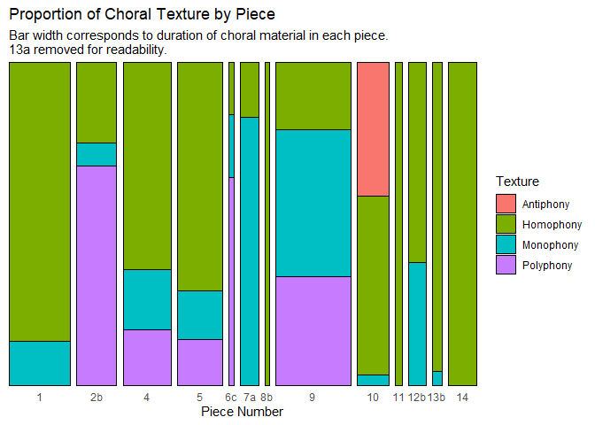
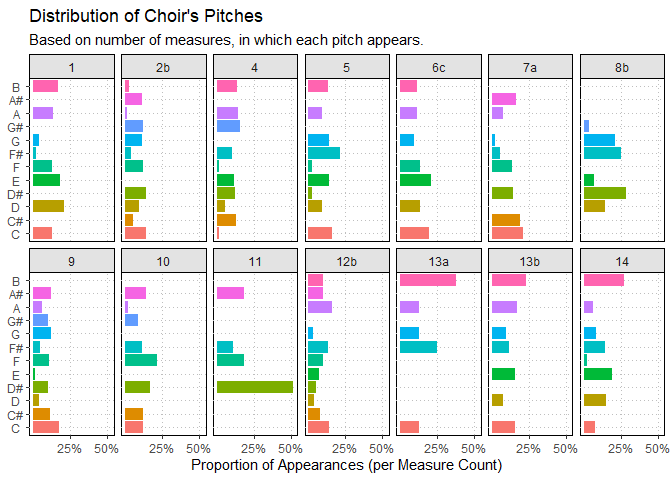

Measures Taken Formal Musical Analysis
================
Noah Zeldin
4/26/2021

  - [Introductory Remarks](#introductory-remarks)
  - [Load Packages](#load-packages)
  - [Importation](#importation)
      - [Duration](#duration)
      - [Voice Analysis](#voice-analysis)
  - [Cleaning and Manipulation: 1.
    Durations](#cleaning-and-manipulation-1.-durations)
  - [Cleaning and Manipulation: 2. Voice
    Analysis](#cleaning-and-manipulation-2.-voice-analysis)
      - [General Tibble: gen\_tib](#general-tibble-gen_tib)
          - [Additional Calculations for
            Density](#additional-calculations-for-density)
      - [Tibble for Choral Portions:
        gen\_tib\_sung](#tibble-for-choral-portions-gen_tib_sung)
      - [Tibble for Pitch: pitch\_tib](#tibble-for-pitch-pitch_tib)
  - [Stats](#stats)
      - [Durations: General](#durations-general)
          - [Total Duration in Minutes](#total-duration-in-minutes)
          - [Duration by Piece](#duration-by-piece)
          - [Duration by Category](#duration-by-category)
          - [Duration by Subcategory](#duration-by-subcategory)
      - [Meter and Tempo](#meter-and-tempo)
          - [Rates of Change](#rates-of-change)
          - [Most Common Meters](#most-common-meters)
      - [Durations: Choir](#durations-choir)
          - [Choir Total Durations](#choir-total-durations)
          - [Choir Sung Durations](#choir-sung-durations)
          - [Choir Acapella Durations](#choir-acapella-durations)
          - [Choir Spoken Durations](#choir-spoken-durations)
          - [Choir Voice Durations](#choir-voice-durations)
      - [Texture](#texture)
          - [Whole Work](#whole-work)
          - [Individual Pieces (By
            Duration)](#individual-pieces-by-duration)
      - [Pitch](#pitch)
          - [Set-Up for Pitch
            Computations](#set-up-for-pitch-computations)
          - [Pitch Distribution](#pitch-distribution)
          - [Chromaticism of Each Piece](#chromaticism-of-each-piece)
      - [Groupings](#groupings)
          - [Combinations of Groupings](#combinations-of-groupings)
          - [Separate Groupings](#separate-groupings)

# Introductory Remarks

Below is the annotated set-up for my formal analysis of Hanns Eisler’s
music to *The Measures Taken*, which is included in the second chapter
of my dissertation. This analysis was conducted in R. (I have tried to
use [tidyverse](https://www.tidyverse.org/) syntax as consistently as
possible. I therefore refer to tables as
[“tibbles”](https://tibble.tidyverse.org/).) Data sets will be made
available to researchers upon request.

**NB: Further refinements to the code are forthcoming.**

# Load Packages

``` r
library(tidyverse)
library(lubridate)
library(readxl)
```

# Importation

There are **two** separate spreadsheets:

1.  **durations** of each piece (`mt_data_durations_meters.xlsx`)

<!-- end list -->

  - also used to compute e.g. rates of meter change

<!-- end list -->

2.  much more detailed data relating specifically to the **choral
    material** (`mt_data_choir.xlsx`)

Both are necessary. The chapter begins with a structural overview of the
work but focuses on the choral material. However, some of the
calculations involved with the latter require the former.

NB: Several column types in both spreadsheets must be converted to
**factors** in a separate step because this is not an option with
`readxl()` (explained again below).

## Duration

Import all sheets into a single list and specify column types:

``` r
durations_sheets <- excel_sheets("mt_data_durations_meters.xlsx")

# comments next to "col_types" are the col. names
durations_list <- 
  lapply(durations_sheets, 
         function(x) 
           read_excel("mt_data_durations_meters.xlsx",
                      sheet = x, 
                      col_types = c("text", # piece_no
                                    "numeric", # category 
                                    "text", # subcategory
                                    "numeric", # segment
                                    "numeric", # m_start
                                    "numeric", # m_end
                                    "numeric", # no_of_mm
                                    "numeric", # meter_1
                                    "numeric", # meter_2
                                    "numeric", # meter_ch_count
                                    "numeric", # quarters_per_bar
                                    "numeric", # beats
                                    "numeric", # tempo
                                    "numeric", # tempo_ch_count
                                    "numeric") # duration 
                      ))
```

From `durations_list` create single data frame and save as tibble:

``` r
dur_tib <- as_tibble(bind_rows(durations_list))
```

## Voice Analysis

Check worksheets and ensure that there is a sheet for each piece
containing choral material:

``` r
excel_sheets("mt_data_choir.xlsx")
```

    ##  [1] "1 Vorspiel"                     "2b Lob der U.S.S.R."           
    ##  [3] "3b Sprechchor"                  "4 Lob der illegalen Arbeit"    
    ##  [5] "5 Gesang der Reiskahnschlepper" "6a (untitled)"                 
    ##  [7] "6b Lenin-Zitat (Sprechchor)"    "6c Kanon über ein Lenin-Zitat" 
    ##  [9] "7a Streiklied"                  "7b (untitled)"                 
    ## [11] "8b Song von der Ware"           "9 Ändere die Welt"             
    ## [13] "10 Lob der Partei"              "11 Rezitativ"                  
    ## [15] "12b Wir sind der Abschaum"      "13a (untitled)"                
    ## [17] "13b (untitled)"                 "14 Schlusschor"

Import all sheets into a single list and specify column types:

``` r
voice_analysis_sheets <- excel_sheets("mt_data_choir.xlsx")

voice_analysis_list <- 
  lapply(voice_analysis_sheets, 
         function(x) 
           read_excel("mt_data_choir.xlsx", 
                      sheet = x, 
                      col_types = c("text", # piece_no
                                    "numeric", # measure
                                    "text", # texture
                                    "numeric", # voices
                                    "text", # groupings
                                    "numeric", 
                                    "numeric", 
                                    "numeric", 
                                    "numeric", 
                                    "numeric", 
                                    "numeric", # soprano:ratio
                                    "numeric", 
                                    "numeric", 
                                    "numeric", 
                                    "numeric", 
                                    "numeric", 
                                    "numeric", 
                                    "numeric", 
                                    "numeric", 
                                    "numeric", # rests
                                    "numeric", 
                                    "numeric", 
                                    "numeric", 
                                    "numeric", 
                                    "numeric", 
                                    "numeric", 
                                    "numeric", 
                                    "numeric", 
                                    "numeric", # quarters
                                    "numeric", 
                                    "numeric", 
                                    "numeric", 
                                    "numeric", 
                                    "numeric", 
                                    "numeric", 
                                    "numeric", 
                                    "numeric", 
                                    "numeric", 
                                    "numeric", # notes
                                    "numeric", 
                                    "numeric", 
                                    "numeric", 
                                    "numeric", 
                                    "numeric", 
                                    "numeric", 
                                    "numeric", 
                                    "numeric", 
                                    "numeric", 
                                    "text", 
                                    "numeric", # tones
                                    "numeric", 
                                    "numeric", # spoken, acapella
                                    "numeric", 
                                    "numeric", 
                                    "numeric", 
                                    "numeric", # meter etc.
                                    "numeric", 
                                    "numeric", 
                                    "numeric", 
                                    "numeric", # general dur's
                                    "numeric", 
                                    "numeric", 
                                    "numeric", 
                                    "numeric", 
                                    "numeric", 
                                    "numeric", 
                                    "numeric",
                                    "numeric" # dur's of voices
                                    )
                      ))
```

From `voice_analysis_list` create single data frame and save as tibble:

``` r
gen_tib <- as_tibble(bind_rows(voice_analysis_list))
```

# Cleaning and Manipulation: 1. Durations

Convert **piece\_no**, **category** and **subcategory** to factors (not
possible with `readxl()`):

``` r
dur_tib <- dur_tib %>% 
    mutate(piece_no = as_factor(piece_no)) %>% 
    mutate(category = as_factor(category)) %>% 
    mutate(subcategory = as_factor(subcategory))
```

<!-- Check to see if each piece is now a factor. -->

<!-- * NB: n col. refers to # of segments -->

<!-- ```{r} -->

<!-- dur_tib$piece_no %>%  -->

<!--     fct_count() -->

<!-- ``` -->

<!-- same for category -->

<!-- ```{r} -->

<!-- dur_tib$category %>%  -->

<!--     fct_count() -->

<!-- ``` -->

Re-level subcategories:

``` r
dur_tib$subcategory <- dur_tib$subcategory %>% 
    fct_relevel("1b", after = 1) %>% 
    fct_relevel("2b", after = 2) %>% 
    fct_relevel("3b", after = 4) %>% 
    fct_relevel("3c", after = 5)

dur_tib$subcategory %>% 
    fct_count()
```

    ## # A tibble: 10 x 2
    ##    f         n
    ##    <fct> <int>
    ##  1 1a       58
    ##  2 1b        9
    ##  3 2b        5
    ##  4 3a        4
    ##  5 3b       18
    ##  6 3c        8
    ##  7 4a       16
    ##  8 4b        1
    ##  9 4c        1
    ## 10 4d        4

# Cleaning and Manipulation: 2. Voice Analysis

## General Tibble: gen\_tib

Convert **piece\_no** to factor (not possible with `readxl()`):

``` r
gen_tib <- gen_tib %>% 
    mutate(piece_no = as_factor(piece_no))
```

<!-- Check to see if each piece is now a factor. -->

<!-- * **Add something about n = # of mm. - and check.** -->

<!-- ```{r} -->

<!-- gen_tib$piece_no %>%  -->

<!--     fct_count() -->

<!-- ``` -->

Since 6c now follows 7a, must re-level (and check):

``` r
gen_tib$piece_no <- gen_tib$piece_no %>% 
    fct_relevel("6c", after = 7)

gen_tib$piece_no %>% 
    fct_count()
```

    ## # A tibble: 18 x 2
    ##    f         n
    ##    <fct> <int>
    ##  1 1       118
    ##  2 2b       49
    ##  3 3b       26
    ##  4 4        72
    ##  5 5       205
    ##  6 6a        3
    ##  7 6b        9
    ##  8 6c       16
    ##  9 7a       72
    ## 10 7b        2
    ## 11 8b      184
    ## 12 9        52
    ## 13 10       70
    ## 14 11       29
    ## 15 12b      57
    ## 16 13a       4
    ## 17 13b      17
    ## 18 14       96

Group by piece:

``` r
by_piece <- gen_tib %>% group_by(piece_no)
```

Add **rowid** column and as new first column (“id”):

``` r
gen_tib <- gen_tib %>% 
    rowid_to_column("id")
```

### Additional Calculations for Density

**NB: This section will in all likelihood be deleted, since it
ultimately was not included in the final analysis.** The goal was to
find a formula that would allow for a quantitative comparison of the
informational density of the choral material in each measure.

Translate texture to numeric value in new column:

  - monophony = 1

  - homophony = 1.5

  - antiphony = 1.5

  - polyphony = 2

<!-- end list -->

``` r
gen_tib <- gen_tib %>% 
    mutate(texture_value = case_when(texture == "na" ~ "0", 
                                   texture == "m" ~ "1", 
                                   texture == "h" ~ "1.5", 
                                   texture == "a" ~ "1.5", # added 12.26.20
                                   texture == "p" ~ "2",)) %>% 
    mutate(texture_value = as.numeric(texture_value)) %>% 
    relocate(texture_value, .after = texture)
```

Add density column for each voice:

``` r
gen_tib <- gen_tib %>% 
    mutate(dm_s1 = (notes_s1+tones_s1)/quarters_per_bar,
                      dm_s2 = (notes_s2+tones_s2)/quarters_per_bar,
                      dm_a1 = (notes_a1+tones_a1)/quarters_per_bar,
                      dm_a2 = (notes_a2+tones_a2)/quarters_per_bar,
                      dm_t1 = (notes_t1+tones_t1)/quarters_per_bar,
                      dm_t2 = (notes_t2+tones_t2)/quarters_per_bar,
                      dm_b1 = (notes_b1+tones_b1)/quarters_per_bar,
                      dm_b2 = (notes_b2+tones_b2)/quarters_per_bar)
```

Create a **dm\_sum** column from 8 individual **dm** columns:

``` r
gen_tib <- gen_tib %>% 
    rowwise() %>% 
    mutate(dm_sum = sum(c_across(dm_s1:dm_b2)))
```

With new **dm\_sum** column, create **dmc** column:

``` r
gen_tib <- gen_tib %>% 
    rowwise() %>% 
    mutate(dmc = (dm_sum/4)*texture_value)
```

Reconvert gen\_tib to tibble after performing `rowwise()`:

``` r
gen_tib <- gen_tib %>% as_tibble()
```

## Tibble for Choral Portions: gen\_tib\_sung

Filter out parts without choral singing (includes passages *spoken* by
choir):

``` r
gen_tib_sung <- gen_tib %>% 
    filter(texture != "na" & 
               parts_active > 0 & 
               spoken == 0) 
```

<!-- Check to see if any NAs remain. The following should return an **empty**  -->

<!-- table. -->

<!-- ```{r} -->

<!-- gen_tib_sung %>%  -->

<!--     filter(is.na(dm_s1), -->

<!--            is.na(dm_s2),  -->

<!--            is.na(dm_a1), -->

<!--            is.na(dm_a2), -->

<!--            is.na(dm_t1), -->

<!--            is.na(dm_t2), -->

<!--            is.na(dm_b1), -->

<!--            is.na(dm_b2)) %>%  -->

<!--     select(id, piece_no, measure, starts_with("notes_"), starts_with("tones_"), -->

<!--            quarters_per_bar, starts_with("dm_"))  -->

<!-- ``` -->

## Tibble for Pitch: pitch\_tib

Create tibble containing data on choir’s pitch material in each measure:

``` r
pitch_tib <- gen_tib_sung %>% 
    select(id, piece_no, measure, tones, dur_choir, dmc) %>%
    relocate(tones, .after = dmc) %>% 
    mutate(
        c = str_count(tones, "c$|c\\,"),
        c_sharp_d_flat = str_count(tones, "c-sharp|d-flat"),
        d = str_count(tones, "d$|d\\,"),
        d_sharp_e_flat = str_count(tones, "d-sharp|e-flat"),
        e = str_count(tones, "e$|e\\,"),
        f = str_count(tones, "f$|f\\,"),
        f_sharp_g_flat = str_count(tones, "f-sharp|g-flat"),
        g = str_count(tones, "g$|g\\,"),
        g_sharp_a_flat = str_count(tones, "g-sharp|a-flat"),
        a = str_count(tones, "a$|a\\,"),
        a_sharp_b_flat = str_count(tones, "a-sharp|b-flat"),
        b = str_count(tones, "b$|b\\,"),    
                ) %>% 
    rowwise %>% 
    mutate(tones_sum = sum(c_across(c:b))) 
```

# Stats

This section contains calculations derived from the tibbles generated
and cleaned in the previous sections. These calculations formed the
basis of my formal analysis and some of the values were used in the
write-up included in the chapter.

## Durations: General

### Total Duration in Minutes

``` r
dur_total_min <- sum(dur_tib$duration) / 60
```

Total duration in minutes: 38.58.

### Duration by Piece

Create tibble with durations for all pieces:

``` r
dur_piece <- dur_tib %>% 
    group_by(piece_no) %>%
    summarize(duration_min = (sum(duration) / 60)) %>% 
    mutate(prop_of_dur = (duration_min/sum(duration_min)),
           duration_min = round(duration_min, digits = 2),
           prop_of_dur = round(prop_of_dur, digits = 3))

knitr::kable(dur_piece)
```

| piece\_no | duration\_min | prop\_of\_dur |
| :-------- | ------------: | ------------: |
| 1         |          4.91 |         0.127 |
| 2b        |          2.07 |         0.054 |
| 3a        |          3.83 |         0.099 |
| 3b        |          0.49 |         0.013 |
| 4         |          4.12 |         0.107 |
| 5         |          3.92 |         0.102 |
| 6a        |          0.06 |         0.002 |
| 6b        |          0.13 |         0.003 |
| 6c        |          0.24 |         0.006 |
| 7a        |          1.62 |         0.042 |
| 7b        |          0.04 |         0.001 |
| 8a        |          2.32 |         0.060 |
| 8b        |          3.12 |         0.081 |
| 9         |          4.82 |         0.125 |
| 10        |          1.96 |         0.051 |
| 11        |          0.60 |         0.016 |
| 12a       |          0.47 |         0.012 |
| 12b       |          0.90 |         0.023 |
| 13a       |          0.10 |         0.003 |
| 13b       |          0.47 |         0.012 |
| 14        |          2.37 |         0.061 |

Resort to find longest pieces:

``` r
dur_piece %>% 
    arrange(desc(duration_min))
```

    ## # A tibble: 21 x 3
    ##    piece_no duration_min prop_of_dur
    ##    <fct>           <dbl>       <dbl>
    ##  1 1                4.91       0.127
    ##  2 9                4.82       0.125
    ##  3 4                4.12       0.107
    ##  4 5                3.92       0.102
    ##  5 3a               3.83       0.099
    ##  6 8b               3.12       0.081
    ##  7 14               2.37       0.061
    ##  8 8a               2.32       0.06 
    ##  9 2b               2.07       0.054
    ## 10 10               1.96       0.051
    ## # ... with 11 more rows

<!-- ##### NEW with Lubridate - FIX! -->

<!-- ```{r} -->

<!-- dur_piece_lubridate <- dur_piece %>%  -->

<!--     separate(duration_min, sep = "\\.", into = c("min", "sec")) %>%  -->

<!--     mutate(min = as.numeric(min), -->

<!--            sec = as.numeric(sec) # PROBLEM - removes zeros -->

<!--            ) %>%  -->

<!--     mutate(sec = round(sec * .6)) %>%  -->

<!--     mutate(duration = (minutes(min) + seconds(sec)), .keep = "unused") %>%  -->

<!--     relocate(duration, .after = piece_no) -->

<!-- dur_piece_lubridate -->

<!-- ``` -->

### Duration by Category

I assigned one of four categories to each of the pieces. These are:

1.  choir with orchestra

2.  spoken dialogue with orchestra

3.  pieces featuring solo tenor

4.  choir acapella or choir with snare drum

<!-- end list -->

``` r
dur_tib %>% 
    group_by(category) %>%
    summarize(duration = sum(duration)) %>% 
    mutate(prop_of_dur = (duration/sum(duration)))
```

    ## # A tibble: 4 x 3
    ##   category duration prop_of_dur
    ##   <fct>       <dbl>       <dbl>
    ## 1 1          1403.       0.606 
    ## 2 2            28.2      0.0122
    ## 3 3           791.       0.342 
    ## 4 4            92.0      0.0398

<!-- No contest: two biggest categories are 1. choir with orchestra and 3. tenor solo -->

<!-- close to 95 % -->

### Duration by Subcategory

Each of the four categories was then subdivided, resulting in a total of
ten different subcategories of music. (All of this is laid out in
**table 2.1. The Structure of *The Measures Taken*** in ch. 2 of the
dissertation.)

``` r
dur_subcategory <- dur_tib %>% 
    group_by(subcategory) %>%
    summarize(duration = sum(duration)) %>% 
    mutate(duration_min = (duration/60)) %>% 
    mutate(prop_of_dur = (duration/sum(duration)))

knitr::kable(dur_subcategory)
```

| subcategory |   duration | duration\_min | prop\_of\_dur |
| :---------- | ---------: | ------------: | ------------: |
| 1a          | 1305.46453 |    21.7577421 |     0.5640358 |
| 1b          |   97.50000 |     1.6250000 |     0.0421256 |
| 2b          |   28.18182 |     0.4696970 |     0.0121762 |
| 3a          |  230.00000 |     3.8333333 |     0.0993732 |
| 3b          |  235.23697 |     3.9206162 |     0.1016359 |
| 3c          |  326.07852 |     5.4346419 |     0.1408847 |
| 4a          |   37.22431 |     0.6204052 |     0.0160830 |
| 4b          |    3.60000 |     0.0600000 |     0.0015554 |
| 4c          |   14.54545 |     0.2424242 |     0.0062845 |
| 4d          |   36.67471 |     0.6112452 |     0.0158456 |

<!-- arranged descending -->

<!-- ```{r} -->

<!-- dur_subcategory %>%  -->

<!--     arrange(desc(prop_of_dur)) -->

<!-- ``` -->

<!-- Exactly what I expected:    -->

<!-- * largest proportion = 1a. mixed choir with orchestra -->

<!-- * followed by 3. tenor solo with accompaniment -->

<!-- * then 1b. = male choir with orchestra -->

<!-- ** actually, only one piece = Streiklied -->

## Meter and Tempo

An important feature of Eisler’s music for *The Measures Taken* are the
frequent meter changes. These, along with the frequent tempo changes in
a handful of pieces, demonstrate the necessity of a professional
conductor. (The reliance of the non-professional workers’ choir on an
array of professional musicians is an important part of my argument in
the dissertation, as it contradicts much of the previous, text-oriented
scholarship on the work by Brecht scholars.)

### Rates of Change

Construct tibble with following stats for each piece:

  - duration

  - number of meter changes

  - rate of meter changes in seconds = duration / number of meter
    changes

  - rate of meter changes in bars

  - number of tempo changes

  - rate of tempo changes in seconds = duration / number of meter
    changes

  - rate of tempo changes in bars

<!-- end list -->

``` r
dur_meter_tempo_piece <- dur_tib %>% 
    group_by(piece_no) %>% 
    summarize(meter_ch_count = sum(meter_ch_count),
              tempo_ch_count = sum(tempo_ch_count),
              duration = sum(duration)) %>% 
    mutate(meter_ch_rate_sec = round(duration / meter_ch_count, 
                                     digits = 2),
           tempo_ch_rate_sec = round(duration / tempo_ch_count, 
                                     digits = 2),
           duration = round(duration, digits = 2)) %>% 
    relocate(meter_ch_rate_sec, .after = meter_ch_count) %>% 
    relocate(tempo_ch_rate_sec, .after = tempo_ch_count)

knitr::kable(dur_meter_tempo_piece)
```

| piece\_no | meter\_ch\_count | meter\_ch\_rate\_sec | tempo\_ch\_count | tempo\_ch\_rate\_sec | duration |
| :-------- | ---------------: | -------------------: | ---------------: | -------------------: | -------: |
| 1         |                9 |                32.76 |                1 |               294.86 |   294.86 |
| 2b        |                9 |                13.82 |                1 |               124.35 |   124.35 |
| 3a        |                1 |               230.00 |                4 |                57.50 |   230.00 |
| 3b        |               12 |                 2.47 |                1 |                29.61 |    29.61 |
| 4         |               18 |                13.73 |                1 |               247.22 |   247.22 |
| 5         |                7 |                33.61 |                9 |                26.14 |   235.24 |
| 6a        |                1 |                 3.60 |                1 |                 3.60 |     3.60 |
| 6b        |                4 |                 1.90 |                1 |                 7.62 |     7.62 |
| 6c        |                1 |                14.55 |                1 |                14.55 |    14.55 |
| 7a        |                3 |                32.50 |                1 |                97.50 |    97.50 |
| 7b        |                1 |                 2.40 |                1 |                 2.40 |     2.40 |
| 8a        |                1 |               138.95 |                1 |               138.95 |   138.95 |
| 8b        |                1 |               187.13 |                7 |                26.73 |   187.13 |
| 9         |                8 |                36.14 |                1 |               289.09 |   289.09 |
| 10        |                5 |                23.48 |                1 |               117.38 |   117.38 |
| 11        |                2 |                18.00 |                1 |                36.00 |    36.00 |
| 12a       |                5 |                 5.64 |                1 |                28.18 |    28.18 |
| 12b       |                1 |                54.29 |                1 |                54.29 |    54.29 |
| 13a       |                1 |                 5.85 |                1 |                 5.85 |     5.85 |
| 13b       |                2 |                14.21 |                1 |                28.42 |    28.42 |
| 14        |                5 |                28.46 |                1 |               142.29 |   142.29 |

<!-- sorted by **meter_ch_count**   -->

<!-- ```{r} -->

<!-- dur_meter_tempo_piece %>%  -->

<!--     arrange(desc(meter_ch_count)) %>%  -->

<!--     select(-tempo_ch_count, -tempo_ch_rate_sec) -->

<!-- ``` -->

5 pieces with greatest number of meter changes:

``` r
meter_ch_count_piece_top_5 <- dur_meter_tempo_piece %>% 
    arrange(desc(meter_ch_count)) %>% 
    select(-tempo_ch_count, -tempo_ch_rate_sec) %>% 
    slice(1:5)

knitr::kable(meter_ch_count_piece_top_5)
```

| piece\_no | meter\_ch\_count | meter\_ch\_rate\_sec | duration |
| :-------- | ---------------: | -------------------: | -------: |
| 4         |               18 |                13.73 |   247.22 |
| 3b        |               12 |                 2.47 |    29.61 |
| 1         |                9 |                32.76 |   294.86 |
| 2b        |                9 |                13.82 |   124.35 |
| 9         |                8 |                36.14 |   289.09 |

<!-- sorted by **meter_ch_rate_sec** ASCENDING   -->

<!-- ```{r} -->

<!-- dur_meter_tempo_piece %>%  -->

<!--     filter(meter_ch_count != 1) %>%  -->

<!--     select(-tempo_ch_count, -tempo_ch_rate_sec) %>%  -->

<!--     arrange(meter_ch_rate_sec) -->

<!-- ``` -->

5 pieces with fastest rates of meter change:

``` r
meter_ch_rate_piece_top_5 <- dur_meter_tempo_piece %>% 
    filter(meter_ch_count != 1) %>% 
    select(-tempo_ch_count, -tempo_ch_rate_sec) %>% 
    arrange(meter_ch_rate_sec) %>% 
    slice(1:5)

knitr::kable(meter_ch_rate_piece_top_5)
```

| piece\_no | meter\_ch\_count | meter\_ch\_rate\_sec | duration |
| :-------- | ---------------: | -------------------: | -------: |
| 6b        |                4 |                 1.90 |     7.62 |
| 3b        |               12 |                 2.47 |    29.61 |
| 12a       |                5 |                 5.64 |    28.18 |
| 4         |               18 |                13.73 |   247.22 |
| 2b        |                9 |                13.82 |   124.35 |

<!-- sorted by **tempo_ch_count**   -->

<!-- ```{r} -->

<!-- dur_meter_tempo_piece %>%   -->

<!--     select(-meter_ch_count, -meter_ch_rate_sec) %>%  -->

<!--     arrange(desc(tempo_ch_count)) -->

<!-- ``` -->

3 pieces with greatest number of tempo changes:

``` r
tempo_ch_count_and_rate_piece <- dur_meter_tempo_piece %>% 
    filter(tempo_ch_count != 1) %>% 
    select(-meter_ch_count, -meter_ch_rate_sec) %>% 
    arrange(tempo_ch_rate_sec)

knitr::kable(tempo_ch_count_and_rate_piece)
```

| piece\_no | tempo\_ch\_count | tempo\_ch\_rate\_sec | duration |
| :-------- | ---------------: | -------------------: | -------: |
| 5         |                9 |                26.14 |   235.24 |
| 8b        |                7 |                26.73 |   187.13 |
| 3a        |                4 |                57.50 |   230.00 |

### Most Common Meters

Create tibble with meter, number of meters and duration:

``` r
dur_meter <- dur_tib %>% 
    unite(meter_1, meter_2, col = "meter", sep = "_") %>% 
    select(piece_no, no_of_mm, meter, duration) %>% 
    relocate(meter, .after = piece_no) %>% 
    filter(meter != "0_0") # remove the pick-up from piece_no 10
```

Most common meters by number of measures:

``` r
dur_meter %>% 
    group_by(meter) %>% 
    count(no_of_mm) %>% 
    mutate(no_of_mm = no_of_mm * n) %>% 
    select(-n) %>% 
    summarize(no_of_mm = sum(no_of_mm)) %>% 
    arrange(desc(no_of_mm))
```

    ## # A tibble: 8 x 2
    ##   meter no_of_mm
    ##   <chr>    <dbl>
    ## 1 2_4        568
    ## 2 3_4        235
    ## 3 3_2        198
    ## 4 2_2        187
    ## 5 6_4         45
    ## 6 4_2         40
    ## 7 4_4         20
    ## 8 1_4          5

Most common meters by duration:

``` r
dur_meter %>% 
    group_by(meter) %>% 
    summarize(duration = sum(duration)) %>% 
    arrange(desc(duration))
```

    ## # A tibble: 8 x 2
    ##   meter duration
    ##   <chr>    <dbl>
    ## 1 2_4     635.  
    ## 2 3_2     624.  
    ## 3 3_4     467.  
    ## 4 2_2     228.  
    ## 5 4_2     203.  
    ## 6 6_4     112.  
    ## 7 4_4      41.9 
    ## 8 1_4       3.17

#### Grouped by Duple vs. Triple

Exploring the proportion of duple vs. triple meters allows one to
determine Eisler’s engagement with march-like anthems (duple meters) and
subversion thereof (triple meters). In short, while the music to *The
Measures Taken* is undoubtedly highly political, Eisler, in his typical
manner, used musical materials in a critical fashion, rather than
composing straightforward anthems.

``` r
dur_meter_groups <- dur_meter %>% 
    group_by(meter) %>% 
    summarize(duration = sum(duration)) %>% 
    separate(meter, sep = "_", into = c("meter_1", "meter_2")) %>% 
    mutate(meter_1 = as.factor(meter_1))

dur_meter_groups$meter_1 <- dur_meter_groups$meter_1 %>% 
    fct_relabel(~ c("other", "duple", "triple", "duple", "duple"))

dur_meter_groups <- dur_meter_groups %>% 
    select(-meter_2) %>% 
    rename(group = meter_1) %>% 
    group_by(group) %>% 
    summarize(duration = sum(duration)) %>% 
    mutate(prop_dur = duration / sum(duration),
           perc_dur = round(prop_dur*100))

knitr::kable(dur_meter_groups)
```

| group  |    duration | prop\_dur | perc\_dur |
| :----- | ----------: | --------: | --------: |
| other  |    3.166667 | 0.0013684 |         0 |
| duple  | 1219.870389 | 0.5271397 |        53 |
| triple | 1091.094253 | 0.4714919 |        47 |

<!-- Interesting: pretty evenly split. -->

#### Special Case: 6/4

6/4 is compound duple and therefore a special case. NB: 6/4 is the only
compound duple meter present in the work.

Check which measures are in 6/4:

``` r
gen_tib %>% 
  filter(meter_1 == 6, meter_2 == 4) 
```

    ## # A tibble: 46 x 83
    ##       id piece_no measure texture texture_value voices groupings soprano  alto
    ##    <int> <fct>      <dbl> <chr>           <dbl>  <dbl> <chr>       <dbl> <dbl>
    ##  1   196 4              3 m                 1        1 tb              0     0
    ##  2   206 4             13 p                 2        2 none            0     0
    ##  3   207 4             14 p                 2        2 none            0     0
    ##  4   209 4             16 h                 1.5      2 tb              0     0
    ##  5   221 4             28 p                 2        1 sa_tb           1     1
    ##  6   222 4             29 p                 2        2 sa_tb           1     1
    ##  7   223 4             30 p                 2        2 sa_tb           1     1
    ##  8   224 4             31 p                 2        2 sa_tb           1     1
    ##  9   225 4             32 p                 2        1 sa_tb           0     0
    ## 10   226 4             33 na                0        0 na              0     0
    ## # ... with 36 more rows, and 74 more variables: tenor <dbl>, bass <dbl>,
    ## #   parts_active <dbl>, ratio_voices_parts <dbl>, rests_s1 <dbl>,
    ## #   rests_s2 <dbl>, rests_a1 <dbl>, rests_a2 <dbl>, rests_t1 <dbl>,
    ## #   rests_t2 <dbl>, rests_b1 <dbl>, rests_b2 <dbl>, rests_all <dbl>,
    ## #   quarters_s1 <dbl>, quarters_s2 <dbl>, quarters_a1 <dbl>, quarters_a2 <dbl>,
    ## #   quarters_t1 <dbl>, quarters_t2 <dbl>, quarters_b1 <dbl>, quarters_b2 <dbl>,
    ## #   quarters_sum <dbl>, notes_s1 <dbl>, notes_s2 <dbl>, notes_a1 <dbl>,
    ## #   notes_a2 <dbl>, notes_t1 <dbl>, notes_t2 <dbl>, notes_b1 <dbl>,
    ## #   notes_b2 <dbl>, notes_sum <dbl>, notes_sum_pairings <dbl>, tones_s1 <dbl>,
    ## #   tones_s2 <dbl>, tones_a1 <dbl>, tones_a2 <dbl>, tones_t1 <dbl>,
    ## #   tones_t2 <dbl>, tones_b1 <dbl>, tones_b2 <dbl>, tones_sum <dbl>,
    ## #   tones <chr>, tones_count <dbl>, spoken <dbl>, acapella <dbl>,
    ## #   meter_1 <dbl>, meter_2 <dbl>, quarters_per_bar <dbl>, tempo <dbl>,
    ## #   duration <dbl>, dur_choir <dbl>, dur_spoken <dbl>, dur_acapella <dbl>,
    ## #   dur_s1 <dbl>, dur_s2 <dbl>, dur_a1 <dbl>, dur_a2 <dbl>, dur_t1 <dbl>,
    ## #   dur_t2 <dbl>, dur_b1 <dbl>, dur_b2 <dbl>, `meter 1` <dbl>, `meter 2` <dbl>,
    ## #   `quarters per bar` <dbl>, dm_s1 <dbl>, dm_s2 <dbl>, dm_a1 <dbl>,
    ## #   dm_a2 <dbl>, dm_t1 <dbl>, dm_t2 <dbl>, dm_b1 <dbl>, dm_b2 <dbl>,
    ## #   dm_sum <dbl>, dmc <dbl>

Compute percent of duration that is 6/4:

``` r
dur_6_4_perc <- round((dur_meter %>% 
    filter(meter == "6_4") %>% 
    select(duration) %>% 
    sum() / 
  dur_meter_groups %>% 
    select(duration) %>% 
    sum()) * 100, digits = 1)
```

4.8 % of the work is in 6/4.

Compute percent of duration of duple that is 6/4:

``` r
dur_6_4_duple_perc <- round((dur_meter %>% 
    filter(meter == "6_4") %>% 
    select(duration) %>% 
    sum() / 
  dur_meter_groups %>% 
    filter(group == "duple") %>% 
    select(duration) %>% 
    sum()) * 100, digits = 1)
```

9.2 % of measures with duple meters are in 6/4.

<!-- ```{r} -->

<!-- # duration of duple meters -->

<!-- dur_meter_groups %>%  -->

<!--   filter(group == "duple") %>%  -->

<!--   select(duration) - -->

<!--   # subtract duration of 6/4 measures -->

<!--   dur_meter %>%  -->

<!--     filter(meter == "6_4") %>%  -->

<!--     select(duration) %>%  -->

<!--     sum() -  -->

<!--   # subtract duration of triple meters -->

<!--   dur_meter_groups %>%  -->

<!--   filter(group == "triple") %>%  -->

<!--   select(duration) -->

<!-- ``` -->

<!-- Almost even. -->

## Durations: Choir

This section is very significant to my analysis, which focuses on the
choral material. The calculations here determine the proportions of
choral material that are sung (with and without instrumental
accompaniment) or spoken.

### Choir Total Durations

Create tibble containing only measures with choir:

``` r
choir_tib <- gen_tib %>% 
    filter(dur_choir != 0)
```

Total duration of choir:

``` r
dur_choir_total_sec <- sum(choir_tib$dur_choir)
dur_choir_total_min <- sum(choir_tib$dur_choir) / 60
```

The choir is active for 20.03 minutes.

Duration of choir as proportion of total duration:

``` r
dur_choir_prop <- round((dur_choir_total_min / dur_total_min), digits = 4)*100
print(dur_choir_prop)
```

    ## [1] 51.94

The choir is active for 51.94 % of total duration of music.

### Choir Sung Durations

``` r
gen_tib %>% 
    filter(dur_choir != 0 & spoken == 0) %>% 
    group_by(piece_no) %>% 
    select(piece_no, dur_choir) %>% 
    summarize(dur_choir = sum(dur_choir)) %>% 
    mutate(dur_choir_prop = dur_choir / sum(dur_choir)) %>% 
    mutate(dur_choir = round(dur_choir, digits = 2), 
           dur_choir_prop = round(dur_choir_prop, digits = 3)) %>% 
    arrange(desc(dur_choir_prop))
```

    ## # A tibble: 14 x 3
    ##    piece_no dur_choir dur_choir_prop
    ##    <fct>        <dbl>          <dbl>
    ##  1 9           210             0.192
    ##  2 1           170.            0.155
    ##  3 4           134.            0.123
    ##  4 5           124.            0.114
    ##  5 2b          111.            0.102
    ##  6 10           88.1           0.081
    ##  7 14           80.3           0.073
    ##  8 7a           51.5           0.047
    ##  9 12b          48.1           0.044
    ## 10 13b          26.4           0.024
    ## 11 11           19             0.017
    ## 12 6c           14.1           0.013
    ## 13 8b           10.6           0.01 
    ## 14 13a           4.76          0.004

<!-- Pretty interesting: -->

<!-- * 9. Aendere die Welt has by far most choir singing -> include in analysis -->

<!-- * other pieces with complex polyphony in top 5: -->

<!-- ** 4. Lob der illegalen Arbeit and 2b. Lob der USSR -->

### Choir Acapella Durations

``` r
dur_acapella <- gen_tib %>% 
    filter(acapella == 1) %>% 
    group_by(piece_no) %>% 
    select(piece_no, dur_choir) %>% 
    summarize(dur_choir = sum(dur_choir)) %>% 
    mutate(dur_choir_prop = dur_choir / sum(dur_choir),
           dur_choir = round(dur_choir, digits = 2),
           dur_choir_prop = round(dur_choir_prop, digits = 3)) 

knitr::kable(dur_acapella)
```

| piece\_no | dur\_choir | dur\_choir\_prop |
| :-------- | ---------: | ---------------: |
| 2b        |      46.96 |            0.316 |
| 6c        |      14.09 |            0.095 |
| 9         |      34.55 |            0.232 |
| 11        |      19.00 |            0.128 |
| 12b       |       2.86 |            0.019 |
| 13a       |       4.76 |            0.032 |
| 13b       |      26.45 |            0.178 |

Arrange descending to see top pieces:

``` r
dur_acapella %>% 
    arrange(desc(dur_choir_prop))
```

    ## # A tibble: 7 x 3
    ##   piece_no dur_choir dur_choir_prop
    ##   <fct>        <dbl>          <dbl>
    ## 1 2b           47.0           0.316
    ## 2 9            34.6           0.232
    ## 3 13b          26.4           0.178
    ## 4 11           19             0.128
    ## 5 6c           14.1           0.095
    ## 6 13a           4.76          0.032
    ## 7 12b           2.86          0.019

Proportion of `dur_chor` that is acapella:

``` r
sum(dur_acapella$dur_choir) / dur_choir_total_sec
```

    ## [1] 0.1236756

<!-- Good results: -->

<!-- * top 2 are 2b. Lob der USSR and 9. Aendere die Welt -->

### Choir Spoken Durations

``` r
gen_tib %>% 
    filter(spoken == 1) %>% 
    group_by(piece_no) %>% 
    select(piece_no, dur_choir) %>% 
    summarize(dur_choir = sum(dur_choir)) %>% 
    mutate(dur_choir_prop = dur_choir / sum(dur_choir),
           dur_choir = round(dur_choir, digits = 2),
           dur_choir_prop = round(dur_choir_prop, digits = 3)) %>% 
    arrange(desc(dur_choir_prop))
```

    ## # A tibble: 9 x 3
    ##   piece_no dur_choir dur_choir_prop
    ##   <fct>        <dbl>          <dbl>
    ## 1 14           28             0.256
    ## 2 3b           24.9           0.227
    ## 3 4            18.3           0.168
    ## 4 9            12.7           0.116
    ## 5 11            9.5           0.087
    ## 6 6b            7.62          0.07 
    ## 7 6a            3.6           0.033
    ## 8 10            3             0.027
    ## 9 7b            1.8           0.016

<!-- Interesting that 14. Schlusschor is top. -->

<!-- Other remarks: -->

<!-- * close second is 3b. Sprechchor = Wer fuer den Kommunismus kaempft -->

<!-- * interesting that 3b. is only category 4 piece in top 5 -->

### Choir Voice Durations

#### Check for measures where duration of 1st and 2nd parts don’t align.

NB: As is typical for choral music, Eisler sometimes splits the part of
one or more of the four voices. The calculations below take account of
this.

1.  Sopranos

<!-- end list -->

``` r
gen_tib_sung %>% 
    filter(quarters_s1 != 0 & quarters_s2 != 0 & quarters_s1 != quarters_s2)
```

    ## # A tibble: 0 x 83
    ## # ... with 83 variables: id <int>, piece_no <fct>, measure <dbl>,
    ## #   texture <chr>, texture_value <dbl>, voices <dbl>, groupings <chr>,
    ## #   soprano <dbl>, alto <dbl>, tenor <dbl>, bass <dbl>, parts_active <dbl>,
    ## #   ratio_voices_parts <dbl>, rests_s1 <dbl>, rests_s2 <dbl>, rests_a1 <dbl>,
    ## #   rests_a2 <dbl>, rests_t1 <dbl>, rests_t2 <dbl>, rests_b1 <dbl>,
    ## #   rests_b2 <dbl>, rests_all <dbl>, quarters_s1 <dbl>, quarters_s2 <dbl>,
    ## #   quarters_a1 <dbl>, quarters_a2 <dbl>, quarters_t1 <dbl>, quarters_t2 <dbl>,
    ## #   quarters_b1 <dbl>, quarters_b2 <dbl>, quarters_sum <dbl>, notes_s1 <dbl>,
    ## #   notes_s2 <dbl>, notes_a1 <dbl>, notes_a2 <dbl>, notes_t1 <dbl>,
    ## #   notes_t2 <dbl>, notes_b1 <dbl>, notes_b2 <dbl>, notes_sum <dbl>,
    ## #   notes_sum_pairings <dbl>, tones_s1 <dbl>, tones_s2 <dbl>, tones_a1 <dbl>,
    ## #   tones_a2 <dbl>, tones_t1 <dbl>, tones_t2 <dbl>, tones_b1 <dbl>,
    ## #   tones_b2 <dbl>, tones_sum <dbl>, tones <chr>, tones_count <dbl>,
    ## #   spoken <dbl>, acapella <dbl>, meter_1 <dbl>, meter_2 <dbl>,
    ## #   quarters_per_bar <dbl>, tempo <dbl>, duration <dbl>, dur_choir <dbl>,
    ## #   dur_spoken <dbl>, dur_acapella <dbl>, dur_s1 <dbl>, dur_s2 <dbl>,
    ## #   dur_a1 <dbl>, dur_a2 <dbl>, dur_t1 <dbl>, dur_t2 <dbl>, dur_b1 <dbl>,
    ## #   dur_b2 <dbl>, `meter 1` <dbl>, `meter 2` <dbl>, `quarters per bar` <dbl>,
    ## #   dm_s1 <dbl>, dm_s2 <dbl>, dm_a1 <dbl>, dm_a2 <dbl>, dm_t1 <dbl>,
    ## #   dm_t2 <dbl>, dm_b1 <dbl>, dm_b2 <dbl>, dm_sum <dbl>, dmc <dbl>

2.  Altos

<!-- end list -->

``` r
gen_tib_sung %>% 
    filter(quarters_a1 != 0 & quarters_a2 != 0 & quarters_a1 != quarters_a2)
```

    ## # A tibble: 0 x 83
    ## # ... with 83 variables: id <int>, piece_no <fct>, measure <dbl>,
    ## #   texture <chr>, texture_value <dbl>, voices <dbl>, groupings <chr>,
    ## #   soprano <dbl>, alto <dbl>, tenor <dbl>, bass <dbl>, parts_active <dbl>,
    ## #   ratio_voices_parts <dbl>, rests_s1 <dbl>, rests_s2 <dbl>, rests_a1 <dbl>,
    ## #   rests_a2 <dbl>, rests_t1 <dbl>, rests_t2 <dbl>, rests_b1 <dbl>,
    ## #   rests_b2 <dbl>, rests_all <dbl>, quarters_s1 <dbl>, quarters_s2 <dbl>,
    ## #   quarters_a1 <dbl>, quarters_a2 <dbl>, quarters_t1 <dbl>, quarters_t2 <dbl>,
    ## #   quarters_b1 <dbl>, quarters_b2 <dbl>, quarters_sum <dbl>, notes_s1 <dbl>,
    ## #   notes_s2 <dbl>, notes_a1 <dbl>, notes_a2 <dbl>, notes_t1 <dbl>,
    ## #   notes_t2 <dbl>, notes_b1 <dbl>, notes_b2 <dbl>, notes_sum <dbl>,
    ## #   notes_sum_pairings <dbl>, tones_s1 <dbl>, tones_s2 <dbl>, tones_a1 <dbl>,
    ## #   tones_a2 <dbl>, tones_t1 <dbl>, tones_t2 <dbl>, tones_b1 <dbl>,
    ## #   tones_b2 <dbl>, tones_sum <dbl>, tones <chr>, tones_count <dbl>,
    ## #   spoken <dbl>, acapella <dbl>, meter_1 <dbl>, meter_2 <dbl>,
    ## #   quarters_per_bar <dbl>, tempo <dbl>, duration <dbl>, dur_choir <dbl>,
    ## #   dur_spoken <dbl>, dur_acapella <dbl>, dur_s1 <dbl>, dur_s2 <dbl>,
    ## #   dur_a1 <dbl>, dur_a2 <dbl>, dur_t1 <dbl>, dur_t2 <dbl>, dur_b1 <dbl>,
    ## #   dur_b2 <dbl>, `meter 1` <dbl>, `meter 2` <dbl>, `quarters per bar` <dbl>,
    ## #   dm_s1 <dbl>, dm_s2 <dbl>, dm_a1 <dbl>, dm_a2 <dbl>, dm_t1 <dbl>,
    ## #   dm_t2 <dbl>, dm_b1 <dbl>, dm_b2 <dbl>, dm_sum <dbl>, dmc <dbl>

3.  Tenors

<!-- end list -->

``` r
gen_tib_sung %>% 
    filter(quarters_t1 != 0 & quarters_t2 != 0 & quarters_t1 != quarters_t2) 
```

    ## # A tibble: 3 x 83
    ##      id piece_no measure texture texture_value voices groupings soprano  alto
    ##   <int> <fct>      <dbl> <chr>           <dbl>  <dbl> <chr>       <dbl> <dbl>
    ## 1   815 10             6 a                 1.5      2 sat1b           1     1
    ## 2   819 10            10 a                 1.5      2 sat1b           1     1
    ## 3   823 10            14 a                 1.5      2 sat1b           1     1
    ## # ... with 74 more variables: tenor <dbl>, bass <dbl>, parts_active <dbl>,
    ## #   ratio_voices_parts <dbl>, rests_s1 <dbl>, rests_s2 <dbl>, rests_a1 <dbl>,
    ## #   rests_a2 <dbl>, rests_t1 <dbl>, rests_t2 <dbl>, rests_b1 <dbl>,
    ## #   rests_b2 <dbl>, rests_all <dbl>, quarters_s1 <dbl>, quarters_s2 <dbl>,
    ## #   quarters_a1 <dbl>, quarters_a2 <dbl>, quarters_t1 <dbl>, quarters_t2 <dbl>,
    ## #   quarters_b1 <dbl>, quarters_b2 <dbl>, quarters_sum <dbl>, notes_s1 <dbl>,
    ## #   notes_s2 <dbl>, notes_a1 <dbl>, notes_a2 <dbl>, notes_t1 <dbl>,
    ## #   notes_t2 <dbl>, notes_b1 <dbl>, notes_b2 <dbl>, notes_sum <dbl>,
    ## #   notes_sum_pairings <dbl>, tones_s1 <dbl>, tones_s2 <dbl>, tones_a1 <dbl>,
    ## #   tones_a2 <dbl>, tones_t1 <dbl>, tones_t2 <dbl>, tones_b1 <dbl>,
    ## #   tones_b2 <dbl>, tones_sum <dbl>, tones <chr>, tones_count <dbl>,
    ## #   spoken <dbl>, acapella <dbl>, meter_1 <dbl>, meter_2 <dbl>,
    ## #   quarters_per_bar <dbl>, tempo <dbl>, duration <dbl>, dur_choir <dbl>,
    ## #   dur_spoken <dbl>, dur_acapella <dbl>, dur_s1 <dbl>, dur_s2 <dbl>,
    ## #   dur_a1 <dbl>, dur_a2 <dbl>, dur_t1 <dbl>, dur_t2 <dbl>, dur_b1 <dbl>,
    ## #   dur_b2 <dbl>, `meter 1` <dbl>, `meter 2` <dbl>, `quarters per bar` <dbl>,
    ## #   dm_s1 <dbl>, dm_s2 <dbl>, dm_a1 <dbl>, dm_a2 <dbl>, dm_t1 <dbl>,
    ## #   dm_t2 <dbl>, dm_b1 <dbl>, dm_b2 <dbl>, dm_sum <dbl>, dmc <dbl>

Only antiphonic passage at beginning of “Lob der Partei.” Doesn’t
matter, because t1 and t2 overlap.

4.  Basses

<!-- end list -->

``` r
gen_tib_sung %>% 
    filter(quarters_b1 != 0 & quarters_b2 != 0 & quarters_b1 != quarters_b2)
```

    ## # A tibble: 1 x 83
    ##      id piece_no measure texture texture_value voices groupings soprano  alto
    ##   <int> <fct>      <dbl> <chr>           <dbl>  <dbl> <chr>       <dbl> <dbl>
    ## 1   570 7a            64 m                   1      1 tb              0     0
    ## # ... with 74 more variables: tenor <dbl>, bass <dbl>, parts_active <dbl>,
    ## #   ratio_voices_parts <dbl>, rests_s1 <dbl>, rests_s2 <dbl>, rests_a1 <dbl>,
    ## #   rests_a2 <dbl>, rests_t1 <dbl>, rests_t2 <dbl>, rests_b1 <dbl>,
    ## #   rests_b2 <dbl>, rests_all <dbl>, quarters_s1 <dbl>, quarters_s2 <dbl>,
    ## #   quarters_a1 <dbl>, quarters_a2 <dbl>, quarters_t1 <dbl>, quarters_t2 <dbl>,
    ## #   quarters_b1 <dbl>, quarters_b2 <dbl>, quarters_sum <dbl>, notes_s1 <dbl>,
    ## #   notes_s2 <dbl>, notes_a1 <dbl>, notes_a2 <dbl>, notes_t1 <dbl>,
    ## #   notes_t2 <dbl>, notes_b1 <dbl>, notes_b2 <dbl>, notes_sum <dbl>,
    ## #   notes_sum_pairings <dbl>, tones_s1 <dbl>, tones_s2 <dbl>, tones_a1 <dbl>,
    ## #   tones_a2 <dbl>, tones_t1 <dbl>, tones_t2 <dbl>, tones_b1 <dbl>,
    ## #   tones_b2 <dbl>, tones_sum <dbl>, tones <chr>, tones_count <dbl>,
    ## #   spoken <dbl>, acapella <dbl>, meter_1 <dbl>, meter_2 <dbl>,
    ## #   quarters_per_bar <dbl>, tempo <dbl>, duration <dbl>, dur_choir <dbl>,
    ## #   dur_spoken <dbl>, dur_acapella <dbl>, dur_s1 <dbl>, dur_s2 <dbl>,
    ## #   dur_a1 <dbl>, dur_a2 <dbl>, dur_t1 <dbl>, dur_t2 <dbl>, dur_b1 <dbl>,
    ## #   dur_b2 <dbl>, `meter 1` <dbl>, `meter 2` <dbl>, `quarters per bar` <dbl>,
    ## #   dm_s1 <dbl>, dm_s2 <dbl>, dm_a1 <dbl>, dm_a2 <dbl>, dm_t1 <dbl>,
    ## #   dm_t2 <dbl>, dm_b1 <dbl>, dm_b2 <dbl>, dm_sum <dbl>, dmc <dbl>

Final measure of “Streiklied.” Doesn’t matter, because b1 and b2
overlap.

#### Check for measures where 2nd sings but 1st doesn’t

NB: Similar goal as in previous section.

1.  Sopranos

<!-- end list -->

``` r
gen_tib_sung %>% 
    filter(quarters_s1 == 0 & quarters_s2 != 0)
```

    ## # A tibble: 0 x 83
    ## # ... with 83 variables: id <int>, piece_no <fct>, measure <dbl>,
    ## #   texture <chr>, texture_value <dbl>, voices <dbl>, groupings <chr>,
    ## #   soprano <dbl>, alto <dbl>, tenor <dbl>, bass <dbl>, parts_active <dbl>,
    ## #   ratio_voices_parts <dbl>, rests_s1 <dbl>, rests_s2 <dbl>, rests_a1 <dbl>,
    ## #   rests_a2 <dbl>, rests_t1 <dbl>, rests_t2 <dbl>, rests_b1 <dbl>,
    ## #   rests_b2 <dbl>, rests_all <dbl>, quarters_s1 <dbl>, quarters_s2 <dbl>,
    ## #   quarters_a1 <dbl>, quarters_a2 <dbl>, quarters_t1 <dbl>, quarters_t2 <dbl>,
    ## #   quarters_b1 <dbl>, quarters_b2 <dbl>, quarters_sum <dbl>, notes_s1 <dbl>,
    ## #   notes_s2 <dbl>, notes_a1 <dbl>, notes_a2 <dbl>, notes_t1 <dbl>,
    ## #   notes_t2 <dbl>, notes_b1 <dbl>, notes_b2 <dbl>, notes_sum <dbl>,
    ## #   notes_sum_pairings <dbl>, tones_s1 <dbl>, tones_s2 <dbl>, tones_a1 <dbl>,
    ## #   tones_a2 <dbl>, tones_t1 <dbl>, tones_t2 <dbl>, tones_b1 <dbl>,
    ## #   tones_b2 <dbl>, tones_sum <dbl>, tones <chr>, tones_count <dbl>,
    ## #   spoken <dbl>, acapella <dbl>, meter_1 <dbl>, meter_2 <dbl>,
    ## #   quarters_per_bar <dbl>, tempo <dbl>, duration <dbl>, dur_choir <dbl>,
    ## #   dur_spoken <dbl>, dur_acapella <dbl>, dur_s1 <dbl>, dur_s2 <dbl>,
    ## #   dur_a1 <dbl>, dur_a2 <dbl>, dur_t1 <dbl>, dur_t2 <dbl>, dur_b1 <dbl>,
    ## #   dur_b2 <dbl>, `meter 1` <dbl>, `meter 2` <dbl>, `quarters per bar` <dbl>,
    ## #   dm_s1 <dbl>, dm_s2 <dbl>, dm_a1 <dbl>, dm_a2 <dbl>, dm_t1 <dbl>,
    ## #   dm_t2 <dbl>, dm_b1 <dbl>, dm_b2 <dbl>, dm_sum <dbl>, dmc <dbl>

2.  Altos

<!-- end list -->

``` r
gen_tib_sung %>% 
    filter(quarters_a1 == 0 & quarters_a2 != 0)
```

    ## # A tibble: 0 x 83
    ## # ... with 83 variables: id <int>, piece_no <fct>, measure <dbl>,
    ## #   texture <chr>, texture_value <dbl>, voices <dbl>, groupings <chr>,
    ## #   soprano <dbl>, alto <dbl>, tenor <dbl>, bass <dbl>, parts_active <dbl>,
    ## #   ratio_voices_parts <dbl>, rests_s1 <dbl>, rests_s2 <dbl>, rests_a1 <dbl>,
    ## #   rests_a2 <dbl>, rests_t1 <dbl>, rests_t2 <dbl>, rests_b1 <dbl>,
    ## #   rests_b2 <dbl>, rests_all <dbl>, quarters_s1 <dbl>, quarters_s2 <dbl>,
    ## #   quarters_a1 <dbl>, quarters_a2 <dbl>, quarters_t1 <dbl>, quarters_t2 <dbl>,
    ## #   quarters_b1 <dbl>, quarters_b2 <dbl>, quarters_sum <dbl>, notes_s1 <dbl>,
    ## #   notes_s2 <dbl>, notes_a1 <dbl>, notes_a2 <dbl>, notes_t1 <dbl>,
    ## #   notes_t2 <dbl>, notes_b1 <dbl>, notes_b2 <dbl>, notes_sum <dbl>,
    ## #   notes_sum_pairings <dbl>, tones_s1 <dbl>, tones_s2 <dbl>, tones_a1 <dbl>,
    ## #   tones_a2 <dbl>, tones_t1 <dbl>, tones_t2 <dbl>, tones_b1 <dbl>,
    ## #   tones_b2 <dbl>, tones_sum <dbl>, tones <chr>, tones_count <dbl>,
    ## #   spoken <dbl>, acapella <dbl>, meter_1 <dbl>, meter_2 <dbl>,
    ## #   quarters_per_bar <dbl>, tempo <dbl>, duration <dbl>, dur_choir <dbl>,
    ## #   dur_spoken <dbl>, dur_acapella <dbl>, dur_s1 <dbl>, dur_s2 <dbl>,
    ## #   dur_a1 <dbl>, dur_a2 <dbl>, dur_t1 <dbl>, dur_t2 <dbl>, dur_b1 <dbl>,
    ## #   dur_b2 <dbl>, `meter 1` <dbl>, `meter 2` <dbl>, `quarters per bar` <dbl>,
    ## #   dm_s1 <dbl>, dm_s2 <dbl>, dm_a1 <dbl>, dm_a2 <dbl>, dm_t1 <dbl>,
    ## #   dm_t2 <dbl>, dm_b1 <dbl>, dm_b2 <dbl>, dm_sum <dbl>, dmc <dbl>

3.  Tenors

<!-- end list -->

``` r
gen_tib_sung %>% 
    filter(quarters_t1 == 0 & quarters_t2 != 0)
```

    ## # A tibble: 5 x 83
    ##      id piece_no measure texture texture_value voices groupings soprano  alto
    ##   <int> <fct>      <dbl> <chr>           <dbl>  <dbl> <chr>       <dbl> <dbl>
    ## 1   814 10             5 a                 1.5      2 sat1b           1     1
    ## 2   818 10             9 a                 1.5      2 sat1b           1     1
    ## 3   822 10            13 a                 1.5      2 sat1b           1     1
    ## 4   826 10            17 a                 1.5      2 sat1b           1     1
    ## 5   827 10            18 a                 1.5      2 sat1b           1     1
    ## # ... with 74 more variables: tenor <dbl>, bass <dbl>, parts_active <dbl>,
    ## #   ratio_voices_parts <dbl>, rests_s1 <dbl>, rests_s2 <dbl>, rests_a1 <dbl>,
    ## #   rests_a2 <dbl>, rests_t1 <dbl>, rests_t2 <dbl>, rests_b1 <dbl>,
    ## #   rests_b2 <dbl>, rests_all <dbl>, quarters_s1 <dbl>, quarters_s2 <dbl>,
    ## #   quarters_a1 <dbl>, quarters_a2 <dbl>, quarters_t1 <dbl>, quarters_t2 <dbl>,
    ## #   quarters_b1 <dbl>, quarters_b2 <dbl>, quarters_sum <dbl>, notes_s1 <dbl>,
    ## #   notes_s2 <dbl>, notes_a1 <dbl>, notes_a2 <dbl>, notes_t1 <dbl>,
    ## #   notes_t2 <dbl>, notes_b1 <dbl>, notes_b2 <dbl>, notes_sum <dbl>,
    ## #   notes_sum_pairings <dbl>, tones_s1 <dbl>, tones_s2 <dbl>, tones_a1 <dbl>,
    ## #   tones_a2 <dbl>, tones_t1 <dbl>, tones_t2 <dbl>, tones_b1 <dbl>,
    ## #   tones_b2 <dbl>, tones_sum <dbl>, tones <chr>, tones_count <dbl>,
    ## #   spoken <dbl>, acapella <dbl>, meter_1 <dbl>, meter_2 <dbl>,
    ## #   quarters_per_bar <dbl>, tempo <dbl>, duration <dbl>, dur_choir <dbl>,
    ## #   dur_spoken <dbl>, dur_acapella <dbl>, dur_s1 <dbl>, dur_s2 <dbl>,
    ## #   dur_a1 <dbl>, dur_a2 <dbl>, dur_t1 <dbl>, dur_t2 <dbl>, dur_b1 <dbl>,
    ## #   dur_b2 <dbl>, `meter 1` <dbl>, `meter 2` <dbl>, `quarters per bar` <dbl>,
    ## #   dm_s1 <dbl>, dm_s2 <dbl>, dm_a1 <dbl>, dm_a2 <dbl>, dm_t1 <dbl>,
    ## #   dm_t2 <dbl>, dm_b1 <dbl>, dm_b2 <dbl>, dm_sum <dbl>, dmc <dbl>

Only beginning of “Lob der Partei,” as expected.

Save as extra duration to add to male proportion.

``` r
dur_t2_extra <- gen_tib_sung %>% 
  filter(quarters_t1 == 0 & quarters_t2 != 0) %>%
  select(dur_t2) %>% 
  sum()
```

4.  Basses

<!-- end list -->

``` r
gen_tib_sung %>% 
    filter(quarters_b1 == 0 & quarters_b2 != 0)
```

    ## # A tibble: 0 x 83
    ## # ... with 83 variables: id <int>, piece_no <fct>, measure <dbl>,
    ## #   texture <chr>, texture_value <dbl>, voices <dbl>, groupings <chr>,
    ## #   soprano <dbl>, alto <dbl>, tenor <dbl>, bass <dbl>, parts_active <dbl>,
    ## #   ratio_voices_parts <dbl>, rests_s1 <dbl>, rests_s2 <dbl>, rests_a1 <dbl>,
    ## #   rests_a2 <dbl>, rests_t1 <dbl>, rests_t2 <dbl>, rests_b1 <dbl>,
    ## #   rests_b2 <dbl>, rests_all <dbl>, quarters_s1 <dbl>, quarters_s2 <dbl>,
    ## #   quarters_a1 <dbl>, quarters_a2 <dbl>, quarters_t1 <dbl>, quarters_t2 <dbl>,
    ## #   quarters_b1 <dbl>, quarters_b2 <dbl>, quarters_sum <dbl>, notes_s1 <dbl>,
    ## #   notes_s2 <dbl>, notes_a1 <dbl>, notes_a2 <dbl>, notes_t1 <dbl>,
    ## #   notes_t2 <dbl>, notes_b1 <dbl>, notes_b2 <dbl>, notes_sum <dbl>,
    ## #   notes_sum_pairings <dbl>, tones_s1 <dbl>, tones_s2 <dbl>, tones_a1 <dbl>,
    ## #   tones_a2 <dbl>, tones_t1 <dbl>, tones_t2 <dbl>, tones_b1 <dbl>,
    ## #   tones_b2 <dbl>, tones_sum <dbl>, tones <chr>, tones_count <dbl>,
    ## #   spoken <dbl>, acapella <dbl>, meter_1 <dbl>, meter_2 <dbl>,
    ## #   quarters_per_bar <dbl>, tempo <dbl>, duration <dbl>, dur_choir <dbl>,
    ## #   dur_spoken <dbl>, dur_acapella <dbl>, dur_s1 <dbl>, dur_s2 <dbl>,
    ## #   dur_a1 <dbl>, dur_a2 <dbl>, dur_t1 <dbl>, dur_t2 <dbl>, dur_b1 <dbl>,
    ## #   dur_b2 <dbl>, `meter 1` <dbl>, `meter 2` <dbl>, `quarters per bar` <dbl>,
    ## #   dm_s1 <dbl>, dm_s2 <dbl>, dm_a1 <dbl>, dm_a2 <dbl>, dm_t1 <dbl>,
    ## #   dm_t2 <dbl>, dm_b1 <dbl>, dm_b2 <dbl>, dm_sum <dbl>, dmc <dbl>

##### Same but with duration

1.  Sopranos

<!-- end list -->

``` r
gen_tib_sung %>% 
    filter(dur_s1 != 0 & dur_s2 != 0 & dur_s1 != dur_s2)
```

    ## # A tibble: 0 x 83
    ## # ... with 83 variables: id <int>, piece_no <fct>, measure <dbl>,
    ## #   texture <chr>, texture_value <dbl>, voices <dbl>, groupings <chr>,
    ## #   soprano <dbl>, alto <dbl>, tenor <dbl>, bass <dbl>, parts_active <dbl>,
    ## #   ratio_voices_parts <dbl>, rests_s1 <dbl>, rests_s2 <dbl>, rests_a1 <dbl>,
    ## #   rests_a2 <dbl>, rests_t1 <dbl>, rests_t2 <dbl>, rests_b1 <dbl>,
    ## #   rests_b2 <dbl>, rests_all <dbl>, quarters_s1 <dbl>, quarters_s2 <dbl>,
    ## #   quarters_a1 <dbl>, quarters_a2 <dbl>, quarters_t1 <dbl>, quarters_t2 <dbl>,
    ## #   quarters_b1 <dbl>, quarters_b2 <dbl>, quarters_sum <dbl>, notes_s1 <dbl>,
    ## #   notes_s2 <dbl>, notes_a1 <dbl>, notes_a2 <dbl>, notes_t1 <dbl>,
    ## #   notes_t2 <dbl>, notes_b1 <dbl>, notes_b2 <dbl>, notes_sum <dbl>,
    ## #   notes_sum_pairings <dbl>, tones_s1 <dbl>, tones_s2 <dbl>, tones_a1 <dbl>,
    ## #   tones_a2 <dbl>, tones_t1 <dbl>, tones_t2 <dbl>, tones_b1 <dbl>,
    ## #   tones_b2 <dbl>, tones_sum <dbl>, tones <chr>, tones_count <dbl>,
    ## #   spoken <dbl>, acapella <dbl>, meter_1 <dbl>, meter_2 <dbl>,
    ## #   quarters_per_bar <dbl>, tempo <dbl>, duration <dbl>, dur_choir <dbl>,
    ## #   dur_spoken <dbl>, dur_acapella <dbl>, dur_s1 <dbl>, dur_s2 <dbl>,
    ## #   dur_a1 <dbl>, dur_a2 <dbl>, dur_t1 <dbl>, dur_t2 <dbl>, dur_b1 <dbl>,
    ## #   dur_b2 <dbl>, `meter 1` <dbl>, `meter 2` <dbl>, `quarters per bar` <dbl>,
    ## #   dm_s1 <dbl>, dm_s2 <dbl>, dm_a1 <dbl>, dm_a2 <dbl>, dm_t1 <dbl>,
    ## #   dm_t2 <dbl>, dm_b1 <dbl>, dm_b2 <dbl>, dm_sum <dbl>, dmc <dbl>

2.  Altos

<!-- end list -->

``` r
gen_tib_sung %>% 
    filter(dur_a1 != 0 & dur_a2 != 0 & dur_a1 != dur_a2)
```

    ## # A tibble: 0 x 83
    ## # ... with 83 variables: id <int>, piece_no <fct>, measure <dbl>,
    ## #   texture <chr>, texture_value <dbl>, voices <dbl>, groupings <chr>,
    ## #   soprano <dbl>, alto <dbl>, tenor <dbl>, bass <dbl>, parts_active <dbl>,
    ## #   ratio_voices_parts <dbl>, rests_s1 <dbl>, rests_s2 <dbl>, rests_a1 <dbl>,
    ## #   rests_a2 <dbl>, rests_t1 <dbl>, rests_t2 <dbl>, rests_b1 <dbl>,
    ## #   rests_b2 <dbl>, rests_all <dbl>, quarters_s1 <dbl>, quarters_s2 <dbl>,
    ## #   quarters_a1 <dbl>, quarters_a2 <dbl>, quarters_t1 <dbl>, quarters_t2 <dbl>,
    ## #   quarters_b1 <dbl>, quarters_b2 <dbl>, quarters_sum <dbl>, notes_s1 <dbl>,
    ## #   notes_s2 <dbl>, notes_a1 <dbl>, notes_a2 <dbl>, notes_t1 <dbl>,
    ## #   notes_t2 <dbl>, notes_b1 <dbl>, notes_b2 <dbl>, notes_sum <dbl>,
    ## #   notes_sum_pairings <dbl>, tones_s1 <dbl>, tones_s2 <dbl>, tones_a1 <dbl>,
    ## #   tones_a2 <dbl>, tones_t1 <dbl>, tones_t2 <dbl>, tones_b1 <dbl>,
    ## #   tones_b2 <dbl>, tones_sum <dbl>, tones <chr>, tones_count <dbl>,
    ## #   spoken <dbl>, acapella <dbl>, meter_1 <dbl>, meter_2 <dbl>,
    ## #   quarters_per_bar <dbl>, tempo <dbl>, duration <dbl>, dur_choir <dbl>,
    ## #   dur_spoken <dbl>, dur_acapella <dbl>, dur_s1 <dbl>, dur_s2 <dbl>,
    ## #   dur_a1 <dbl>, dur_a2 <dbl>, dur_t1 <dbl>, dur_t2 <dbl>, dur_b1 <dbl>,
    ## #   dur_b2 <dbl>, `meter 1` <dbl>, `meter 2` <dbl>, `quarters per bar` <dbl>,
    ## #   dm_s1 <dbl>, dm_s2 <dbl>, dm_a1 <dbl>, dm_a2 <dbl>, dm_t1 <dbl>,
    ## #   dm_t2 <dbl>, dm_b1 <dbl>, dm_b2 <dbl>, dm_sum <dbl>, dmc <dbl>

3.  Tenors

<!-- end list -->

``` r
gen_tib_sung %>% 
    filter(dur_t1 != 0 & dur_t2 != 0 & dur_t1 != dur_t2) %>% 
    select(piece_no, measure, dur_t1, dur_t2) 
```

    ## # A tibble: 3 x 4
    ##   piece_no measure dur_t1 dur_t2
    ##   <fct>      <dbl>  <dbl>  <dbl>
    ## 1 10             6  0.375   2.25
    ## 2 10            10  0.375   2.25
    ## 3 10            14  0.375   2.25

Again, doesn’t matter because of overlap.

4.  Basses

<!-- end list -->

``` r
gen_tib_sung %>% 
    filter(dur_b1 != 0 & dur_b2 != 0 & dur_b1 != dur_b2) %>% 
    select(piece_no, measure, dur_b1, dur_b2)
```

    ## # A tibble: 1 x 4
    ##   piece_no measure dur_b1 dur_b2
    ##   <fct>      <dbl>  <dbl>  <dbl>
    ## 1 7a            64   0.75   0.25

Again, doesn’t matter because of overlap.

#### Computations for male vs. female

The introduction of mixed choirs into the German worker-singers’
movement was a widely discussed and highly politicized topic in the
Weimar Republic. These calculations determine the extent to which Eisler
used women’s voices in comparison to men’s voices.

<!-- Four voices - FIX - need to account for doublings, can't just add 1 and 2 -->

<!-- **CURRENTLY SKIPPING THIS CHUNK - PROB DELETE** -->

<!-- ```{r, eval=FALSE} -->

<!-- dur_soprano <- sum(gen_tib_sung$dur_s1 + gen_tib_sung$dur_s2) -->

<!-- dur_alto <- sum(gen_tib_sung$dur_a1 + gen_tib_sung$dur_a2) -->

<!-- dur_tenor <- sum(gen_tib_sung$dur_t1 + gen_tib_sung$dur_t2) -->

<!-- dur_bass <- sum(gen_tib_sung$dur_b1 + gen_tib_sung$dur_b2) # FIX/CHECK -->

<!-- dur_soprano <- sum(gen_tib_sung$soprano * gen_tib_sung) -->

<!-- dur_voice <-  -->

<!--     tibble(voice = c("soprano", "alto", "tenor", "bass"), -->

<!--     dur_min =  -->

<!--     c(dur_soprano /60,  -->

<!--     dur_alto / 60,  -->

<!--     dur_tenor / 60,  -->

<!--     dur_bass / 60)) -->

<!-- dur_voice %>%  -->

<!--     mutate(dur_prop = dur_min / sum(dur_min)) -->

<!-- ``` -->

Generate sums of sung material for each voice:

``` r
dur_s1_sung <- gen_tib_sung %>% 
    select(dur_s1) %>% 
    sum()

dur_a1_sung <- gen_tib_sung %>% 
    select(dur_a1) %>% 
    sum()

dur_t1_sung <- gen_tib_sung %>% 
    select(dur_t1) %>% 
    sum()

dur_b1_sung <- gen_tib_sung %>% 
    select(dur_b1) %>% 
    sum()

dur_sung_total <- dur_s1_sung + dur_a1_sung + dur_t1_sung + dur_b1_sung + dur_t2_extra

dur_female_sung <- dur_s1_sung + dur_a1_sung
dur_male_sung <- dur_t1_sung + dur_b1_sung + dur_t2_extra
```

Calculate proportions of male and female durations:

``` r
dur_female_sung_perc <- round((dur_female_sung/dur_sung_total)*100)
dur_male_sung_perc <- round((dur_male_sung/dur_sung_total)*100)
```

Compute proportion of discrepancy resulting from pieces 5 and 7a:

1.  Get extra durations for tenors and basses:

<!-- end list -->

``` r
dur_t1_sung_5_and_7a <- gen_tib_sung %>% 
    filter(piece_no == "5" | piece_no == "7a") %>% 
    select(dur_t1) %>% 
    sum()

dur_b1_sung_5_and_7a <-gen_tib_sung %>% 
    filter(piece_no == "5" | piece_no == "7a") %>% 
    select(dur_b1) %>% 
    sum()
```

2.  Amount by which dur\_male is longer than dur\_female:

<!-- end list -->

``` r
dur_male_sung - dur_female_sung
```

    ## [1] 629.0887

3.  Extra duration from 5 and 7a:

<!-- end list -->

``` r
dur_t1_sung_5_and_7a + dur_b1_sung_5_and_7a
```

    ## [1] 333.8192

4.  Compute percentage:

<!-- end list -->

``` r
dur_male_extra_from_5_and_7a_perc <- 
  round(((dur_t1_sung_5_and_7a + dur_b1_sung_5_and_7a) /
         (dur_male_sung - dur_female_sung)) * 100)

dur_male_extra_from_5_and_7a_perc
```

    ## [1] 53

## Texture

The texture of the choral writing plays a pivotal role in my analysis.
The calculations in this section confirm implicitly statistical
observations made in previous analyses of the work, most significantly
the claim that homophony dominates.

Additionally, the results of the analysis here provide the foundation
for my claim that there is a strong relationship between choral texture
and textual content. In short, Eisler tends to set texts with concrete
political content to sparser choral textures (monophony and reduced
homophony). This claim is fully developed in ch. 2.

### Whole Work

#### By Measure Count

Generate tibble for whole work:

``` r
texture_tib <- gen_tib %>% 
    count(texture) %>% 
    as_tibble %>% 
    rename(n_measures = n) %>% 
    filter(texture != "na") %>% 
    mutate(prop_of_sung = (n_measures/sum(n_measures)*100))
```

<!-- Check to see if proportions add up to 100, in order to ensure that order of  -->

<!-- previous step is correct. -->

<!-- ```{r} -->

<!-- sum(texture_tib$prop_of_sung) == 100  -->

<!-- ``` -->

Create a basic barplot of textures for whole work:

``` r
texture_tib %>% 
    ggplot() +
    geom_col(aes(x = texture, y = prop_of_sung, fill = texture))
```

<!-- -->

Homophony clearly dominates, followed by monophony.

#### By Duration

Create tibble:

``` r
dur_texture_work <- gen_tib %>% 
    filter(texture != "na") %>% 
    group_by(texture) %>% 
    summarize(duration = dur_choir) %>% 
    summarize(duration = sum(duration)) %>% 
    mutate(prop_of_sung = round((duration/sum(duration)), 
                                digits = 2),
           perc_of_sung = prop_of_sung*100) 
```

Create barplot:

``` r
dur_texture_work %>% 
    ggplot() +
    geom_col(aes(x = texture, y = prop_of_sung, fill = texture))
```

<!-- -->

Again, homophony clearly dominates, followed by monophony.

<!-- #### Table of Polyphonic Passages by Piece/Measure -->

<!-- ```{r} -->

<!-- gen_tib_sung %>%  -->

<!--     filter(texture == "p") %>%  -->

<!--     select(id:texture)  -->

<!-- ``` -->

### Individual Pieces (By Duration)

<!-- #### By Measure Count -->

<!-- Generate basic tibble, grouped by piece: -->

<!-- ```{r} -->

<!-- texture_piece <- by_piece %>%  -->

<!--     count(texture) %>%  -->

<!--     as_tibble %>%  -->

<!--     rename(n_measures = n) %>%  -->

<!--     filter(texture != "na") %>% -->

<!--     group_by(piece_no) %>%  -->

<!--     mutate(mm_sung = sum(n_measures)) %>%  -->

<!--     mutate(prop_of_sung = (n_measures/sum(n_measures)*100))  -->

<!-- ``` -->

<!-- Relevel factors for piece_no, so that bars in barcharts below appear in correct order: -->

<!-- ```{r} -->

<!-- texture_piece <- texture_piece %>%  -->

<!--     mutate(piece_no = fct_relevel(piece_no,  -->

<!--                                   c("1", "2b", "4", "5", "6c", "7a", "8b",  -->

<!--                                     "9","10", "11", "12b","13a", "13b", "14"))) -->

<!-- ``` -->

<!-- Create a stacked bar chart displaying the proportions of each texture in each -->

<!-- piece. **MAY NEED TO CHANGE** `width = 0.3`. -->

<!-- ```{r} -->

<!-- bar_texture_piece <- texture_piece %>%  -->

<!--     ggplot(aes(fill = texture, y = prop_of_sung, x = piece_no)) + -->

<!--     geom_bar(position = "stack", stat = "identity",  -->

<!--              width = 0.45 # play with this -->

<!--              ) + -->

<!--     xlab("Piece Number") + -->

<!--     scale_fill_discrete(name = "Texture", -->

<!--                         labels = c("Antiphony", "Homophony",  -->

<!--                                    "Monophony", "Polyphony")) + -->

<!--     theme(axis.title.y = element_blank(), -->

<!--           axis.ticks.y = element_blank(), -->

<!--           axis.text.y = element_blank(), -->

<!--           axis.ticks.x = element_blank() -->

<!--          ) + -->

<!--     ggtitle("Proportion of Texture by Piece") -->

<!-- bar_texture_piece -->

<!-- ``` -->

Create tibble:

``` r
dur_texture_piece <- gen_tib %>% 
    filter(texture != "na") %>% 
    group_by(piece_no, texture) %>% 
    summarize(duration = dur_choir) %>% 
    summarize(duration = sum(duration)) %>% 
    mutate(prop_of_piece = round((duration/sum(duration)), 
                                 digits = 2)) %>% 
    group_by(piece_no) %>% 
    mutate(dur_piece = sum(duration)
           ) %>% 
    relocate(dur_piece, .after = duration) %>% 
    ungroup() %>% 
    mutate(prop_of_work = round((duration / sum(duration)), 
                                digits = 3),
           prop_piece_of_work = dur_piece/sum(dur_piece)) # check if necessary
```

Create mosaic plot, displaying proportion of each texture in each piece:

``` r
# create new table just for this plot
dur_texture_piece_mosaic_table <- gen_tib %>% 
    filter(texture != "na") %>% 
    group_by(piece_no, texture) %>% 
    summarize(duration = dur_choir) %>% 
    summarize(duration = sum(duration)) %>% 
    mutate(prop_of_piece = duration/sum(duration)) %>% 
    group_by(piece_no) %>% 
    mutate(dur_piece = sum(duration)) %>% 
    ungroup()

# eliminate 13a for readability
dur_texture_piece_mosaic_table <- dur_texture_piece_mosaic_table %>% 
    filter(piece_no != "13a")

# code for plot
dur_texture_piece_mosaic_plot <- ggplot(dur_texture_piece_mosaic_table, 
       aes(x = piece_no, y = prop_of_piece, 
           width = dur_piece, fill = texture)) +
    geom_bar(stat = "identity", position = "fill", color = "black") +
    facet_grid(~piece_no, scales = "free_x", space = "free_x") +
    scale_fill_brewer(palette = "RdYlGn") +
    xlab("Piece Number") +
    scale_fill_discrete(name = "Texture",
                        labels = c("Antiphony", "Homophony", 
                                   "Monophony", "Polyphony")) +
    scale_y_continuous(expand = c(0,0)) + 
    theme(axis.title.y = element_blank(),
          axis.ticks.y = element_blank(),
          axis.text.y = element_blank(),
          axis.ticks.x = element_blank(),
          strip.background = element_blank(),
          strip.text.x = element_blank(),
          panel.border = element_rect(colour = "black", fill = NA),
          panel.background = element_rect(fill = NA, color = "white")
          ) +
    labs(title = "Proportion of Choral Texture by Piece",
         subtitle = "Bar width corresponds to duration of choral material in each piece. \n13a removed for readability.")

dur_texture_piece_mosaic_plot
```

<!-- -->

<!-- #### Presence of Each Texture by Piece -->

<!-- Create table: -->

<!-- ```{r} -->

<!-- texture_piece_presence <- dur_texture_piece %>%  -->

<!--     group_by(piece_no, texture) %>%  -->

<!--     count(texture) %>%  -->

<!--     spread(texture, n, fill = 0) %>%  -->

<!--     mutate(no_of_textures = sum(c_across(a:p))) -->

<!-- texture_piece_presence -->

<!-- ``` -->

<!-- ##### Pieces grouped by number of textures -->

<!-- Pieces with 3 textures. -->

<!-- ```{r} -->

<!-- texture_piece_presence %>%  -->

<!--     filter(no_of_textures == 3) -->

<!-- ``` -->

<!-- Pieces with 1 texture. -->

<!-- ```{r} -->

<!-- texture_piece_presence %>%  -->

<!--     filter(no_of_textures == 1) -->

<!-- ``` -->

<!-- Really interesting - all homophonic. -->

<!-- ##### Grouped by type of texture -->

<!-- 1. with antiphony -->

<!-- ```{r} -->

<!-- texture_piece_presence %>%  -->

<!--     filter(a == 1) -->

<!-- ``` -->

<!-- Yep, only start of "Lob der Partei". -->

<!-- 2. with homophony -->

<!-- ```{r} -->

<!-- texture_piece_presence %>%  -->

<!--     filter(h == 1) -->

<!-- ``` -->

<!-- So, every single piece. -->

<!-- 3. with monophony -->

<!-- ```{r} -->

<!-- texture_piece_presence %>%  -->

<!--     filter(m == 1) -->

<!-- ``` -->

<!-- ###### CONSIDER CHANGING - MAY NOT NEED VALUE -->

<!-- 4. with polyphony -->

<!-- ```{r} -->

<!-- no_pieces_with_polyphony <- texture_piece_presence %>%  -->

<!--     filter(p == 1) %>%  -->

<!--     print() %>%  -->

<!--     nrow() -->

<!-- ``` -->

## Pitch

Although pitch is a secondary consideration in my analysis, I wanted to
get a sense of the chromaticism of each piece. As I point out in ch. 2,
the pieces with more concretely political texts tend to be less
chromatic.

### Set-Up for Pitch Computations

Create new, elongated table with pitches:

``` r
pitch_long <- pitch_tib %>% 
    # this first step may be unnecessary if factors work
    mutate(c = c*1, # unnecessary but included for clarity
           c_sharp_d_flat = c_sharp_d_flat*2,
           d = d*3,
           d_sharp_e_flat = d_sharp_e_flat*4,
           e = e*5,
           f = f*6,
           f_sharp_g_flat = f_sharp_g_flat*7,
           g = g*8,
           g_sharp_a_flat = g_sharp_a_flat*9,
           a = a*10,
           a_sharp_b_flat = a_sharp_b_flat*11,
           b = b*12) %>% 
    pivot_longer(c:b, names_to = "pitch", values_to = "value") %>% 
    filter(value != 0) %>% 
    mutate(pitch = as.factor(pitch),
           value = as.factor(value)
           ) %>% 
    mutate(pitch = fct_relevel(pitch,
                             levels = c("c",
                                        "c_sharp_d_flat",
                                        "d",
                                        "d_sharp_e_flat",
                                        "e",
                                        "f",
                                        "f_sharp_g_flat",
                                        "g",
                                        "g_sharp_a_flat",
                                        "a",
                                        "a_sharp_b_flat",
                                        "b")))

# check if pitches are correctly factored
levels(pitch_long$pitch)
```

    ##  [1] "c"              "c_sharp_d_flat" "d"              "d_sharp_e_flat"
    ##  [5] "e"              "f"              "f_sharp_g_flat" "g"             
    ##  [9] "g_sharp_a_flat" "a"              "a_sharp_b_flat" "b"

### Pitch Distribution

``` r
pitch_distribution_plot <- pitch_long %>% 
    group_by(piece_no) %>% 
    mutate(prop_piece = dur_choir / sum(dur_choir)) %>% 
    select(piece_no, pitch, prop_piece) %>% 
    ggplot(aes(x = pitch,
                 fill = pitch, y = prop_piece)) +
    geom_col(
        # color = "black" # want to add outline to entire bar but this splits for each obs.
        ) +
    scale_x_discrete(labels = c("C ", "C#", "D ", "D#", "E ", "F ", "F#",
                                "G ", "G#", "A ", "A#", "B " )) +
    scale_y_continuous(
        breaks = c(0.25, 0.5), labels = c("25%", "50%") # gives same as automated in next line
        # labels = percent_format()
        ) +
    ylab("Proportion of Appearances of all Pitches per Number of Measures") + # FIX
    facet_wrap(~piece_no, ncol = 7) +
    coord_flip() +
    theme(legend.position = "none", 
          axis.title.y = element_blank(),
          panel.background = element_rect(fill = "white", colour = 'black'),
          panel.grid.major.y = element_line(color = "grey", linetype = 3),
          panel.grid.major.x = element_line(color = "grey", linetype = 3),
          strip.background = element_rect(fill = "gray89", 
                                          color = "black")) +
    labs(title = "Distribution of Choir's Pitches"
         # , subtitle = "Based on number of measures, in which each pitch appears."
         )

pitch_distribution_plot
```

<!-- -->

<!-- **OLD** -->

<!-- ```{r, eval=FALSE} -->

<!-- # pitch_long %>%  -->

<!-- #     ggplot() + -->

<!-- #     geom_bar(aes(x = pitch, -->

<!-- #                  fill = pitch, -->

<!-- #                  y = ..count../sum(..count..))) + -->

<!-- #     scale_y_continuous(labels = percent_format()) + -->

<!-- #     scale_x_discrete(labels = c("C", "C#", "D", "D#", "E", "F", "F-sh", -->

<!-- #                                 "G", "G-sh", "A", "A-sh", "B")) + -->

<!-- #     facet_wrap(~piece_no, ncol = 5) + -->

<!-- #     coord_flip() + -->

<!-- #     theme(legend.position = "none",  -->

<!-- #           axis.title.x = element_blank(), -->

<!-- #           axis.title = element_blank(), -->

<!-- #           axis.text.x = element_blank(), -->

<!-- #           axis.ticks.x = element_blank(), -->

<!-- #           panel.background = element_rect(fill = "white", colour = 'black'), -->

<!-- #           panel.grid.major.y = element_line(color = "grey", linetype = 3), -->

<!-- #           strip.background = element_rect(fill = "gray89",  -->

<!-- #                                           color = "black")) + -->

<!-- #     labs(title = "Distribution of Choir's Pitches", -->

<!-- #          subtitle = "Based on number of measures, in which each pitch appears. \nBar length corresponds to proportion of whole.") -->

<!-- ``` -->

### Chromaticism of Each Piece

Sort pieces by number of pitches that appear in choral writing.

``` r
pitch_no_piece <- pitch_long %>% 
    group_by(piece_no) %>% 
    count(pitch) %>% 
    count(piece_no) %>% 
    rename(no_of_pitches = n) %>% 
    arrange(desc(no_of_pitches))

pitch_no_piece
```

    ## # A tibble: 14 x 2
    ## # Groups:   piece_no [14]
    ##    piece_no no_of_pitches
    ##    <fct>            <int>
    ##  1 2b                  11
    ##  2 9                   11
    ##  3 12b                 11
    ##  4 4                   10
    ##  5 5                    9
    ##  6 1                    8
    ##  7 7a                   8
    ##  8 10                   8
    ##  9 14                   8
    ## 10 6c                   7
    ## 11 13b                  7
    ## 12 8b                   6
    ## 13 13a                  5
    ## 14 11                   4

## Groupings

<!-- UPDATE 12.08: changed source data from `gen_tib` to `gen_tib_sung`. -->

<!-- * This should avoid pieces with no singing. -->

Directly related to Eisler’s heavy use of reduced choral textures
(monophony and homophony), the composer also frequently groups voices
together. The calculations in this section explore this compositional
tactical and e.g.  determine which groupings of voices are most common.

NB: It is necessary to perform two separate calculations:

1.  separate groupings

2.  combinations of groupings

To give an example, the first reveals the duration of the grouping
sopranos- tenors, while the second will reveals the duration of this
grouping *plus* the grouping altos-basses.

<!-- **2. combinations of groupings** will be much easier, because this is the  -->

<!-- existing observation in the spreadsheet. Can calculate now.   -->

<!-- Will need to put in some work for **1. separate groupings.**   -->

<!-- * must separate groupings, probably into different columns and then count   -->

### Combinations of Groupings

#### By Number of Measures

Generate basic tibble for whole work:

``` r
groupings_tib <- gen_tib_sung %>% 
    count(groupings) %>% # number of measures but not durations
    as_tibble %>% 
    rename(n_groupings = n) %>% 
    filter(groupings != "na") %>% 
    mutate(prop_of_groupings = n_groupings/sum(n_groupings))
```

Create list of 5 most common groupings:

``` r
groupings_5 <- groupings_tib %>% 
    arrange(desc(prop_of_groupings)) %>%
    select(groupings, prop_of_groupings) %>%
    slice(1:5) %>% 
    mutate(perc_of_groupings = round((prop_of_groupings*100), digits = 0)) %>% 
    print()
```

    ## # A tibble: 5 x 3
    ##   groupings prop_of_groupings perc_of_groupings
    ##   <chr>                 <dbl>             <dbl>
    ## 1 st_ab                0.343                 34
    ## 2 tb                   0.212                 21
    ## 3 none                 0.173                 17
    ## 4 st                   0.0517                 5
    ## 5 b1b2                 0.04                   4

#### By Duration (of Measures)

Create tibble with groupings, duration and proportion:

``` r
groupings_dur_tib <- gen_tib_sung %>% 
    select(groupings, duration) %>% 
    filter(groupings != "na") %>% 
    group_by(groupings) %>%
    summarize(duration = sum(duration)) %>% 
    mutate(prop_of_dur = (duration/sum(duration)))
```

Create list of 5 most common groupings by duration:

``` r
groupings_5_dur <- groupings_dur_tib %>% 
    arrange(desc(prop_of_dur)) %>%
    select(groupings, prop_of_dur) %>%
    slice(1:5) %>%  
    mutate(perc_of_dur = round(prop_of_dur*100))

groupings_5_dur 
```

    ## # A tibble: 5 x 3
    ##   groupings prop_of_dur perc_of_dur
    ##   <chr>           <dbl>       <dbl>
    ## 1 st_ab          0.367           37
    ## 2 tb             0.157           16
    ## 3 none           0.111           11
    ## 4 satb           0.0967          10
    ## 5 sa_tb          0.0519           5

This differs only slightly from previous computation (by number of
measures). Top 3 and no. 5 are same as `groupings_5` but 4th place is
now **satb** (rather than st).

##### Separated by Texture

``` r
groupings_texture_dur <- gen_tib_sung %>% 
    select(groupings, texture, duration) %>% 
    filter(groupings != "na",
           texture != "na") %>% 
    group_by(groupings, texture) %>%
    summarize(duration = sum(duration)) %>% 
    mutate(prop_of_dur_text = (duration/sum(duration)),
           perc_of_dur_text = round(prop_of_dur_text*100)) %>%
    arrange(groupings, desc(duration))

groupings_texture_dur
```

    ## # A tibble: 28 x 5
    ## # Groups:   groupings [21]
    ##    groupings    texture duration prop_of_dur_text perc_of_dur_text
    ##    <chr>        <chr>      <dbl>            <dbl>            <dbl>
    ##  1 ab           p           5.45           1                   100
    ##  2 b1b2         m          17.8            0.5                  50
    ##  3 b1b2         p          17.8            0.5                  50
    ##  4 none         h         105.             0.826                83
    ##  5 none         m          15.5            0.122                12
    ##  6 none         p           6.67           0.0525                5
    ##  7 s1t_s2b2_ab2 h          29.1            1                   100
    ##  8 s1t1_s2t2_ab h           4.5            1                   100
    ##  9 sa           h          20.6            1                   100
    ## 10 sa_tb        p          45.8            0.774                77
    ## # ... with 18 more rows

With top 5 groupings:

``` r
groupings_texture_dur_5 <- semi_join(groupings_texture_dur, groupings_5_dur)

groupings_texture_dur_5
```

    ## # A tibble: 10 x 5
    ## # Groups:   groupings [5]
    ##    groupings texture duration prop_of_dur_text perc_of_dur_text
    ##    <chr>     <chr>      <dbl>            <dbl>            <dbl>
    ##  1 none      h         105.             0.826                83
    ##  2 none      m          15.5            0.122                12
    ##  3 none      p           6.67           0.0525                5
    ##  4 sa_tb     p          45.8            0.774                77
    ##  5 sa_tb     h          13.4            0.226                23
    ##  6 satb      m         110.             1                   100
    ##  7 st_ab     h         297.             0.711                71
    ##  8 st_ab     p         121.             0.289                29
    ##  9 tb        m         111.             0.621                62
    ## 10 tb        h          68              0.379                38

Compute percentages of each texture:

``` r
groupings_texture_dur_5 %>% 
    group_by(texture) %>% 
    summarize(duration = sum(duration)) %>% 
    mutate(prop_dur = duration / sum(duration),
           perc_dur = round(prop_dur * 100))
```

    ## # A tibble: 3 x 4
    ##   texture duration prop_dur perc_dur
    ##   <chr>      <dbl>    <dbl>    <dbl>
    ## 1 h           483.    0.541       54
    ## 2 m           237.    0.265       27
    ## 3 p           174.    0.194       19

Just homophony:

``` r
groupings_homophony_dur <- gen_tib_sung %>% 
    filter(texture == "h") %>% 
    select(groupings, duration) %>% 
    group_by(groupings) %>% 
    summarize(duration = sum(duration)) %>% 
    mutate(prop_of_dur = (duration/sum(duration)),
           perc_of_dur = round(prop_of_dur*100
                               # , digits = 1 # not sure how hard I can round,
                               # really only need top 3/4, so doesn't matter
                               )) %>% 
    arrange(desc(duration))

groupings_homophony_dur
```

    ## # A tibble: 17 x 4
    ##    groupings    duration prop_of_dur perc_of_dur
    ##    <chr>           <dbl>       <dbl>       <dbl>
    ##  1 st_ab         297.        0.461            46
    ##  2 none          105.        0.162            16
    ##  3 tb             68         0.105            11
    ##  4 st             48.2       0.0747            7
    ##  5 s1t_s2b2_ab2   29.1       0.0451            5
    ##  6 sa             20.6       0.0319            3
    ##  7 sat            20.6       0.0319            3
    ##  8 stb            17.1       0.0265            3
    ##  9 sa_tb          13.4       0.0207            2
    ## 10 st1b_at2       10.3       0.0159            2
    ## 11 s1t1_s2t2_ab    4.5       0.00698           1
    ## 12 st_a1b          3.81      0.00591           1
    ## 13 sab             1.90      0.00295           0
    ## 14 st_ab1          1.90      0.00295           0
    ## 15 st_a1a2         1.71      0.00266           0
    ## 16 sb_at           0.984     0.00153           0
    ## 17 stb2_ab1        0.952     0.00148           0

Show that all instances of homophony with no groupings are just two
voices (necessary for write-up in ch. 2):

``` r
gen_tib_sung %>% 
    filter(texture == "h" & groupings == "none") %>% 
    select(voices, duration) %>% 
    group_by(voices) %>% 
    summarize(duration = sum(duration)) %>% 
    mutate(prop_of_dur = (duration/sum(duration)),
           perc_of_dur = round(prop_of_dur*100)) 
```

    ## # A tibble: 1 x 4
    ##   voices duration prop_of_dur perc_of_dur
    ##    <dbl>    <dbl>       <dbl>       <dbl>
    ## 1      2     105.           1         100

### Separate Groupings

#### By Number of Measures

Create basic tibble for whole work:

``` r
groupings_separate_tib <- gen_tib_sung %>% 
    separate(groupings, sep = "_", 
             into = c("grouping_1", "grouping_2", "grouping_3")) %>% 
    gather("grouping_1", "grouping_2", "grouping_3", key = "old_column", 
           value = "groupings") %>% 
    select(groupings) %>% 
    filter(groupings != "na") %>% 
    count(groupings) %>% 
    mutate(perc_of_groupings = (n/sum(n)*100)) 
```

Create list of 10 most common separate groupings:

``` r
groupings_separate_10 <- groupings_separate_tib %>% 
    arrange(desc(perc_of_groupings)) %>%
    select(groupings, perc_of_groupings) %>%
    slice(1:10) 

groupings_separate_10
```

    ## # A tibble: 10 x 2
    ##    groupings perc_of_groupings
    ##    <chr>                 <dbl>
    ##  1 st                   28.7  
    ##  2 ab                   24.7  
    ##  3 tb                   16.6  
    ##  4 none                 12.2  
    ##  5 b1b2                  2.83 
    ##  6 sa                    2.83 
    ##  7 satb                  2.71 
    ##  8 sat1b                 2.00 
    ##  9 stb                   1.30 
    ## 10 sat                   0.942

<!-- Also quite interesting!    -->

<!-- * Like `groupings_tib`, shows that **st** and **ab** are most common, though -->

<!-- interesting that **st** appears a little more frequently.   -->

<!-- * **tb** is almost as common as **none** and far more common than **sa**.   -->

<!-- ** This makes sense, since male voices sing much more than female voices.   -->

#### By Duration (of Measures)

Create tibble with each separate grouping and its total duration:

``` r
groupings_separate_dur_tib <- gen_tib %>% 
    separate(groupings, sep = "_", 
             into = c("grouping_1", "grouping_2", "grouping_3")) %>% 
    gather("grouping_1", "grouping_2", "grouping_3", key = "old_column", 
           value = "groupings") %>% 
    select(groupings, duration) %>% 
    filter(groupings != "na") %>% 
    group_by(groupings) %>% 
    summarize(duration = sum(duration)) %>% 
    mutate(prop_of_dur = duration/sum(duration)) 
```

Create list of 10 most common separate groupings by duration:

``` r
groupings_separate_10_dur <- groupings_separate_dur_tib %>% 
    arrange(desc(prop_of_dur)) %>%
    select(groupings, prop_of_dur) %>%
    slice(1:10) %>%  
    mutate(perc_of_dur = round(prop_of_dur*100))

groupings_separate_10_dur
```

    ## # A tibble: 10 x 3
    ##    groupings prop_of_dur perc_of_dur
    ##    <chr>           <dbl>       <dbl>
    ##  1 st             0.266           27
    ##  2 ab             0.238           24
    ##  3 tb             0.132           13
    ##  4 none           0.124           12
    ##  5 satb           0.0612           6
    ##  6 sa             0.0442           4
    ##  7 sat1b          0.0212           2
    ##  8 b1b2           0.0198           2
    ##  9 ab2            0.0162           2
    ## 10 s1t            0.0162           2

Results show that factoring in duration makes *very* little difference.
