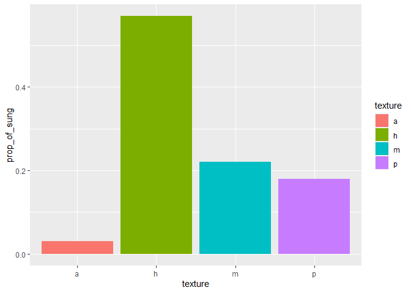

Measures Taken Formal Musical Analysis
================
Noah Zeldin
4/26/2021

  - [Introductory Remarks](#introductory-remarks)
  - [Load Packages](#load-packages)
  - [Importation](#importation)
      - [Duration](#duration)
      - [Voice Analysis](#voice-analysis)
  - [Cleaning and Manipulation: 1.
    Durations](#cleaning-and-manipulation-1.-durations)
  - [Cleaning and Manipulation: 2. Voice
    Analysis](#cleaning-and-manipulation-2.-voice-analysis)
      - [General Tibble: gen\_tib](#general-tibble-gen_tib)
          - [Additional Calculations for
            Density](#additional-calculations-for-density)
      - [Tibble for Choral Portions:
        gen\_tib\_sung](#tibble-for-choral-portions-gen_tib_sung)
      - [Tibble for Pitch: pitch\_tib](#tibble-for-pitch-pitch_tib)
  - [Stats](#stats)
      - [Durations: General](#durations-general)
          - [Total Duration in Minutes](#total-duration-in-minutes)
          - [Duration by Piece](#duration-by-piece)
          - [Duration by Category](#duration-by-category)
          - [Duration by Subcategory](#duration-by-subcategory)
      - [Meter and Tempo](#meter-and-tempo)
          - [Rates of Change](#rates-of-change)
          - [Most Common Meters](#most-common-meters)
      - [Durations: Choir](#durations-choir)
          - [Choir Total Durations](#choir-total-durations)
          - [Choir Sung Durations](#choir-sung-durations)
          - [Choir Acapella Durations](#choir-acapella-durations)
          - [Choir Spoken Durations](#choir-spoken-durations)
          - [Choir Voice Durations](#choir-voice-durations)
      - [Texture](#texture)
          - [Whole Work](#whole-work)
          - [Individual Pieces (By
            Duration)](#individual-pieces-by-duration)
      - [Pitch](#pitch)
          - [Set-Up for Pitch
            Computations](#set-up-for-pitch-computations)
          - [Pitch Distribution](#pitch-distribution)
          - [Chromaticism of Each Piece](#chromaticism-of-each-piece)
      - [Groupings](#groupings)
          - [Combinations of Groupings](#combinations-of-groupings)
          - [Separate Groupings](#separate-groupings)

# Introductory Remarks

Below is the annotated set-up for my formal analysis of Hanns Eisler’s
music to *The Measures Taken*, which is included in the second chapter
of my dissertation. This analysis was conducted in R. (I have tried to
use [tidyverse](https://www.tidyverse.org/) syntax as consistently as
possible. I therefore refer to tables as
[“tibbles”](https://tibble.tidyverse.org/).) Data sets will be made
available to researchers upon request.

**NB: Further refinements to the code are forthcoming.**

# Load Packages

``` r
library(tidyverse)
library(lubridate)
library(readxl)
```

# Importation

There are **two** separate spreadsheets:

1.  **durations** of each piece (`mt_data_durations_meters.xlsx`)

<!-- end list -->

  - also used to compute e.g. rates of meter change

<!-- end list -->

2.  much more detailed data relating specifically to the **choral
    material** (`mt_data_choir.xlsx`)

Both are necessary. The chapter begins with a structural overview of the
work but focuses on the choral material. However, some of the
calculations involved with the latter require the former.

NB: Several column types in both spreadsheets must be converted to
**factors** in a separate step because this is not an option with
`readxl()` (explained again below).

## Duration

Import all sheets into a single list and specify column types:

``` r
durations_sheets <- excel_sheets("mt_data_durations_meters.xlsx")

# comments next to "col_types" are the col. names
durations_list <- 
  lapply(durations_sheets, 
         function(x) 
           read_excel("mt_data_durations_meters.xlsx",
                      sheet = x, 
                      col_types = c("text", # piece_no
                                    "numeric", # category 
                                    "text", # subcategory
                                    "numeric", # segment
                                    "numeric", # m_start
                                    "numeric", # m_end
                                    "numeric", # no_of_mm
                                    "numeric", # meter_1
                                    "numeric", # meter_2
                                    "numeric", # meter_ch_count
                                    "numeric", # quarters_per_bar
                                    "numeric", # beats
                                    "numeric", # tempo
                                    "numeric", # tempo_ch_count
                                    "numeric") # duration 
                      ))
```

From `durations_list` create single data frame and save as tibble:

``` r
dur_tib <- as_tibble(bind_rows(durations_list))
```

## Voice Analysis

Check worksheets and ensure that there is a sheet for each piece
containing choral material:

``` r
excel_sheets("mt_data_choir.xlsx")
```

    ##  [1] "1 Vorspiel"                     "2b Lob der U.S.S.R."           
    ##  [3] "3b Sprechchor"                  "4 Lob der illegalen Arbeit"    
    ##  [5] "5 Gesang der Reiskahnschlepper" "6a (untitled)"                 
    ##  [7] "6b Lenin-Zitat (Sprechchor)"    "6c Kanon über ein Lenin-Zitat" 
    ##  [9] "7a Streiklied"                  "7b (untitled)"                 
    ## [11] "8b Song von der Ware"           "9 Ändere die Welt"             
    ## [13] "10 Lob der Partei"              "11 Rezitativ"                  
    ## [15] "12b Wir sind der Abschaum"      "13a (untitled)"                
    ## [17] "13b (untitled)"                 "14 Schlusschor"

Import all sheets into a single list and specify column types:

``` r
voice_analysis_sheets <- excel_sheets("mt_data_choir.xlsx")

voice_analysis_list <- 
  lapply(voice_analysis_sheets, 
         function(x) 
           read_excel("mt_data_choir.xlsx", 
                      sheet = x, 
                      col_types = c("text", # piece_no
                                    "numeric", # measure
                                    "text", # texture
                                    "numeric", # voices
                                    "text", # groupings
                                    "numeric", 
                                    "numeric", 
                                    "numeric", 
                                    "numeric", 
                                    "numeric", 
                                    "numeric", # soprano:ratio
                                    "numeric", 
                                    "numeric", 
                                    "numeric", 
                                    "numeric", 
                                    "numeric", 
                                    "numeric", 
                                    "numeric", 
                                    "numeric", 
                                    "numeric", # rests
                                    "numeric", 
                                    "numeric", 
                                    "numeric", 
                                    "numeric", 
                                    "numeric", 
                                    "numeric", 
                                    "numeric", 
                                    "numeric", 
                                    "numeric", # quarters
                                    "numeric", 
                                    "numeric", 
                                    "numeric", 
                                    "numeric", 
                                    "numeric", 
                                    "numeric", 
                                    "numeric", 
                                    "numeric", 
                                    "numeric", 
                                    "numeric", # notes
                                    "numeric", 
                                    "numeric", 
                                    "numeric", 
                                    "numeric", 
                                    "numeric", 
                                    "numeric", 
                                    "numeric", 
                                    "numeric", 
                                    "numeric", 
                                    "text", 
                                    "numeric", # tones
                                    "numeric", 
                                    "numeric", # spoken, acapella
                                    "numeric", 
                                    "numeric", 
                                    "numeric", 
                                    "numeric", # meter etc.
                                    "numeric", 
                                    "numeric", 
                                    "numeric", 
                                    "numeric", # general dur's
                                    "numeric", 
                                    "numeric", 
                                    "numeric", 
                                    "numeric", 
                                    "numeric", 
                                    "numeric", 
                                    "numeric",
                                    "numeric" # dur's of voices
                                    )
                      ))
```

From `voice_analysis_list` create single data frame and save as tibble:

``` r
gen_tib <- as_tibble(bind_rows(voice_analysis_list))
```

# Cleaning and Manipulation: 1. Durations

Convert **piece\_no**, **category** and **subcategory** to factors (not
possible with `readxl()`):

``` r
dur_tib <- dur_tib %>% 
    mutate(piece_no = as_factor(piece_no)) %>% 
    mutate(category = as_factor(category)) %>% 
    mutate(subcategory = as_factor(subcategory))
```

Re-level subcategories and ensure proper order:

``` r
dur_tib$subcategory <- dur_tib$subcategory %>% 
    fct_relevel("1b", after = 1) %>% 
    fct_relevel("2b", after = 2) %>% 
    fct_relevel("3b", after = 4) %>% 
    fct_relevel("3c", after = 5)

dur_tib$subcategory %>% 
    fct_count()
```

    ## # A tibble: 10 x 2
    ##    f         n
    ##    <fct> <int>
    ##  1 1a       58
    ##  2 1b        9
    ##  3 2b        5
    ##  4 3a        4
    ##  5 3b       18
    ##  6 3c        8
    ##  7 4a       16
    ##  8 4b        1
    ##  9 4c        1
    ## 10 4d        4

# Cleaning and Manipulation: 2. Voice Analysis

## General Tibble: gen\_tib

Convert **piece\_no** to factor (not possible with `readxl()`):

``` r
gen_tib <- gen_tib %>% 
    mutate(piece_no = as_factor(piece_no))
```

Since 6c now follows 7a, must re-level (and then double check):

``` r
gen_tib$piece_no <- gen_tib$piece_no %>% 
    fct_relevel("6c", after = 7)

gen_tib$piece_no %>% 
    fct_count()
```

    ## # A tibble: 18 x 2
    ##    f         n
    ##    <fct> <int>
    ##  1 1       118
    ##  2 2b       49
    ##  3 3b       26
    ##  4 4        72
    ##  5 5       205
    ##  6 6a        3
    ##  7 6b        9
    ##  8 6c       16
    ##  9 7a       72
    ## 10 7b        2
    ## 11 8b      184
    ## 12 9        52
    ## 13 10       70
    ## 14 11       29
    ## 15 12b      57
    ## 16 13a       4
    ## 17 13b      17
    ## 18 14       96

Group by piece:

``` r
by_piece <- gen_tib %>% group_by(piece_no)
```

Add **rowid** column and as new first column (“id”):

``` r
gen_tib <- gen_tib %>% 
    rowid_to_column("id")
```

### Additional Calculations for Density

**NB: This section will in all likelihood be deleted, since it
ultimately was not included in the final analysis.** The goal was to
find a formula that would allow for a quantitative comparison of the
informational density of the choral material in each measure.

Translate texture to numeric value in new column:

  - monophony = 1

  - homophony = 1.5

  - antiphony = 1.5

  - polyphony = 2

<!-- end list -->

``` r
gen_tib <- gen_tib %>% 
    mutate(texture_value = case_when(texture == "na" ~ "0", 
                                   texture == "m" ~ "1", 
                                   texture == "h" ~ "1.5", 
                                   texture == "a" ~ "1.5", # added 12.26.20
                                   texture == "p" ~ "2",)) %>% 
    mutate(texture_value = as.numeric(texture_value)) %>% 
    relocate(texture_value, .after = texture)
```

Add density column for each voice:

``` r
gen_tib <- gen_tib %>% 
    mutate(dm_s1 = (notes_s1+tones_s1)/quarters_per_bar,
                      dm_s2 = (notes_s2+tones_s2)/quarters_per_bar,
                      dm_a1 = (notes_a1+tones_a1)/quarters_per_bar,
                      dm_a2 = (notes_a2+tones_a2)/quarters_per_bar,
                      dm_t1 = (notes_t1+tones_t1)/quarters_per_bar,
                      dm_t2 = (notes_t2+tones_t2)/quarters_per_bar,
                      dm_b1 = (notes_b1+tones_b1)/quarters_per_bar,
                      dm_b2 = (notes_b2+tones_b2)/quarters_per_bar)
```

Create a **dm\_sum** column from 8 individual **dm** columns:

``` r
gen_tib <- gen_tib %>% 
    rowwise() %>% 
    mutate(dm_sum = sum(c_across(dm_s1:dm_b2)))
```

With new **dm\_sum** column, create **dmc** column:

``` r
gen_tib <- gen_tib %>% 
    rowwise() %>% 
    mutate(dmc = (dm_sum/4)*texture_value)
```

Reconvert gen\_tib to tibble after performing `rowwise()`:

``` r
gen_tib <- gen_tib %>% as_tibble()
```

## Tibble for Choral Portions: gen\_tib\_sung

Filter out parts without choral singing (includes passages *spoken* by
choir):

``` r
gen_tib_sung <- gen_tib %>% 
    filter(texture != "na" & 
               parts_active > 0 & 
               spoken == 0) 
```

## Tibble for Pitch: pitch\_tib

Create tibble containing data on choir’s pitch material in each measure:

``` r
pitch_tib <- gen_tib_sung %>% 
    select(id, piece_no, measure, tones, dur_choir, dmc) %>%
    relocate(tones, .after = dmc) %>% 
    mutate(
        c = str_count(tones, "c$|c\\,"),
        c_sharp_d_flat = str_count(tones, "c-sharp|d-flat"),
        d = str_count(tones, "d$|d\\,"),
        d_sharp_e_flat = str_count(tones, "d-sharp|e-flat"),
        e = str_count(tones, "e$|e\\,"),
        f = str_count(tones, "f$|f\\,"),
        f_sharp_g_flat = str_count(tones, "f-sharp|g-flat"),
        g = str_count(tones, "g$|g\\,"),
        g_sharp_a_flat = str_count(tones, "g-sharp|a-flat"),
        a = str_count(tones, "a$|a\\,"),
        a_sharp_b_flat = str_count(tones, "a-sharp|b-flat"),
        b = str_count(tones, "b$|b\\,"),    
                ) %>% 
    rowwise %>% 
    mutate(tones_sum = sum(c_across(c:b))) 
```

# Stats

This section contains calculations derived from the tibbles generated
and cleaned in the previous sections. These calculations formed the
basis of my formal analysis and some of the values were used in the
write-up included in the chapter.

## Durations: General

The following calculations derive from the data set:
`mt_data_durations_meters.xlsx` (post-importation and -processing:
`dur_tib`).

### Total Duration in Minutes

``` r
dur_total_min <- sum(dur_tib$duration) / 60
```

Total duration in minutes: 38.58.

### Duration by Piece

Create tibble with durations for all pieces:

``` r
dur_piece <- dur_tib %>% 
    group_by(piece_no) %>%
    summarize(duration_min = (sum(duration) / 60)) %>% 
    mutate(prop_of_dur = (duration_min/sum(duration_min)),
           duration_min = round(duration_min, digits = 2),
           prop_of_dur = round(prop_of_dur, digits = 3))

knitr::kable(dur_piece)
```

| piece\_no | duration\_min | prop\_of\_dur |
| :-------- | ------------: | ------------: |
| 1         |          4.91 |         0.127 |
| 2b        |          2.07 |         0.054 |
| 3a        |          3.83 |         0.099 |
| 3b        |          0.49 |         0.013 |
| 4         |          4.12 |         0.107 |
| 5         |          3.92 |         0.102 |
| 6a        |          0.06 |         0.002 |
| 6b        |          0.13 |         0.003 |
| 6c        |          0.24 |         0.006 |
| 7a        |          1.62 |         0.042 |
| 7b        |          0.04 |         0.001 |
| 8a        |          2.32 |         0.060 |
| 8b        |          3.12 |         0.081 |
| 9         |          4.82 |         0.125 |
| 10        |          1.96 |         0.051 |
| 11        |          0.60 |         0.016 |
| 12a       |          0.47 |         0.012 |
| 12b       |          0.90 |         0.023 |
| 13a       |          0.10 |         0.003 |
| 13b       |          0.47 |         0.012 |
| 14        |          2.37 |         0.061 |

Resort to find longest pieces:

``` r
dur_piece %>% 
  arrange(desc(duration_min)) %>% 
  mutate(perc_of_dur = prop_of_dur*100) %>% 
  select(-prop_of_dur) %>% 
  knitr::kable()
```

| piece\_no | duration\_min | perc\_of\_dur |
| :-------- | ------------: | ------------: |
| 1         |          4.91 |          12.7 |
| 9         |          4.82 |          12.5 |
| 4         |          4.12 |          10.7 |
| 5         |          3.92 |          10.2 |
| 3a        |          3.83 |           9.9 |
| 8b        |          3.12 |           8.1 |
| 14        |          2.37 |           6.1 |
| 8a        |          2.32 |           6.0 |
| 2b        |          2.07 |           5.4 |
| 10        |          1.96 |           5.1 |
| 7a        |          1.62 |           4.2 |
| 12b       |          0.90 |           2.3 |
| 11        |          0.60 |           1.6 |
| 3b        |          0.49 |           1.3 |
| 12a       |          0.47 |           1.2 |
| 13b       |          0.47 |           1.2 |
| 6c        |          0.24 |           0.6 |
| 6b        |          0.13 |           0.3 |
| 13a       |          0.10 |           0.3 |
| 6a        |          0.06 |           0.2 |
| 7b        |          0.04 |           0.1 |

##### In Lubridate Format (properly displaying seconds)

Create new table with Lubridate that expresses min. and sec. properly
(`dur_piece_lubridate`):

``` r
# The code here is not very elegant and must be split up into multiple steps.

# create foundational dataframe
dur_piece_lubridate <- dur_piece %>%
    as.data.frame() %>% 
    select(-prop_of_dur)

# create dummy vector for partial min. that retains trailing zeros
x <- sub("^[^.]*[.]", "", 
         format(dur_piece_lubridate$duration_min, 
                width = max(nchar(dur_piece_lubridate$duration_min))))

# split min col and prep for conversion to Lubridate format
dur_piece_lubridate <- dur_piece_lubridate %>% 
    mutate(sec = x) %>% 
    mutate(min = str_split(duration_min, "\\.", simplify = FALSE, n = 2), 
           .keep = "unused", .before = "sec") %>% 
    unnest_wider(min) %>% 
    rename(min = "...1") %>% 
    select(-"...2") %>% 
    mutate(min = as.numeric(min), 
             sec = as.numeric(sec)) %>%
    mutate(sec = round(sec * .6)) %>%
    mutate(duration = (minutes(min) + seconds(sec)), .keep = "unused") %>%
    relocate(duration, .after = piece_no)

# delete dummy vector
rm(x)

dur_piece_lubridate %>% knitr::kable()
```

| piece\_no | duration |
| :-------- | -------: |
| 1         |   4M 55S |
| 2b        |    2M 4S |
| 3a        |   3M 50S |
| 3b        |      29S |
| 4         |    4M 7S |
| 5         |   3M 55S |
| 6a        |       4S |
| 6b        |       8S |
| 6c        |      14S |
| 7a        |   1M 37S |
| 7b        |       2S |
| 8a        |   2M 19S |
| 8b        |    3M 7S |
| 9         |   4M 49S |
| 10        |   1M 58S |
| 11        |      36S |
| 12a       |      28S |
| 12b       |      54S |
| 13a       |       6S |
| 13b       |      28S |
| 14        |   2M 22S |

### Duration by Category

I assigned one of four categories to each of the pieces. These are:

1.  choir with orchestra

2.  spoken dialogue with orchestra

3.  pieces featuring solo tenor

4.  choir acapella or choir with snare drum

<!-- end list -->

``` r
dur_tib %>% 
  group_by(category) %>%
  summarize(duration = sum(duration)) %>% 
  mutate(perc_of_dur = round((duration/sum(duration))*100, digits = 2)) %>% 
  knitr::kable()
```

| category |   duration | perc\_of\_dur |
| :------- | ---------: | ------------: |
| 1        | 1402.96453 |         60.62 |
| 2        |   28.18182 |          1.22 |
| 3        |  791.31549 |         34.19 |
| 4        |   92.04448 |          3.98 |

### Duration by Subcategory

Each of the four categories was then subdivided, resulting in a total of
ten different subcategories of music. (All of this is laid out in
**table 2.1. The Structure of *The Measures Taken*** in ch. 2 of the
dissertation.)

``` r
dur_subcategory <- dur_tib %>% 
    group_by(subcategory) %>%
    summarize(duration = sum(duration)) %>% 
    mutate(duration_min = (duration/60)) %>% 
    mutate(prop_of_dur = (duration/sum(duration)))

knitr::kable(dur_subcategory)
```

| subcategory |   duration | duration\_min | prop\_of\_dur |
| :---------- | ---------: | ------------: | ------------: |
| 1a          | 1305.46453 |    21.7577421 |     0.5640358 |
| 1b          |   97.50000 |     1.6250000 |     0.0421256 |
| 2b          |   28.18182 |     0.4696970 |     0.0121762 |
| 3a          |  230.00000 |     3.8333333 |     0.0993732 |
| 3b          |  235.23697 |     3.9206162 |     0.1016359 |
| 3c          |  326.07852 |     5.4346419 |     0.1408847 |
| 4a          |   37.22431 |     0.6204052 |     0.0160830 |
| 4b          |    3.60000 |     0.0600000 |     0.0015554 |
| 4c          |   14.54545 |     0.2424242 |     0.0062845 |
| 4d          |   36.67471 |     0.6112452 |     0.0158456 |

<!-- arranged descending -->

<!-- ```{r} -->

<!-- dur_subcategory %>%  -->

<!--     arrange(desc(prop_of_dur)) -->

<!-- ``` -->

<!-- Exactly what I expected:    -->

<!-- * largest proportion = 1a. mixed choir with orchestra -->

<!-- * followed by 3. tenor solo with accompaniment -->

<!-- * then 1b. = male choir with orchestra -->

<!-- ** actually, only one piece = Streiklied -->

## Meter and Tempo

An important feature of Eisler’s music for *The Measures Taken* are the
frequent meter changes. These, along with the frequent tempo changes in
a handful of pieces, demonstrate the necessity of a professional
conductor. (The reliance of the non-professional workers’ choir on an
array of professional musicians is an important part of my argument in
the dissertation, as it contradicts much of the previous, text-oriented
scholarship on the work by Brecht scholars.)

### Rates of Change

Construct tibble with following stats for each piece:

  - duration

  - number of meter changes

  - rate of meter changes in seconds = duration / number of meter
    changes

  - rate of meter changes in bars

  - number of tempo changes

  - rate of tempo changes in seconds = duration / number of meter
    changes

  - rate of tempo changes in bars

<!-- end list -->

``` r
dur_meter_tempo_piece <- dur_tib %>% 
    group_by(piece_no) %>% 
    summarize(meter_ch_count = sum(meter_ch_count),
              tempo_ch_count = sum(tempo_ch_count),
              duration = sum(duration)) %>% 
    mutate(meter_ch_rate_sec = round(duration / meter_ch_count, 
                                     digits = 2),
           tempo_ch_rate_sec = round(duration / tempo_ch_count, 
                                     digits = 2),
           duration = round(duration, digits = 2)) %>% 
    relocate(meter_ch_rate_sec, .after = meter_ch_count) %>% 
    relocate(tempo_ch_rate_sec, .after = tempo_ch_count)

knitr::kable(dur_meter_tempo_piece)
```

| piece\_no | meter\_ch\_count | meter\_ch\_rate\_sec | tempo\_ch\_count | tempo\_ch\_rate\_sec | duration |
| :-------- | ---------------: | -------------------: | ---------------: | -------------------: | -------: |
| 1         |                9 |                32.76 |                1 |               294.86 |   294.86 |
| 2b        |                9 |                13.82 |                1 |               124.35 |   124.35 |
| 3a        |                1 |               230.00 |                4 |                57.50 |   230.00 |
| 3b        |               12 |                 2.47 |                1 |                29.61 |    29.61 |
| 4         |               18 |                13.73 |                1 |               247.22 |   247.22 |
| 5         |                7 |                33.61 |                9 |                26.14 |   235.24 |
| 6a        |                1 |                 3.60 |                1 |                 3.60 |     3.60 |
| 6b        |                4 |                 1.90 |                1 |                 7.62 |     7.62 |
| 6c        |                1 |                14.55 |                1 |                14.55 |    14.55 |
| 7a        |                3 |                32.50 |                1 |                97.50 |    97.50 |
| 7b        |                1 |                 2.40 |                1 |                 2.40 |     2.40 |
| 8a        |                1 |               138.95 |                1 |               138.95 |   138.95 |
| 8b        |                1 |               187.13 |                7 |                26.73 |   187.13 |
| 9         |                8 |                36.14 |                1 |               289.09 |   289.09 |
| 10        |                5 |                23.48 |                1 |               117.38 |   117.38 |
| 11        |                2 |                18.00 |                1 |                36.00 |    36.00 |
| 12a       |                5 |                 5.64 |                1 |                28.18 |    28.18 |
| 12b       |                1 |                54.29 |                1 |                54.29 |    54.29 |
| 13a       |                1 |                 5.85 |                1 |                 5.85 |     5.85 |
| 13b       |                2 |                14.21 |                1 |                28.42 |    28.42 |
| 14        |                5 |                28.46 |                1 |               142.29 |   142.29 |

<!-- sorted by **meter_ch_count**   -->

<!-- ```{r} -->

<!-- dur_meter_tempo_piece %>%  -->

<!--     arrange(desc(meter_ch_count)) %>%  -->

<!--     select(-tempo_ch_count, -tempo_ch_rate_sec) -->

<!-- ``` -->

5 pieces with greatest number of meter changes:

``` r
meter_ch_count_piece_top_5 <- dur_meter_tempo_piece %>% 
    arrange(desc(meter_ch_count)) %>% 
    select(-tempo_ch_count, -tempo_ch_rate_sec) %>% 
    slice(1:5)

knitr::kable(meter_ch_count_piece_top_5)
```

| piece\_no | meter\_ch\_count | meter\_ch\_rate\_sec | duration |
| :-------- | ---------------: | -------------------: | -------: |
| 4         |               18 |                13.73 |   247.22 |
| 3b        |               12 |                 2.47 |    29.61 |
| 1         |                9 |                32.76 |   294.86 |
| 2b        |                9 |                13.82 |   124.35 |
| 9         |                8 |                36.14 |   289.09 |

<!-- sorted by **meter_ch_rate_sec** ASCENDING   -->

<!-- ```{r} -->

<!-- dur_meter_tempo_piece %>%  -->

<!--     filter(meter_ch_count != 1) %>%  -->

<!--     select(-tempo_ch_count, -tempo_ch_rate_sec) %>%  -->

<!--     arrange(meter_ch_rate_sec) -->

<!-- ``` -->

5 pieces with fastest rates of meter change:

``` r
meter_ch_rate_piece_top_5 <- dur_meter_tempo_piece %>% 
    filter(meter_ch_count != 1) %>% 
    select(-tempo_ch_count, -tempo_ch_rate_sec) %>% 
    arrange(meter_ch_rate_sec) %>% 
    slice(1:5)

knitr::kable(meter_ch_rate_piece_top_5)
```

| piece\_no | meter\_ch\_count | meter\_ch\_rate\_sec | duration |
| :-------- | ---------------: | -------------------: | -------: |
| 6b        |                4 |                 1.90 |     7.62 |
| 3b        |               12 |                 2.47 |    29.61 |
| 12a       |                5 |                 5.64 |    28.18 |
| 4         |               18 |                13.73 |   247.22 |
| 2b        |                9 |                13.82 |   124.35 |

<!-- sorted by **tempo_ch_count**   -->

<!-- ```{r} -->

<!-- dur_meter_tempo_piece %>%   -->

<!--     select(-meter_ch_count, -meter_ch_rate_sec) %>%  -->

<!--     arrange(desc(tempo_ch_count)) -->

<!-- ``` -->

3 pieces with greatest number of tempo changes:

``` r
tempo_ch_count_and_rate_piece <- dur_meter_tempo_piece %>% 
    filter(tempo_ch_count != 1) %>% 
    select(-meter_ch_count, -meter_ch_rate_sec) %>% 
    arrange(tempo_ch_rate_sec)

knitr::kable(tempo_ch_count_and_rate_piece)
```

| piece\_no | tempo\_ch\_count | tempo\_ch\_rate\_sec | duration |
| :-------- | ---------------: | -------------------: | -------: |
| 5         |                9 |                26.14 |   235.24 |
| 8b        |                7 |                26.73 |   187.13 |
| 3a        |                4 |                57.50 |   230.00 |

### Most Common Meters

Create tibble with meter, number of meters and duration (`dur_meter`):

``` r
dur_meter <- dur_tib %>% 
    unite(meter_1, meter_2, col = "meter", sep = "_") %>% 
    select(piece_no, no_of_mm, meter, duration) %>% 
    relocate(meter, .after = piece_no) %>% 
    filter(meter != "0_0") # remove the pick-up from piece_no 10
```

Most common meters by number of measures:

``` r
dur_meter %>% 
  group_by(meter) %>% 
  count(no_of_mm) %>% 
  mutate(no_of_mm = no_of_mm * n) %>% 
  select(-n) %>% 
  summarize(no_of_mm = sum(no_of_mm)) %>% 
  arrange(desc(no_of_mm)) %>% 
  knitr::kable()
```

| meter | no\_of\_mm |
| :---- | ---------: |
| 2\_4  |        568 |
| 3\_4  |        235 |
| 3\_2  |        198 |
| 2\_2  |        187 |
| 6\_4  |         45 |
| 4\_2  |         40 |
| 4\_4  |         20 |
| 1\_4  |          5 |

Most common meters by duration:

``` r
dur_meter %>% 
  group_by(meter) %>% 
  summarize(duration = sum(duration)) %>% 
  mutate(duration = round(duration, digits = 2)) %>% 
  arrange(desc(duration)) %>% 
  knitr::kable()
```

| meter | duration |
| :---- | -------: |
| 2\_4  |   634.95 |
| 3\_2  |   624.38 |
| 3\_4  |   466.72 |
| 2\_2  |   227.73 |
| 4\_2  |   203.23 |
| 6\_4  |   112.08 |
| 4\_4  |    41.87 |
| 1\_4  |     3.17 |

#### Grouped by Duple vs. Triple

Exploring the proportion of duple vs. triple meters allows one to
determine Eisler’s engagement with march-like anthems (duple meters) and
subversion thereof (triple meters). In short, while the music to *The
Measures Taken* is undoubtedly highly political, Eisler, in his typical
manner, used musical materials in a critical fashion, rather than
composing straightforward anthems.

``` r
dur_meter_groups <- dur_meter %>% 
    group_by(meter) %>% 
    summarize(duration = sum(duration)) %>% 
    separate(meter, sep = "_", into = c("meter_1", "meter_2")) %>% 
    mutate(meter_1 = as.factor(meter_1))

dur_meter_groups$meter_1 <- dur_meter_groups$meter_1 %>% 
    fct_relabel(~ c("other", "duple", "triple", "duple", "duple"))

dur_meter_groups <- dur_meter_groups %>% 
    select(-meter_2) %>% 
    rename(group = meter_1) %>% 
    group_by(group) %>% 
    summarize(duration = sum(duration)) %>% 
    mutate(prop_dur = duration / sum(duration),
           perc_dur = round(prop_dur*100))

knitr::kable(dur_meter_groups)
```

| group  |    duration | prop\_dur | perc\_dur |
| :----- | ----------: | --------: | --------: |
| other  |    3.166667 | 0.0013684 |         0 |
| duple  | 1219.870389 | 0.5271397 |        53 |
| triple | 1091.094253 | 0.4714919 |        47 |

#### Special Case: 6/4

6/4 is compound duple and therefore a special case. NB: 6/4 is the only
compound duple meter present in the work.

Check which measures are in 6/4:

``` r
gen_tib %>% 
  filter(meter_1 == 6, meter_2 == 4) %>% 
  select(id:measure) %>% 
  knitr::kable()
```

|  id | piece\_no | measure |
| --: | :-------- | ------: |
| 196 | 4         |       3 |
| 206 | 4         |      13 |
| 207 | 4         |      14 |
| 209 | 4         |      16 |
| 221 | 4         |      28 |
| 222 | 4         |      29 |
| 223 | 4         |      30 |
| 224 | 4         |      31 |
| 225 | 4         |      32 |
| 226 | 4         |      33 |
| 809 | 10        |       0 |
| 810 | 10        |       1 |
| 811 | 10        |       2 |
| 812 | 10        |       3 |
| 813 | 10        |       4 |
| 814 | 10        |       5 |
| 815 | 10        |       6 |
| 816 | 10        |       7 |
| 817 | 10        |       8 |
| 818 | 10        |       9 |
| 819 | 10        |      10 |
| 820 | 10        |      11 |
| 821 | 10        |      12 |
| 822 | 10        |      13 |
| 823 | 10        |      14 |
| 824 | 10        |      15 |
| 825 | 10        |      16 |
| 826 | 10        |      17 |
| 827 | 10        |      18 |
| 843 | 10        |      34 |
| 844 | 10        |      35 |
| 845 | 10        |      36 |
| 846 | 10        |      37 |
| 847 | 10        |      38 |
| 848 | 10        |      39 |
| 849 | 10        |      40 |
| 850 | 10        |      41 |
| 851 | 10        |      42 |
| 852 | 10        |      43 |
| 853 | 10        |      44 |
| 854 | 10        |      45 |
| 855 | 10        |      46 |
| 856 | 10        |      47 |
| 857 | 10        |      48 |
| 858 | 10        |      49 |
| 878 | 10        |      69 |

Compute percent of duration that is 6/4:

``` r
dur_6_4_perc <- round((dur_meter %>% 
    filter(meter == "6_4") %>% 
    select(duration) %>% 
    sum() / 
  dur_meter_groups %>% 
    select(duration) %>% 
    sum()) * 100, digits = 1)
```

4.8 % of the work is in 6/4.

Compute percent of duration of duple that is 6/4:

``` r
dur_6_4_duple_perc <- round((dur_meter %>% 
    filter(meter == "6_4") %>% 
    select(duration) %>% 
    sum() / 
  dur_meter_groups %>% 
    filter(group == "duple") %>% 
    select(duration) %>% 
    sum()) * 100, digits = 1)
```

9.2 % of measures with duple meters are in 6/4.

<!-- ```{r} -->

<!-- # duration of duple meters -->

<!-- dur_meter_groups %>%  -->

<!--   filter(group == "duple") %>%  -->

<!--   select(duration) - -->

<!--   # subtract duration of 6/4 measures -->

<!--   dur_meter %>%  -->

<!--     filter(meter == "6_4") %>%  -->

<!--     select(duration) %>%  -->

<!--     sum() -  -->

<!--   # subtract duration of triple meters -->

<!--   dur_meter_groups %>%  -->

<!--   filter(group == "triple") %>%  -->

<!--   select(duration) -->

<!-- ``` -->

<!-- Almost even. -->

## Durations: Choir

This section is very significant to my analysis, which focuses on the
choral material. The calculations here determine the proportions of
choral material that are sung (with and without instrumental
accompaniment) or spoken.

The following calculations derive from the data set:
`mt_data_choir.xlsx` (post-importation and -processing: `dur_choir`).

### Choir Total Durations

Create tibble containing only measures with choir:

``` r
choir_tib <- gen_tib %>% 
    filter(dur_choir != 0)
```

Total duration of choir:

``` r
# in seconds
dur_choir_total_sec <- sum(choir_tib$dur_choir)

# in minutes
dur_choir_total_min <- sum(choir_tib$dur_choir) / 60
```

The choir is active for 20.03 minutes.

Duration of choir as proportion of total duration:

``` r
dur_choir_prop <- round((dur_choir_total_min / dur_total_min), digits = 4)*100
```

The choir is active for 51.94 % of total duration of music.

### Choir Sung Durations

Create table listing the pieces with the greatest durations of **sung**
choral material:

``` r
gen_tib %>% 
    filter(dur_choir != 0 & spoken == 0) %>% 
    group_by(piece_no) %>% 
    select(piece_no, dur_choir) %>% 
    summarize(dur_choir = sum(dur_choir)) %>% 
    mutate(dur_choir_prop = dur_choir / sum(dur_choir)) %>% 
    mutate(dur_choir = round(dur_choir, digits = 2), 
           dur_choir_prop = round(dur_choir_prop, digits = 3)) %>% 
    arrange(desc(dur_choir_prop)) %>% 
    knitr::kable()
```

| piece\_no | dur\_choir | dur\_choir\_prop |
| :-------- | ---------: | ---------------: |
| 9         |     210.00 |            0.192 |
| 1         |     169.71 |            0.155 |
| 4         |     134.44 |            0.123 |
| 5         |     124.31 |            0.114 |
| 2b        |     111.30 |            0.102 |
| 10        |      88.12 |            0.081 |
| 14        |      80.29 |            0.073 |
| 7a        |      51.50 |            0.047 |
| 12b       |      48.10 |            0.044 |
| 13b       |      26.45 |            0.024 |
| 11        |      19.00 |            0.017 |
| 6c        |      14.09 |            0.013 |
| 8b        |      10.57 |            0.010 |
| 13a       |       4.76 |            0.004 |

### Choir Acapella Durations

Create list of pieces with **acapella** choral material (saved as
`dur_acapella`):

``` r
dur_acapella <- gen_tib %>% 
    filter(acapella == 1) %>% 
    group_by(piece_no) %>% 
    select(piece_no, dur_choir) %>% 
    summarize(dur_choir = sum(dur_choir)) %>% 
    mutate(dur_choir_prop = dur_choir / sum(dur_choir),
           dur_choir = round(dur_choir, digits = 2),
           dur_choir_prop = round(dur_choir_prop, digits = 3)) 

knitr::kable(dur_acapella)
```

| piece\_no | dur\_choir | dur\_choir\_prop |
| :-------- | ---------: | ---------------: |
| 2b        |      46.96 |            0.316 |
| 6c        |      14.09 |            0.095 |
| 9         |      34.55 |            0.232 |
| 11        |      19.00 |            0.128 |
| 12b       |       2.86 |            0.019 |
| 13a       |       4.76 |            0.032 |
| 13b       |      26.45 |            0.178 |

Arrange `dur_acapella` by duration (descending) to see top pieces:

``` r
dur_acapella %>% 
  arrange(desc(dur_choir_prop)) %>% 
  mutate(dur_choir_perc = dur_choir_prop*100, .keep = "unused") %>% 
  knitr::kable()
```

| piece\_no | dur\_choir | dur\_choir\_perc |
| :-------- | ---------: | ---------------: |
| 2b        |      46.96 |             31.6 |
| 9         |      34.55 |             23.2 |
| 13b       |      26.45 |             17.8 |
| 11        |      19.00 |             12.8 |
| 6c        |      14.09 |              9.5 |
| 13a       |       4.76 |              3.2 |
| 12b       |       2.86 |              1.9 |

Proportion of `dur_chor` that is acapella:

``` r
sum(dur_acapella$dur_choir) / dur_choir_total_sec
```

    ## [1] 0.1236756

### Choir Spoken Durations

Create list of works with greatest durations of **spoken** choral
material:

``` r
gen_tib %>% 
  filter(spoken == 1) %>% 
  group_by(piece_no) %>% 
  select(piece_no, dur_choir) %>% 
  summarize(dur_choir = sum(dur_choir)) %>% 
  mutate(dur_choir_prop = dur_choir / sum(dur_choir),
         dur_choir = round(dur_choir, digits = 2),
         dur_choir_prop = round(dur_choir_prop, digits = 3)) %>% 
  arrange(desc(dur_choir_prop)) %>% 
  knitr::kable()
```

| piece\_no | dur\_choir | dur\_choir\_prop |
| :-------- | ---------: | ---------------: |
| 14        |      28.00 |            0.256 |
| 3b        |      24.87 |            0.227 |
| 4         |      18.33 |            0.168 |
| 9         |      12.73 |            0.116 |
| 11        |       9.50 |            0.087 |
| 6b        |       7.62 |            0.070 |
| 6a        |       3.60 |            0.033 |
| 10        |       3.00 |            0.027 |
| 7b        |       1.80 |            0.016 |

### Choir Voice Durations

#### Check for measures where duration of 1st and 2nd parts don’t align.

NB: As is typical for choral music, Eisler sometimes splits the part of
one or more of the four voices. The calculations below account for this.

1.  Sopranos

<!-- end list -->

``` r
gen_tib_sung %>% 
  filter(quarters_s1 != 0 & quarters_s2 != 0 & quarters_s1 != quarters_s2) %>% 
  nrow()
```

    ## [1] 0

2.  Altos

<!-- end list -->

``` r
gen_tib_sung %>% 
  filter(quarters_a1 != 0 & quarters_a2 != 0 & quarters_a1 != quarters_a2) %>% 
  nrow()
```

    ## [1] 0

3.  Tenors

<!-- end list -->

``` r
gen_tib_sung %>% 
  filter(quarters_t1 != 0 & quarters_t2 != 0 & quarters_t1 != quarters_t2) %>% 
  select(piece_no, measure, dur_t1, dur_t2)
```

    ## # A tibble: 3 x 4
    ##   piece_no measure dur_t1 dur_t2
    ##   <fct>      <dbl>  <dbl>  <dbl>
    ## 1 10             6  0.375   2.25
    ## 2 10            10  0.375   2.25
    ## 3 10            14  0.375   2.25

  - Only the antiphonic passage at beginning of “Lob der Partei.” This
    doesn’t impact any of the calculations, because even though t1 and
    t2 are split, they overlap.

<!-- end list -->

4.  Basses

<!-- end list -->

``` r
gen_tib_sung %>% 
  filter(quarters_b1 != 0 & quarters_b2 != 0 & quarters_b1 != quarters_b2) %>% 
  select(piece_no, measure, dur_b1, dur_b2)
```

    ## # A tibble: 1 x 4
    ##   piece_no measure dur_b1 dur_b2
    ##   <fct>      <dbl>  <dbl>  <dbl>
    ## 1 7a            64   0.75   0.25

  - Only the final measure of “Streiklied.” As is the case with the
    tenors, this doesn’t matter, because b1 and b2 overlap.

#### Check for measures where 2nd sings but 1st doesn’t

NB: Similar goal as in previous section.

1.  Sopranos

<!-- end list -->

``` r
gen_tib_sung %>% 
  filter(quarters_s1 == 0 & quarters_s2 != 0) %>% 
  nrow()
```

    ## [1] 0

2.  Altos

<!-- end list -->

``` r
gen_tib_sung %>% 
  filter(quarters_a1 == 0 & quarters_a2 != 0) %>% 
  nrow()
```

    ## [1] 0

3.  Tenors

<!-- end list -->

``` r
gen_tib_sung %>% 
  filter(quarters_t1 == 0 & quarters_t2 != 0) %>% 
  select(piece_no, measure, dur_t1, dur_t2)
```

    ## # A tibble: 5 x 4
    ##   piece_no measure dur_t1 dur_t2
    ##   <fct>      <dbl>  <dbl>  <dbl>
    ## 1 10             5      0   2.25
    ## 2 10             9      0   2.25
    ## 3 10            13      0   2.25
    ## 4 10            17      0   2.25
    ## 5 10            18      0   2.25

  - Only the beginning of “Lob der Partei,” as expected. Save as extra
    duration to add to male proportion (`dur_t2_extra`).

<!-- end list -->

``` r
dur_t2_extra <- gen_tib_sung %>% 
  filter(quarters_t1 == 0 & quarters_t2 != 0) %>%
  select(dur_t2) %>% 
  sum()
```

4.  Basses

<!-- end list -->

``` r
gen_tib_sung %>% 
  filter(quarters_b1 == 0 & quarters_b2 != 0) %>% 
  nrow()
```

    ## [1] 0

##### Same but with duration

1.  Sopranos

<!-- end list -->

``` r
gen_tib_sung %>% 
  filter(dur_s1 != 0 & dur_s2 != 0 & dur_s1 != dur_s2) %>% 
  nrow()
```

    ## [1] 0

2.  Altos

<!-- end list -->

``` r
gen_tib_sung %>% 
  filter(dur_a1 != 0 & dur_a2 != 0 & dur_a1 != dur_a2) %>% 
  nrow()
```

    ## [1] 0

3.  Tenors

<!-- end list -->

``` r
gen_tib_sung %>% 
    filter(dur_t1 != 0 & dur_t2 != 0 & dur_t1 != dur_t2) %>% 
    select(piece_no, measure, dur_t1, dur_t2) 
```

    ## # A tibble: 3 x 4
    ##   piece_no measure dur_t1 dur_t2
    ##   <fct>      <dbl>  <dbl>  <dbl>
    ## 1 10             6  0.375   2.25
    ## 2 10            10  0.375   2.25
    ## 3 10            14  0.375   2.25

  - This doesn’t matter because there is overlap.

<!-- end list -->

4.  Basses

<!-- end list -->

``` r
gen_tib_sung %>% 
    filter(dur_b1 != 0 & dur_b2 != 0 & dur_b1 != dur_b2) %>% 
    select(piece_no, measure, dur_b1, dur_b2)
```

    ## # A tibble: 1 x 4
    ##   piece_no measure dur_b1 dur_b2
    ##   <fct>      <dbl>  <dbl>  <dbl>
    ## 1 7a            64   0.75   0.25

  - Again, this doesn’t matter because of the overlap.

#### Computations for male vs. female

The introduction of mixed choirs into the German worker-singers’
movement was a widely discussed and highly politicized topic in the
Weimar Republic. I address this point briefly in ch. 2.

These following calculations determine the extent to which Eisler used
women’s voices in comparison to men’s voices.

Generate sums of sung material for each voice:

``` r
# soprano
dur_s1_sung <- gen_tib_sung %>% 
    select(dur_s1) %>% 
    sum()

# alto
dur_a1_sung <- gen_tib_sung %>% 
    select(dur_a1) %>% 
    sum()

# tenor
dur_t1_sung <- gen_tib_sung %>% 
    select(dur_t1) %>% 
    sum()

# bass
dur_b1_sung <- gen_tib_sung %>% 
    select(dur_b1) %>% 
    sum()

# total (plus extra from tenor 2 - see above)
dur_sung_total <- dur_s1_sung + dur_a1_sung + dur_t1_sung + dur_b1_sung + 
  dur_t2_extra

# total of women's voices (soprano + alto)
dur_women_sung <- dur_s1_sung + dur_a1_sung

# total of men's voices (tenor + bass)
dur_men_sung <- dur_t1_sung + dur_b1_sung + dur_t2_extra
```

Calculate proportions of male and female durations and save for further
calculations:

``` r
dur_women_sung_perc <- round((dur_women_sung/dur_sung_total)*100)

dur_men_sung_perc <- round((dur_men_sung/dur_sung_total)*100)
```

Compute proportion of discrepancy resulting from pieces 5 and 7a (the
two pieces that feature men’s choir):

1.  Get extra durations for tenors and basses:

<!-- end list -->

``` r
dur_t1_sung_5_and_7a <- gen_tib_sung %>% 
    filter(piece_no == "5" | piece_no == "7a") %>% 
    select(dur_t1) %>% 
    sum()

dur_b1_sung_5_and_7a <-gen_tib_sung %>% 
    filter(piece_no == "5" | piece_no == "7a") %>% 
    select(dur_b1) %>% 
    sum()
```

2.  Amount by which `dur_men` is longer than `dur_women`:

<!-- end list -->

``` r
dur_men_sung - dur_women_sung
```

    ## [1] 629.0887

3.  Extra duration from 5 and 7a:

<!-- end list -->

``` r
dur_t1_sung_5_and_7a + dur_b1_sung_5_and_7a
```

    ## [1] 333.8192

4.  Compute percentage:

<!-- end list -->

``` r
dur_men_extra_from_5_and_7a_perc <- 
  round(((dur_t1_sung_5_and_7a + dur_b1_sung_5_and_7a) /
         (dur_men_sung - dur_women_sung)) * 100)

dur_men_extra_from_5_and_7a_perc
```

    ## [1] 53

## Texture

The texture of the choral writing plays a pivotal role in my analysis.
The calculations in this section confirm implicitly statistical
observations made in previous analyses of the work, most significantly
the claim that homophony dominates.

Additionally, the results of the analysis here provide the foundation
for my claim that there is a strong relationship between choral texture
and textual content. In short, Eisler tends to set texts with concrete
political content to sparser choral textures (monophony and reduced
homophony). This claim is fully developed in ch. 2.

### Whole Work

As a precaution, I compute the proportions of each texture in relation
to both **measure count** and **duration**. The results differ very
little from each other.

#### By Measure Count

Generate tibble for whole work (`texture_tib_mm`):

``` r
texture_tib_mm <- gen_tib %>% 
    count(texture) %>% 
    as_tibble %>% 
    rename(n_measures = n) %>% 
    filter(texture != "na") %>% 
    mutate(prop_of_sung = (n_measures/sum(n_measures)*100))
```

Create a basic barplot of textures for whole work (for basic exploratory
purposes):

``` r
texture_tib_mm %>% 
    ggplot() +
    geom_col(aes(x = texture, y = prop_of_sung, fill = texture))
```

<!-- -->

  - Homophony clearly dominates, followed by monophony.

#### By Duration

Create tibble:

``` r
texture_tib_dur <- gen_tib %>% 
    filter(texture != "na") %>% 
    group_by(texture) %>% 
    summarize(duration = dur_choir) %>% 
    summarize(duration = sum(duration)) %>% 
    mutate(prop_of_sung = round((duration/sum(duration)), 
                                digits = 2),
           perc_of_sung = prop_of_sung*100) 
```

Create barplot:

``` r
texture_tib_dur %>% 
    ggplot() +
    geom_col(aes(x = texture, y = prop_of_sung, fill = texture))
```

<!-- -->

  - Again, homophony clearly dominates, followed by monophony.

### Individual Pieces (By Duration)

Create tibble (`texture_piece_dur`):

``` r
texture_piece_dur <- gen_tib %>% 
    filter(texture != "na") %>% 
    group_by(piece_no, texture) %>% 
    summarize(duration = dur_choir) %>% 
    summarize(duration = sum(duration)) %>% 
    mutate(prop_of_piece = round((duration/sum(duration)), 
                                 digits = 2)) %>% 
    group_by(piece_no) %>% 
    mutate(dur_piece = sum(duration)
           ) %>% 
    relocate(dur_piece, .after = duration) %>% 
    ungroup() %>% 
    mutate(prop_of_work = round((duration / sum(duration)), 
                                digits = 3),
           prop_piece_of_work = dur_piece/sum(dur_piece)) # check if necessary
```

Create mosaic plot, displaying proportion of each texture in each piece:

``` r
# create new table just for this plot
dur_texture_piece_mosaic_table <- gen_tib %>% 
    filter(texture != "na") %>% 
    group_by(piece_no, texture) %>% 
    summarize(duration = dur_choir) %>% 
    summarize(duration = sum(duration)) %>% 
    mutate(prop_of_piece = duration/sum(duration)) %>% 
    group_by(piece_no) %>% 
    mutate(dur_piece = sum(duration)) %>% 
    ungroup()

# eliminate 13a for readability
dur_texture_piece_mosaic_table <- dur_texture_piece_mosaic_table %>% 
    filter(piece_no != "13a")

# code for plot
dur_texture_piece_mosaic_plot <- ggplot(dur_texture_piece_mosaic_table, 
       aes(x = piece_no, y = prop_of_piece, 
           width = dur_piece, fill = texture)) +
    geom_bar(stat = "identity", position = "fill", color = "black") +
    facet_grid(~piece_no, scales = "free_x", space = "free_x") +
    scale_fill_brewer(palette = "RdYlGn") +
    xlab("Piece Number") +
    scale_fill_discrete(name = "Texture",
                        labels = c("Antiphony", "Homophony", 
                                   "Monophony", "Polyphony")) +
    scale_y_continuous(expand = c(0,0)) + 
    theme(axis.title.y = element_blank(),
          axis.ticks.y = element_blank(),
          axis.text.y = element_blank(),
          axis.ticks.x = element_blank(),
          strip.background = element_blank(),
          strip.text.x = element_blank(),
          panel.border = element_rect(colour = "black", fill = NA),
          panel.background = element_rect(fill = NA, color = "white")
          ) +
    labs(title = "Proportion of Choral Texture by Piece",
         subtitle = "Bar width corresponds to duration of choral material in each piece. \n13a removed for readability.")

dur_texture_piece_mosaic_plot
```

<!-- -->

  - included in ch. 2

<!-- #### Presence of Each Texture by Piece -->

<!-- Create table: -->

<!-- ```{r} -->

<!-- texture_piece_presence <- texture_piece_dur %>%  -->

<!--     group_by(piece_no, texture) %>%  -->

<!--     count(texture) %>%  -->

<!--     spread(texture, n, fill = 0) %>%  -->

<!--     mutate(no_of_textures = sum(c_across(a:p))) -->

<!-- texture_piece_presence -->

<!-- ``` -->

<!-- ##### Pieces grouped by number of textures -->

<!-- Pieces with 3 textures. -->

<!-- ```{r} -->

<!-- texture_piece_presence %>%  -->

<!--     filter(no_of_textures == 3) -->

<!-- ``` -->

<!-- Pieces with 1 texture. -->

<!-- ```{r} -->

<!-- texture_piece_presence %>%  -->

<!--     filter(no_of_textures == 1) -->

<!-- ``` -->

<!-- Really interesting - all homophonic. -->

<!-- ##### Grouped by type of texture -->

<!-- 1. with antiphony -->

<!-- ```{r} -->

<!-- texture_piece_presence %>%  -->

<!--     filter(a == 1) -->

<!-- ``` -->

<!-- Yep, only start of "Lob der Partei". -->

<!-- 2. with homophony -->

<!-- ```{r} -->

<!-- texture_piece_presence %>%  -->

<!--     filter(h == 1) -->

<!-- ``` -->

<!-- So, every single piece. -->

<!-- 3. with monophony -->

<!-- ```{r} -->

<!-- texture_piece_presence %>%  -->

<!--     filter(m == 1) -->

<!-- ``` -->

<!-- ###### CONSIDER CHANGING - MAY NOT NEED VALUE -->

<!-- 4. with polyphony -->

<!-- ```{r} -->

<!-- no_pieces_with_polyphony <- texture_piece_presence %>%  -->

<!--     filter(p == 1) %>%  -->

<!--     print() %>%  -->

<!--     nrow() -->

<!-- ``` -->

## Pitch

Although pitch is a secondary consideration in my analysis, I wanted to
get a sense of the chromaticism of each piece. As I point out in ch. 2,
the pieces with more concretely political texts tend to be less
chromatic.

### Set-Up for Pitch Computations

Create new, elongated table with pitches:

``` r
pitch_long <- pitch_tib %>% 
  mutate(c = c*1, # unnecessary but included for clarity
         c_sharp_d_flat = c_sharp_d_flat*2,
         d = d*3,
         d_sharp_e_flat = d_sharp_e_flat*4,
         e = e*5,
         f = f*6,
         f_sharp_g_flat = f_sharp_g_flat*7,
         g = g*8,
         g_sharp_a_flat = g_sharp_a_flat*9,
         a = a*10,
         a_sharp_b_flat = a_sharp_b_flat*11,
         b = b*12) %>% 
  pivot_longer(c:b, names_to = "pitch", values_to = "value") %>% 
  filter(value != 0) %>% 
  mutate(pitch = as.factor(pitch),
         value = as.factor(value)) %>% 
  mutate(pitch = fct_relevel(pitch,
                             levels = c("c",
                                        "c_sharp_d_flat",
                                        "d",
                                        "d_sharp_e_flat",
                                        "e",
                                        "f",
                                        "f_sharp_g_flat",
                                        "g",
                                        "g_sharp_a_flat",
                                        "a",
                                        "a_sharp_b_flat",
                                        "b")))
```

### Pitch Distribution

``` r
pitch_distribution_plot <- pitch_long %>% 
    group_by(piece_no) %>%
    count(pitch) %>% 
    mutate(mm = sum(n)) %>% 
    mutate(prop_piece = n / mm) %>% 
    ggplot(aes(x = pitch,
                 fill = pitch, y = prop_piece)) +
    geom_col() +
    scale_x_discrete(labels = c("C ", "C#", "D ", "D#", "E ", "F ", "F#",
                                "G ", "G#", "A ", "A#", "B " )) +
    scale_y_continuous(
        breaks = c(0.25, 0.5), labels = c("25%", "50%") 
        ) +
    ylab("Proportion of Appearances (per Measure Count)") + 
    facet_wrap(~piece_no, ncol = 7) +
    coord_flip() +
    theme(legend.position = "none", 
          axis.title.y = element_blank(),
          panel.background = element_rect(fill = "white", colour = 'black'),
          panel.grid.major.y = element_line(color = "grey", linetype = 3),
          panel.grid.major.x = element_line(color = "grey", linetype = 3),
          strip.background = element_rect(fill = "gray89", 
                                          color = "black")) +
    labs(title = "Distribution of Choir's Pitches"
         , subtitle = "Based on number of measures, in which each pitch appears."
         )

pitch_distribution_plot
```

<!-- -->

### Chromaticism of Each Piece

Sort pieces by number of pitches that appear in choral writing.

``` r
pitch_no_piece <- pitch_long %>% 
    group_by(piece_no) %>% 
    count(pitch) %>% 
    count(piece_no) %>% 
    rename(no_of_pitches = n) %>% 
    arrange(desc(no_of_pitches))

knitr::kable(pitch_no_piece)
```

| piece\_no | no\_of\_pitches |
| :-------- | --------------: |
| 2b        |              11 |
| 9         |              11 |
| 12b       |              11 |
| 4         |              10 |
| 5         |               9 |
| 1         |               8 |
| 7a        |               8 |
| 10        |               8 |
| 14        |               8 |
| 6c        |               7 |
| 13b       |               7 |
| 8b        |               6 |
| 13a       |               5 |
| 11        |               4 |

## Groupings

Eisler frequently grouped voices together, which relates directly to his
heavy use of reduced choral textures (monophony and homophony). The
calculations in this section explore this compositional tactic and
determine for instance which groupings of voices are most common.

NB: It is necessary to perform two separate calculations:

1.  separate groupings

2.  combinations of groupings

To give an example of why both calculations are necessary: The first
reveals the duration of the grouping sopranos-tenors, while the second
will reveals the duration of this grouping *plus* the grouping
altos-basses.

### Combinations of Groupings

#### By Number of Measures

Generate basic tibble for whole work:

``` r
groupings_tib <- gen_tib_sung %>% 
    count(groupings) %>% # number of measures but not durations
    as_tibble %>% 
    rename(n_groupings = n) %>% 
    filter(groupings != "na") %>% 
    mutate(prop_of_groupings = n_groupings/sum(n_groupings))
```

Create list of 5 most common groupings:

``` r
groupings_5 <- groupings_tib %>% 
    arrange(desc(prop_of_groupings)) %>%
    select(groupings, prop_of_groupings) %>%
    slice(1:5) %>% 
    mutate(perc_of_groupings = round((prop_of_groupings*100), digits = 0)) 

groupings_5 %>% 
  select(groupings, perc_of_groupings) %>% 
  knitr::kable()
```

| groupings | perc\_of\_groupings |
| :-------- | ------------------: |
| st\_ab    |                  34 |
| tb        |                  21 |
| none      |                  17 |
| st        |                   5 |
| b1b2      |                   4 |

#### By Duration (of Measures)

Create tibble with groupings, duration and proportion:

``` r
groupings_dur_tib <- gen_tib_sung %>% 
    select(groupings, duration) %>% 
    filter(groupings != "na") %>% 
    group_by(groupings) %>%
    summarize(duration = sum(duration)) %>% 
    mutate(prop_of_dur = (duration/sum(duration)))
```

Create list of 5 most common groupings by duration:

``` r
groupings_5_dur <- groupings_dur_tib %>% 
    arrange(desc(prop_of_dur)) %>%
    select(groupings, prop_of_dur) %>%
    slice(1:5) %>%  
    mutate(perc_of_dur = round(prop_of_dur*100))

groupings_5_dur %>% 
  select(groupings, perc_of_dur) %>% 
  knitr::kable()
```

| groupings | perc\_of\_dur |
| :-------- | ------------: |
| st\_ab    |            37 |
| tb        |            16 |
| none      |            11 |
| satb      |            10 |
| sa\_tb    |             5 |

This differs only slightly from previous computation (by number of
measures). Top 3 and no. 5 are same as `groupings_5` but 4th place is
now **satb** (rather than **st**).

##### Separated by Texture

``` r
groupings_texture_dur <- gen_tib_sung %>% 
    select(groupings, texture, duration) %>% 
    filter(groupings != "na",
           texture != "na") %>% 
    group_by(groupings, texture) %>%
    summarize(duration = sum(duration)) %>% 
    mutate(prop_of_dur_text = (duration/sum(duration)),
           perc_of_dur_text = round(prop_of_dur_text*100)) %>%
    arrange(groupings, desc(duration))

groupings_texture_dur %>% 
  select(-prop_of_dur_text) %>% 
  knitr::kable()
```

| groupings      | texture |    duration | perc\_of\_dur\_text |
| :------------- | :------ | ----------: | ------------------: |
| ab             | p       |   5.4545455 |                 100 |
| b1b2           | m       |  17.8032787 |                  50 |
| b1b2           | p       |  17.8032787 |                  50 |
| none           | h       | 104.7582418 |                  83 |
| none           | m       |  15.4545455 |                  12 |
| none           | p       |   6.6666667 |                   5 |
| s1t\_s2b2\_ab2 | h       |  29.0909091 |                 100 |
| s1t1\_s2t2\_ab | h       |   4.5000000 |                 100 |
| sa             | h       |  20.5714286 |                 100 |
| sa\_tb         | p       |  45.7575758 |                  77 |
| sa\_tb         | h       |  13.3679654 |                  23 |
| sab            | h       |   1.9047619 |                 100 |
| sat            | h       |  20.5714286 |                 100 |
| sat1b          | a       |  38.2500000 |                 100 |
| satb           | m       | 110.2314036 |                 100 |
| sb\_at         | h       |   0.9836066 |                 100 |
| st             | h       |  48.1697723 |                  90 |
| st             | m       |   5.3359684 |                  10 |
| st\_a1a2       | h       |   1.7142857 |                 100 |
| st\_a1b        | h       |   3.8095238 |                 100 |
| st\_ab         | h       | 297.2279242 |                  71 |
| st\_ab         | p       | 121.1067194 |                  29 |
| st\_ab1        | h       |   1.9047619 |                 100 |
| st1b\_at2      | h       |  10.2857143 |                 100 |
| stb            | h       |  17.1085090 |                 100 |
| stb2\_ab1      | h       |   0.9523810 |                 100 |
| tb             | m       | 111.1847042 |                  62 |
| tb             | h       |  68.0000000 |                  38 |

With top 5 groupings:

``` r
groupings_texture_dur_5 <- semi_join(groupings_texture_dur, groupings_5_dur)

groupings_texture_dur_5 %>% 
  select(-prop_of_dur_text) %>% 
  knitr::kable()
```

| groupings | texture |   duration | perc\_of\_dur\_text |
| :-------- | :------ | ---------: | ------------------: |
| none      | h       | 104.758242 |                  83 |
| none      | m       |  15.454546 |                  12 |
| none      | p       |   6.666667 |                   5 |
| sa\_tb    | p       |  45.757576 |                  77 |
| sa\_tb    | h       |  13.367965 |                  23 |
| satb      | m       | 110.231404 |                 100 |
| st\_ab    | h       | 297.227924 |                  71 |
| st\_ab    | p       | 121.106719 |                  29 |
| tb        | m       | 111.184704 |                  62 |
| tb        | h       |  68.000000 |                  38 |

Compute percentages of each texture:

``` r
groupings_texture_dur_5 %>% 
  group_by(texture) %>% 
  summarize(duration = sum(duration)) %>% 
  mutate(prop_dur = duration / sum(duration),
         perc_dur = round(prop_dur * 100)) %>% 
  select(-prop_dur) %>% 
  knitr::kable()
```

| texture | duration | perc\_dur |
| :------ | -------: | --------: |
| h       | 483.3541 |        54 |
| m       | 236.8707 |        27 |
| p       | 173.5310 |        19 |

Just homophony:

``` r
groupings_homophony_dur <- gen_tib_sung %>% 
    filter(texture == "h") %>% 
    select(groupings, duration) %>% 
    group_by(groupings) %>% 
    summarize(duration = sum(duration)) %>% 
    mutate(prop_of_dur = (duration/sum(duration)),
           perc_of_dur = round(prop_of_dur*100
                               # , digits = 1 # not sure how hard I can round,
                               # really only need top 3/4, so doesn't matter
                               )) %>% 
    arrange(desc(duration))

groupings_homophony_dur %>% 
  select(-prop_of_dur) %>% 
  knitr::kable()
```

| groupings      |    duration | perc\_of\_dur |
| :------------- | ----------: | ------------: |
| st\_ab         | 297.2279242 |            46 |
| none           | 104.7582418 |            16 |
| tb             |  68.0000000 |            11 |
| st             |  48.1697723 |             7 |
| s1t\_s2b2\_ab2 |  29.0909091 |             5 |
| sa             |  20.5714286 |             3 |
| sat            |  20.5714286 |             3 |
| stb            |  17.1085090 |             3 |
| sa\_tb         |  13.3679654 |             2 |
| st1b\_at2      |  10.2857143 |             2 |
| s1t1\_s2t2\_ab |   4.5000000 |             1 |
| st\_a1b        |   3.8095238 |             1 |
| sab            |   1.9047619 |             0 |
| st\_ab1        |   1.9047619 |             0 |
| st\_a1a2       |   1.7142857 |             0 |
| sb\_at         |   0.9836066 |             0 |
| stb2\_ab1      |   0.9523810 |             0 |

Show that all instances of homophony with no groupings are just two
voices (necessary for write-up in ch. 2):

``` r
gen_tib_sung %>% 
  filter(texture == "h" & groupings == "none") %>% 
  select(voices, duration) %>% 
  group_by(voices) %>% 
  summarize(duration = sum(duration)) %>% 
  mutate(prop_of_dur = (duration/sum(duration))) %>% 
  knitr::kable()
```

| voices | duration | prop\_of\_dur |
| -----: | -------: | ------------: |
|      2 | 104.7582 |             1 |

### Separate Groupings

#### By Number of Measures

Create basic tibble for whole work:

``` r
groupings_separate_tib <- gen_tib_sung %>% 
    separate(groupings, sep = "_", 
             into = c("grouping_1", "grouping_2", "grouping_3")) %>% 
    gather("grouping_1", "grouping_2", "grouping_3", key = "old_column", 
           value = "groupings") %>% 
    select(groupings) %>% 
    filter(groupings != "na") %>% 
    count(groupings) %>% 
    mutate(perc_of_groupings = (n/sum(n)*100)) 
```

Create list of 10 most common separate groupings:

``` r
groupings_separate_10 <- groupings_separate_tib %>% 
  arrange(desc(perc_of_groupings)) %>%
  select(groupings, perc_of_groupings) %>%
  slice(1:10) 

groupings_separate_10 %>% 
  mutate(perc_of_groupings = round(perc_of_groupings, digits = 2)) %>% 
  knitr::kable()
```

| groupings | perc\_of\_groupings |
| :-------- | ------------------: |
| st        |               28.74 |
| ab        |               24.73 |
| tb        |               16.61 |
| none      |               12.25 |
| b1b2      |                2.83 |
| sa        |                2.83 |
| satb      |                2.71 |
| sat1b     |                2.00 |
| stb       |                1.30 |
| sat       |                0.94 |

#### By Duration (of Measures)

Create tibble with each separate grouping and its total duration:

``` r
groupings_separate_dur_tib <- gen_tib %>% 
  separate(groupings, sep = "_", 
           into = c("grouping_1", "grouping_2", "grouping_3")) %>% 
  gather("grouping_1", "grouping_2", "grouping_3", key = "old_column", 
         value = "groupings") %>% 
  select(groupings, duration) %>% 
  filter(groupings != "na") %>% 
  group_by(groupings) %>% 
  summarize(duration = sum(duration)) %>% 
  mutate(prop_of_dur = duration/sum(duration)) 
```

Create list of 10 most common separate groupings by duration:

``` r
groupings_separate_10_dur <- groupings_separate_dur_tib %>% 
  arrange(desc(prop_of_dur)) %>%
  select(groupings, prop_of_dur) %>%
  slice(1:10) %>%  
  mutate(perc_of_dur = round((prop_of_dur*100), digits = 2))

groupings_separate_10_dur %>% 
  select(-prop_of_dur) %>% 
  knitr::kable()
```

| groupings | perc\_of\_dur |
| :-------- | ------------: |
| st        |         26.61 |
| ab        |         23.78 |
| tb        |         13.23 |
| none      |         12.42 |
| satb      |          6.12 |
| sa        |          4.42 |
| sat1b     |          2.12 |
| b1b2      |          1.98 |
| ab2       |          1.62 |
| s1t       |          1.62 |

Results show that factoring in duration makes *very* little difference.
