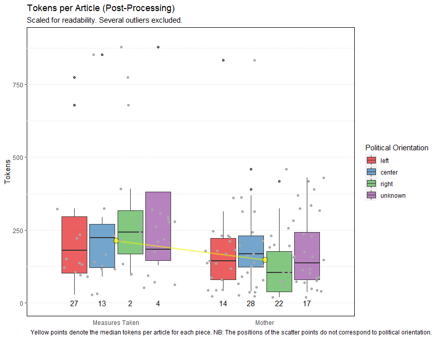
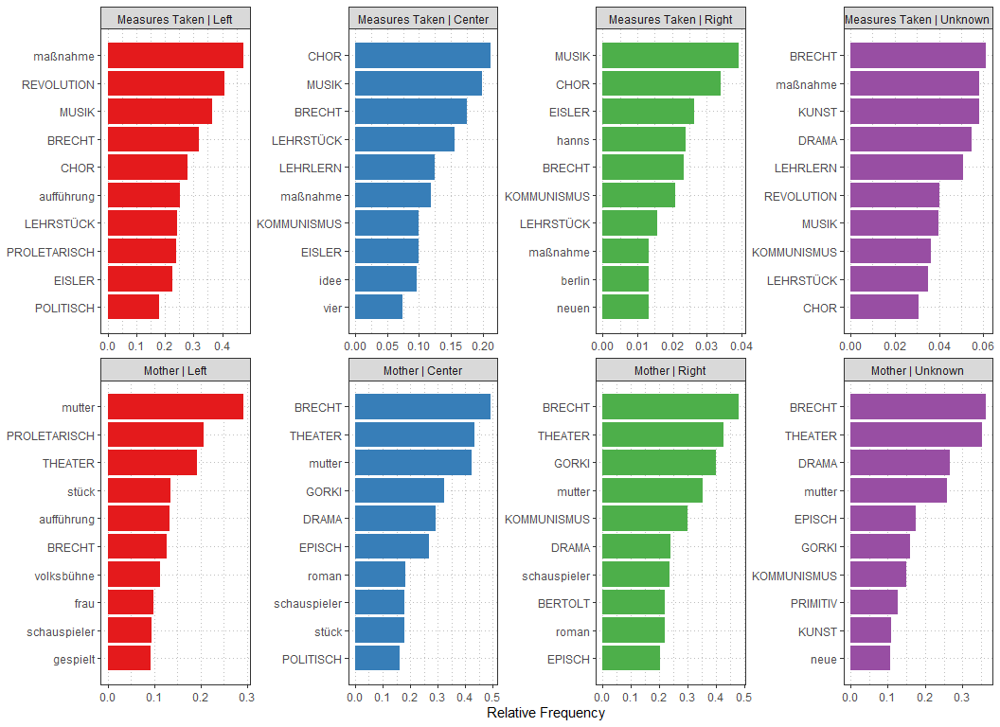

The Reception of The Measures Taken and The Mother in the
Political-Aesthetic Space of the Weimar Republic
================
Noah Zeldin
4/27/2021

  - [Introductory Remarks](#introductory-remarks)
  - [Load Packages](#load-packages)
  - [Importation](#importation)
  - [Quanteda Set-Up](#quanteda-set-up)
      - [Create Corpora](#create-corpora)
          - [General Corpora](#general-corpora)
          - [Piece Corpora](#piece-corpora)
          - [Title Corpora](#title-corpora)
      - [Corpus Summary - Article Lengths,
        etc.](#corpus-summary---article-lengths-etc.)
      - [Dictionaries and Additional
        Stopwords](#dictionaries-and-additional-stopwords)
      - [Tokenize and Filter Corpora](#tokenize-and-filter-corpora)
      - [DFMs](#dfms)
          - [Add GPO to general/ungrouped dfm
            -](#add-gpo-to-generalungrouped-dfm--)
          - [Create GPO grouped dfm’s for each
            piece](#create-gpo-grouped-dfms-for-each-piece)
          - [Less Specific Groupings](#less-specific-groupings)
          - [By GPO](#by-gpo)
          - [By Piece](#by-piece)
      - [Create corpus, dfm, ca, etc. of each piece w/o
        unknown](#create-corpus-dfm-ca-etc.-of-each-piece-wo-unknown)
  - [FactoMineR Set-Up](#factominer-set-up)
      - [Create function for converting dfm to dataframe and performing
        CA](#create-function-for-converting-dfm-to-dataframe-and-performing-ca)
      - [Use this function on each dfm](#use-this-function-on-each-dfm)
  - [Keywords In Context and Keyword
    Exploration](#keywords-in-context-and-keyword-exploration)
      - [Create function to link KWIC with
        data](#create-function-to-link-kwic-with-data)
      - [Explore various KWIC](#explore-various-kwic)
          - [Special Case: LEHRLERN in
            Mother/Right](#special-case-lehrlern-in-motherright)
          - [Combinations](#combinations)
      - [Additional Terms Post-Processing
        (DFMs)](#additional-terms-post-processing-dfms)
  - [Dates of Publication with
    Counts](#dates-of-publication-with-counts)
      - [Create Tables](#create-tables)
          - [General](#general)
          - [By Piece](#by-piece-1)
      - [Date Ranges, Time Lengths,
        etc.](#date-ranges-time-lengths-etc.)
          - [Time Length in Years](#time-length-in-years)
          - [Range / Interval](#range-interval)
          - [Proportion of Articles near
            Premieres](#proportion-of-articles-near-premieres)
      - [1932 articles for Measures Taken](#articles-for-measures-taken)
  - [Visualizations](#visualizations)
      - [Visual Summary of Reduced
        Corpus](#visual-summary-of-reduced-corpus)
          - [Very Long Articles](#very-long-articles)
      - [Wordclouds](#wordclouds)
      - [Word Frequency](#word-frequency)
      - [Correspondence Analysis](#correspondence-analysis)

# Introductory Remarks

Below is the annotated set-up for my quantitative analysis of the
Weimar-era reception of Brecht and Eisler’s *The Measures Taken* and
*The Mother*, which is included in the second chapter of my
dissertation. This analysis was conducted in R and relies heavily on the
[quanteda](https://quanteda.io/) package (for general manipulation, word
counts, etc.) and [FactoMineR](http://factominer.free.fr/index.html)
package (for correspondence analysis). (Also, I have tried to use
[tidyverse](https://www.tidyverse.org/) syntax as consistently as
possible.) Data sets will be made available to researchers upon request.

The **main goals** of this analysis are:

1.  to determine the most-discussed aspects of each work
    
      - In the dissertation, I compare these results to the works’
        postwar reception.

2.  to determine if there is a measurable correspondence between
    aesthetics and politics
    
      - Hence the notion of the “political-aesthetic space.”

**NB: Further refinements to the code are forthcoming.** This was my
first serious attempt at coding in R, so certain portions are still a
bit clunky. The final version will be included in the supplementary
materials of the dissertation.

In the near future, I will upload the corresponding write-up included in
ch. 2 of my dissertation to this repository.

# Load Packages

``` r
library(tidyverse)
library(readxl)
library(quanteda)
library(quanteda.textmodels)
library(readtext)
library(ggplot2)
library(FactoMineR)
library(lubridate)
```

# Importation

NB: Several articles had to be removed because of their distortionary
effects. This resulted in multiple versions of the data, as shown below.
(This will be cleaned up in the near future.)

Main Spreadsheet

``` r
spreadsheet <- read_excel("all_documents_updated_9.10.xlsx", sheet = "All")
```

Spreadsheet w/o Massnahme Erfurt

``` r
spreadsheet_no_erfurt <- spreadsheet[-(c(38:45, 49)),]
```

Spreadshet w/or Massnahme Erfurt or “Kartenhaus”

``` r
spreadsheet_reduced <- spreadsheet[-(c(38:45, 49, 65)),]
```

# Quanteda Set-Up

## Create Corpora

### General Corpora

General Corpus

``` r
corp <- corpus(spreadsheet, text_field = "Text")
```

General Corpus w/o Massnahme Erfurt

``` r
corp_no_erfurt <- corpus(spreadsheet_no_erfurt, text_field = "Text")
```

General Corpus Reduced

``` r
corp_reduced <- corpus(spreadsheet_reduced, text_field = "Text")
```

### Piece Corpora

Massnahme Corpus

``` r
mass_corp <- corpus_subset(corp, Piece == "Massnahme")
```

Massnahme Corpus No Erfurt

``` r
mass_corp_no_erfurt <- corpus_subset(corp_no_erfurt, Piece == "Massnahme")
```

Mutter Corpus

``` r
mutter_corp <- corpus_subset(corp, Piece == "Mutter")
```

### Title Corpora

Title Corpus

``` r
corp_title <- corpus(spreadsheet, text_field = "Title")
```

Mother Title Corpus

``` r
mutter_corp_title <- corpus_subset(corp_title, Piece == "Mutter")
```

## Corpus Summary - Article Lengths, etc.

``` r
corp_reduced_summary <- textstat_summary(corp_reduced) %>% 
  as_tibble

corp_reduced_summary$document <- corp_reduced_summary$document %>% 
        str_replace("text", "") 
    
corp_reduced_summary <- corp_reduced_summary %>% mutate(document = as.numeric(document)) %>% 
        rename(Article = document) %>% # this seems to work better than including in above step
        left_join(spreadsheet, by = "Article") %>% 
        select(-c(Text, Other_Metadata:Comp_Doc))
```

## Dictionaries and Additional Stopwords

General Dictionary

``` r
dict_gen <- dictionary(list(revolution = "revolution*",
                            bertolt = c("bert*", "bertolt*"),
                            theater = c("theater*", "theatralisch*"),
                            episch = "episch*",
                            musik = "musik*",
                            drama = "drama*",
                            politisch = "politi*",
                            kommunismus = "kommunis*",
                            chor = c("chor*", "chöre*"), 
                            proletarisch = "prolet*",
                            marxismus = "marx*",
                            primitiv = "primitiv*",
                            lehrstück = "lehrstück*",
                            brecht = "brecht*",
                            eisler = "eisler*",
                            gorki = "gorki*",
                            bürgerlich = "bürgerlich*",
                            propaganda = "propagand*",
                            kunst = c("kunst", "künstler*"),
                            lied = c("lied*", "song*"),
                            arbeitersänger = "arbeitersänger*", 
                            arbeiterchor = "arbeiterch*", 
                            bolschewismus = c("bolschewis*",
                                              "kulturbolschewis*"), 
                            langweilig = c("langweilig*", 
                                           "langeweile")))
```

Regex Dictionary

``` r
dict_regex <- dictionary(list(lehrlern = c("lehr(?!s)[a-z]+", 
                                           "belehr(?!s)[a-z]+", 
                                           "lern[a-z]+",
                                           "erlern[a-z]+", 
                                           "gelern[a-z]+", 
                                           "pädagog[a-z]+", 
                                           "didakt[a-z]+"))) 
```

Additional Stopwords

``` r
sw_add <- c("dass", "wurde", "schon", "mehr", "ganz*", "immer", "gibt", "ja",
            "müssen", "kommt", "sei", "tun")
```

## Tokenize and Filter Corpora

Create function for tokenizing and removing stopwords:

``` r
tokenize_and_remove_stopwords <- function(i) {
    tokens(i,
           remove_punct = TRUE,
           remove_numbers = TRUE,
           remove_symbols = TRUE) %>% 
        tokens_remove(c(stopwords("de"), sw_add)) %>% 
        tokens_remove(valuetype = "regex", "[0-9]+") %>% 
        tokens_keep(min_nchar = 3) 
}
```

Tokenize and filter corpora:

``` r
# general / ungrouped
gen_toks <- tokenize_and_remove_stopwords(corp)
# general / ungrouped NO ERFURT
gen_toks_no_erfurt <- tokenize_and_remove_stopwords(corp_no_erfurt)
# general / ungrouped REDUCED
gen_toks_reduced <- tokenize_and_remove_stopwords(corp_reduced)
# Massnahme
mass_toks <- tokenize_and_remove_stopwords(mass_corp)
# Massnahme NO ERFURT
mass_toks_no_erfurt <- tokenize_and_remove_stopwords(mass_corp_no_erfurt)
# Mutter
mutter_toks <- tokenize_and_remove_stopwords(mutter_corp)
# ADDITION 12.17.20 - Mutter TITLE
mutter_title_toks <- tokenize_and_remove_stopwords(mutter_corp_title)
```

## DFMs

Create function for converting toks to dfm and applying dictionaries:

``` r
convert_to_dfm_and_apply_dictionaries <- function(i) {
    dfm(i) %>% 
        dfm_lookup(dict_gen, exclusive = FALSE) %>% 
        dfm_lookup(dict_regex, valuetype = "regex", exclusive = FALSE)
}
```

Convert and apply dictionaries to corpora:

``` r
# general / ungrouped
gen_dfm <- convert_to_dfm_and_apply_dictionaries(gen_toks)
# general / ungrouped NO ERFURT
gen_dfm_no_erfurt <- convert_to_dfm_and_apply_dictionaries(gen_toks_no_erfurt)
# general / ungrouped REDUCD
gen_dfm_reduced <- convert_to_dfm_and_apply_dictionaries(gen_toks_reduced)
# Massnahme 
mass_dfm <- convert_to_dfm_and_apply_dictionaries(mass_toks)
# Massnahme NO ERFURT
mass_dfm_no_erfurt <- convert_to_dfm_and_apply_dictionaries(mass_toks_no_erfurt)
# Mutter
mutter_dfm <- convert_to_dfm_and_apply_dictionaries(mutter_toks)
# ADDITION 12.17.20: Mutter TITLE
mutter_title_dfm <- convert_to_dfm_and_apply_dictionaries(mutter_title_toks)
```

### Add GPO to general/ungrouped dfm -

<!-- PROB NEED TO CLEAN UP -->

NB: **GPO** stands for “general political orientation.”

``` r
# convert gen_dfm[_reduced] to dataframe
gen_datafr_reduced <- convert(gen_dfm_reduced, to = "data.frame")
# convert corp_reduced to dataframe - this has GPOs + other metadata
corp_reduced_datafr <- convert(corp_reduced, to = "data.frame")


# add GPO column to gen_datafr_reduced
gen_datafr_reduced_gpo <- left_join(gen_datafr_reduced, 
                                    corp_reduced_datafr[ , c("doc_id",    "Generalized_Political_Orientation")], 
                                    by = "doc_id", # 8.01 - now do this
                                    # by = c("document" = "doc_id"), # used to work
                                    copy = TRUE)


# eliminate doc col to perform CA (otherwise 2 quali.sup)
gen_datafr_reduced_gpo_2 <- gen_datafr_reduced_gpo[ , -1]


# ** group dfm's ####

# create grouped dfm: piece.gpo = 8 groups
grouped_dfm <- dfm_group(gen_dfm,
                         groups = c("Piece",
                                    "Generalized_Political_Orientation"))
# same but NO ERFURT
grouped_dfm_no_erfurt <- dfm_group(gen_dfm_no_erfurt,
                                   groups = c("Piece",
                                             "Generalized_Political_Orientation"))
```

### Create GPO grouped dfm’s for each piece

``` r
# Massnahme
mass_dfm_gpo <- dfm_group(mass_dfm,
                          groups = "Generalized_Political_Orientation")
# Massnahme NO ERFURT
mass_dfm_gpo_no_erfurt <- dfm_group(mass_dfm_no_erfurt,
                                    groups = "Generalized_Political_Orientation")
# Mutter
mutter_dfm_gpo <- dfm_group(mutter_dfm,
                            groups = "Generalized_Political_Orientation")
```

### Less Specific Groupings

``` r
# by piece
piece_dfm <- dfm_group(gen_dfm,
                       groups = "Piece")
# by GPO
gpo_dfm <- dfm_group(gen_dfm,
                     groups = "Generalized_Political_Orientation")

# less specific groupings NO ERFURT
# by piece
piece_dfm_no_erfurt <- dfm_group(gen_dfm_no_erfurt,
                                 groups = "Piece")
# by GPO
gpo_dfm_no_erfurt <- dfm_group(gen_dfm_no_erfurt,
                               groups = "Generalized_Political_Orientation")
```

### By GPO

``` r
# Left
left_sub <- dfm_subset(grouped_dfm, 
                       Generalized_Political_Orientation == "Left")
# Right
right_sub <- dfm_subset(grouped_dfm, 
                        Generalized_Political_Orientation == "Right")
# Center
center_sub <- dfm_subset(grouped_dfm, 
                         Generalized_Political_Orientation == "Center")
# Unknown
unknown_sub <- dfm_subset(grouped_dfm,
                          Generalized_Political_Orientation == "Unknown")
```

### By Piece

``` r
# Massnahme
massnahme_sub <- dfm_subset(grouped_dfm,
                            Piece == "Massnahme")
# Mutter
mutter_sub <- dfm_subset(grouped_dfm,
                         Piece == "Mutter")
```

## Create corpus, dfm, ca, etc. of each piece w/o unknown

<!-- from exp_7.24 -> need to integrate better, just being lazy -->

General - just GPO

``` r
corp_no_erfurt_or_unknown <- corpus_subset(corp_no_erfurt, 
                                           ! Generalized_Political_Orientation == "Unknown" )

toks_no_erfurt_or_unknown <- tokenize_and_remove_stopwords(corp_no_erfurt_or_unknown)

dfm_no_erfurt_or_unknown <- convert_to_dfm_and_apply_dictionaries(toks_no_erfurt_or_unknown)
```

Just GPO, not piece

``` r
gpo_dfm_no_erfurt_or_unknown <- dfm_group(dfm_no_erfurt_or_unknown,
                                          groups = "Generalized_Political_Orientation")
```

General - Piece + GPO

``` r
grouped_dfm_no_erfurt_or_unknown <- dfm_group(dfm_no_erfurt_or_unknown,
                                              groups = c("Piece", "Generalized_Political_Orientation"))
```

Measures Taken

``` r
mass_corp_no_erfurt_or_unknown <- corpus_subset(corp_no_erfurt, 
                                                Piece == "Massnahme" &! Generalized_Political_Orientation == "Unknown" )


mass_toks_no_erfurt_or_unknown <- tokenize_and_remove_stopwords(mass_corp_no_erfurt_or_unknown)

mass_dfm_no_erfurt_or_unknown <- convert_to_dfm_and_apply_dictionaries(mass_toks_no_erfurt_or_unknown)

mass_dfm_gpo_no_erfurt_or_unknown <- dfm_group(mass_dfm_no_erfurt_or_unknown,
                                               groups = "Generalized_Political_Orientation")
```

Mother

``` r
mutter_corp_no_unknown <- corpus_subset(corp, 
                                        Piece == "Mutter" &! Generalized_Political_Orientation == "Unknown" )

mutter_toks_no_unknown <- tokenize_and_remove_stopwords(mutter_corp_no_unknown)

mutter_dfm_no_unknown <- convert_to_dfm_and_apply_dictionaries(mutter_toks_no_unknown)

mutter_dfm_gpo_no_unknown <- dfm_group(mutter_dfm_no_unknown,
                                       groups = "Generalized_Political_Orientation")
```

# FactoMineR Set-Up

## Create function for converting dfm to dataframe and performing CA

``` r
convert_to_dataframe_and_perform_ca <- function(i) {
    convert(i, to = "data.frame") %>% 
        CA(quali.sup = 1, graph = FALSE)
}
```

## Use this function on each dfm

I think this is the only one I need

``` r
# piece + GPO = 8 groups NO ERFURT OR UNKNOWN
grouped_ca_no_erfurt_or_unknown <- convert_to_dataframe_and_perform_ca(grouped_dfm_no_erfurt_or_unknown)
```

NEW with English - 1.02.21

``` r
grouped_dfm_no_erfurt_or_unknown_english <- 
  dfm_group(grouped_dfm_no_erfurt_or_unknown,
            groups = c("Measures.Center", "Mother.Center", "Measures.Left",
                       "Mother.Left", "Measures.Right", "Mother.Right"))

grouped_ca_no_erfurt_or_unknown_english <- 
  convert_to_dataframe_and_perform_ca(grouped_dfm_no_erfurt_or_unknown_english)
```

# Keywords In Context and Keyword Exploration

## Create function to link KWIC with data

``` r
combine_kwic_with_data <- function(corpus, words, window) {
    
    i <- kwic(corpus, words, window = window) %>% 
        as_tibble() 
    
    i$docname <- i$docname %>% 
        str_replace("text", "") 
    
    i <- i %>% mutate(docname = as.numeric(docname)) %>% 
        rename(Article = docname) %>% # this seems to work better than including in above step
        left_join(
          spreadsheet_reduced, # CHECKING 12.29.20 - seems to have worked better than normal spreadsheet with corp_reduced
          by = "Article") %>% 
        select(-c(Text, Other_Metadata:Comp_Doc))

    }
```

## Explore various KWIC

All of these keywords relate to claims made in ch. 2.

  - primitiv

<!-- end list -->

``` r
primitiv_kwic <- 
  combine_kwic_with_data(corp, "primitiv*", 15)
```

  - langweilig

<!-- end list -->

``` r
langweilig_kwic <- 
  combine_kwic_with_data(corp, c("langeweile", "langweilig*"), 10)
```

  - proletarisch

<!-- end list -->

``` r
proletarisch_kwic <- 
  combine_kwic_with_data(corp, "proletarisch*", 10)
```

  - pudowkin

<!-- end list -->

``` r
pudowkin_kwic <- 
  combine_kwic_with_data(corp, "pudowkin*", 10)
```

  - kunst

<!-- end list -->

``` r
kunst_kwic <- 
  combine_kwic_with_data(corp, c("kunst", "künstler*"), 10)
```

  - agitprop

<!-- end list -->

``` r
agitprop_kwic <- 
  combine_kwic_with_data(corp, "agitprop*", 10)
```

  - bildung

<!-- end list -->

``` r
bildung_kwic <- 
  combine_kwic_with_data(corp, "bildung", 10)
```

  - wissen

<!-- end list -->

``` r
wissen_kwic <- 
  combine_kwic_with_data(corp, "wissen*", 10)
```

  - lehrstück MUTTER

<!-- end list -->

``` r
lehrstueck_mutter_kwic <- 
  combine_kwic_with_data(corp, "lehrstück*", 10) %>% 
  filter(Piece == "Mutter")
```

  - Oratorium MASSNAHME

<!-- end list -->

``` r
oratorium_mass_kwic <- 
  combine_kwic_with_data(corp, "oratori*", 30) %>% 
  filter(Piece == "Massnahme")
```

  - Arbeitersänger MASSNAHME

<!-- end list -->

``` r
arbeitersaenger_mass_kwic <- 
  combine_kwic_with_data(corp, "arbeitersänger*", 30) %>% 
  filter(Piece == "Massnahme")
```

  - Stalin and Stalinismus

<!-- end list -->

``` r
combine_kwic_with_data(corp, "stalin*", 30) %>% 
  print()
```

    ## # A tibble: 3 x 16
    ##   Article  from    to pre   keyword post  pattern Title Newspaper Publisher
    ##     <dbl> <int> <int> <chr> <chr>   <chr> <fct>   <chr> <chr>     <chr>    
    ## 1      62    23    23 Gork~ Stalin  "- h~ stalin* "Die~ Germania  Zentrum  
    ## 2      66    55    55 Best~ Stalin  "und~ stalin* "Gor~ Sächsisc~ SPD      
    ## 3      83   662   662 und ~ Stalin~ "von~ stalin* "Ber~ Der_Aben~ SPD      
    ## # ... with 6 more variables: Political_Affiliation_or_Orientation <chr>,
    ## #   Generalized_Political_Orientation <chr>, Date <chr>, Author <chr>,
    ## #   Complete_or_Incomplete <chr>, Piece <chr>

Only 3 articles on Mutter.

  - Cantata

<!-- end list -->

``` r
combine_kwic_with_data(corp, "Kantate*", 25) %>% 
  print()
```

    ## # A tibble: 0 x 16
    ## # ... with 16 variables: Article <dbl>, from <int>, to <int>, pre <chr>,
    ## #   keyword <chr>, post <chr>, pattern <fct>, Title <chr>, Newspaper <chr>,
    ## #   Publisher <chr>, Political_Affiliation_or_Orientation <chr>,
    ## #   Generalized_Political_Orientation <chr>, Date <chr>, Author <chr>,
    ## #   Complete_or_Incomplete <chr>, Piece <chr>

No results.

### Special Case: LEHRLERN in Mother/Right

NB: Can’t use FN, b/c can’t specify valuetype Here, adaptation of FN

1.  create tibble

<!-- end list -->

``` r
lehrlern_kwic <- kwic(corp, dict_regex, window = 20, 
                      valuetype = "regex") %>% # must specify to used dict
  as_tibble()

lehrlern_kwic$docname <- lehrlern_kwic$docname %>% 
    str_replace("text", "") 

lehrlern_kwic <- lehrlern_kwic %>% mutate(docname = as.numeric(docname)) %>% 
    rename(Article = docname) %>% # this seems to work better than including in above step
    left_join(spreadsheet, by = "Article") %>% 
    select(-c(Text, Other_Metadata:Comp_Doc))
```

2.  filter for Mutter & Right

<!-- end list -->

``` r
lehrlern_kwic_mutter_right <- lehrlern_kwic %>% 
  filter(Piece == "Mutter" & 
               Generalized_Political_Orientation == "Right")
```

### Combinations

langweilig + primitiv

``` r
langweilig_primitiv_kwic <- 
  inner_join(langweilig_kwic, primitiv_kwic, by = "Article")
```

## Additional Terms Post-Processing (DFMs)

LEHRLERN in Mutter

``` r
lehrlern_mutter_gpo_count <-  
  dfm_select(mutter_dfm_gpo, pattern = "LEHRLERN") %>% 
  as_tibble()

lehrlern_mutter_gpo_count
```

    ## # A tibble: 4 x 2
    ##   doc_id  LEHRLERN
    ##   <chr>      <dbl>
    ## 1 Center        29
    ## 2 Left          18
    ## 3 Right         15
    ## 4 Unknown       15

# Dates of Publication with Counts

## Create Tables

### General

All Articles

``` r
dates_tib <- corp_reduced_datafr %>% 
  as_tibble() %>% 
  select(Article, Date, Piece) %>% 
  group_by(Piece, Date) %>% 
  count(Date) %>% 
  arrange(desc(n))
```

Separate columns:

``` r
dates_tib_separate <- corp_reduced_datafr %>% 
  as_tibble() %>% 
    select(Article, Date, Piece) %>% 
    filter(str_detect(Date, "\\S{2}\\.\\S{2}\\.[:digit:]{4}")) %>% 
    separate(Date, sep = "\\.", into = c("day", "month", "year"))
```

Make compatible with Lubridate package:

``` r
dates_tib_lubridate <- dates_tib_separate %>% 
    mutate(day = as.numeric(day), 
           month = as.numeric(month),
           year = as.numeric(year)) %>%
    relocate(day, .after = month) %>% 
    relocate(year, .before = month) %>% 
    mutate(date = make_date(year, month, day)) %>% 
    select(Article, date, Piece) %>% 
  filter(!is.na(date)) %>% 
  arrange(date)
```

Percent of articles *without* full dates (i.e. excluded from lubridate):

``` r
articles_perc_without_full_dates <- 
  (((nrow(dates_tib_separate) - 
     nrow(dates_tib_lubridate)) 
  / nrow(dates_tib_lubridate)) * 100) %>% 
  round() 
```

Percent of articles *with* full dates (i.e. included for lubridate):

``` r
articles_perc_with_full_dates <- 100 - articles_perc_without_full_dates
```

### By Piece

#### Measures Taken

All

``` r
dates_mass <- dates_tib %>% 
  filter(Piece == "Massnahme") %>% 
  ungroup %>% 
  select(-Piece)
```

Edited, Lubridate

  - Chronological, w/o counts - saved for computing range, length, etc.

<!-- end list -->

``` r
dates_mass_lubridate <- 
  dates_tib_lubridate %>% 
  filter(Piece == "Massnahme") %>% 
  arrange(date)
```

  - Counted and Sorted Descending

<!-- end list -->

``` r
dates_tib_lubridate %>% 
  filter(Piece == "Massnahme") %>%
  count(date) %>% 
  arrange(desc(n))
```

    ## # A tibble: 20 x 2
    ##    date           n
    ##    <date>     <int>
    ##  1 1930-12-15    10
    ##  2 1930-12-16     2
    ##  3 1931-01-20     2
    ##  4 1930-06-04     1
    ##  5 1930-12-13     1
    ##  6 1930-12-20     1
    ##  7 1930-12-22     1
    ##  8 1930-12-24     1
    ##  9 1931-01-01     1
    ## 10 1931-01-03     1
    ## 11 1931-01-11     1
    ## 12 1931-01-14     1
    ## 13 1931-01-24     1
    ## 14 1931-05-09     1
    ## 15 1931-12-09     1
    ## 16 1932-02-19     1
    ## 17 1932-06-01     1
    ## 18 1932-09-24     1
    ## 19 1932-11-22     1
    ## 20 1932-11-25     1

#### Mother

All

``` r
dates_mutter <- dates_tib %>% 
  filter(Piece == "Mutter") %>% 
  ungroup %>% 
  select(-Piece)
```

Edited, Lubridate

  - Chronological, w/o counts - saved for computing range, length, etc.

<!-- end list -->

``` r
dates_mutter_lubridate <- 
  dates_tib_lubridate %>% 
  filter(Piece == "Mutter") %>% 
  arrange(date)
```

  - Counted and Sorted Descending

<!-- end list -->

``` r
dates_tib_lubridate %>% 
  filter(Piece == "Mutter") %>%
  count(date) %>% 
  arrange(desc(n))
```

    ## # A tibble: 20 x 2
    ##    date           n
    ##    <date>     <int>
    ##  1 1932-01-18    20
    ##  2 1932-01-17     7
    ##  3 1932-01-19     7
    ##  4 1932-01-24     5
    ##  5 1932-01-23     4
    ##  6 1932-01-22     3
    ##  7 1932-01-25     3
    ##  8 1932-01-26     2
    ##  9 1932-01-27     2
    ## 10 1932-01-30     2
    ## 11 1931-12-23     1
    ## 12 1932-01-08     1
    ## 13 1932-01-13     1
    ## 14 1932-01-15     1
    ## 15 1932-01-20     1
    ## 16 1932-01-21     1
    ## 17 1932-01-29     1
    ## 18 1932-02-23     1
    ## 19 1932-03-05     1
    ## 20 1932-12-09     1

## Date Ranges, Time Lengths, etc.

### Time Length in Years

All Articles (Edited for Lubridate)

``` r
difftime(tail(dates_tib_lubridate$date, 1),
         head(dates_tib_lubridate$date, 1)) %>% 
  time_length(unit = "year")
```

    ## [1] 2.516085

Measures Taken

``` r
difftime(tail(dates_mass_lubridate$date, 1),
         head(dates_mass_lubridate$date, 1)) %>% 
  time_length(unit = "year")
```

    ## [1] 2.477755

Mother

``` r
difftime(tail(dates_mutter_lubridate$date, 1),
         head(dates_mutter_lubridate$date, 1)) %>% 
  time_length(unit = "year")
```

    ## [1] 0.9637235

### Range / Interval

#### All

Save general start and end dates as variables for write-up:

``` r
articles_first_date <- head(dates_tib_lubridate$date, 1)
articles_last_date <- tail(dates_tib_lubridate$date, 1)
```

General dates interval:

``` r
interval(start = articles_first_date,
         end = articles_last_date)
```

    ## [1] 1930-06-04 UTC--1932-12-09 UTC

#### Measures Taken

``` r
interval(start = head(dates_mass_lubridate$date, 1),
         end = tail(dates_mass_lubridate$date, 1))
```

    ## [1] 1930-06-04 UTC--1932-11-25 UTC

#### Mother

``` r
interval(start = head(dates_mutter_lubridate$date, 1),
         end = tail(dates_mutter_lubridate$date, 1))
```

    ## [1] 1931-12-23 UTC--1932-12-09 UTC

### Proportion of Articles near Premieres

#### Measures Taken

Save date of premiere as variable (cf. BFA 3: 431):

``` r
mass_premiere_date <- ymd("1930-12-13")
```

Create interval for 1 week after premiere:

``` r
mass_premiere_week <- interval(start = mass_premiere_date,
         end = mass_premiere_date + dweeks(x = 1))
```

Percentage of articles within 1 week of premiere:

``` r
articles_mass_premiere_week_perc <- 
  round(((dates_mass_lubridate %>% 
    filter(date %within% mass_premiere_week) %>% 
    nrow()) / nrow(dates_mass_lubridate)) * 100)
```

#### Mother

Save date of premiere (cf. BFA 3: 478):

``` r
mutter_premiere_date <- ymd("1932-01-17")
```

Create interval for 1 week after premiere:

``` r
mutter_premiere_week <- interval(start = mutter_premiere_date,
         end = mutter_premiere_date + dweeks(x = 1))
```

Percentage of articles within 1 week of premiere:

``` r
articles_mutter_premiere_week_perc <- 
  round(((dates_mutter_lubridate %>% 
    filter(date %within% mutter_premiere_week) %>% 
    nrow()) / nrow(dates_mutter_lubridate)) * 100)
```

## 1932 articles for Measures Taken

``` r
dates_tib_lubridate %>% 
    filter(Piece == "Massnahme" &
            year(date) == 1932) %>% 
    left_join(spreadsheet)
```

    ## # A tibble: 5 x 17
    ##   Article date       Piece Title Text  Newspaper Publisher Political_Affil~
    ##     <dbl> <date>     <chr> <chr> <chr> <chr>     <chr>     <chr>           
    ## 1      35 1932-02-19 Mass~ "Leh~ "Nic~ Literari~ Welt Ver~ Unknown         
    ## 2      50 1932-06-01 Mass~ "„Di~ "1.\~ Der_Kämp~ KPD       KPD             
    ## 3      34 1932-09-24 Mass~ "Die~ "Die~ Arbeiter~ Sozialde~ SPÖ             
    ## 4      36 1932-11-22 Mass~ "Ers~ "In ~ General-~ Independ~ Unknown         
    ## 5      37 1932-11-25 Mass~ "Kom~ "Am ~ Bayrisch~ Independ~ Unknown         
    ## # ... with 9 more variables: Generalized_Political_Orientation <chr>,
    ## #   Date <chr>, Author <chr>, Complete_or_Incomplete <chr>,
    ## #   Other_Metadata <chr>, Other_Notes <chr>, AdK <chr>, AdK_Duplicate <chr>,
    ## #   Comp_Doc <chr>

# Visualizations

Create color scheme:

``` r
colors_four <- c("#E41A1C", "#377EB8", "#4DAF4A", "#984EA3")
```

Create English labels for both works:

``` r
labels_english <- c(Massnahme = "Measures Taken", Mutter = "Mother")
```

## Visual Summary of Reduced Corpus

Set-up for boxplot:

``` r
# 3 steps for set up

# STEP 1
toks_grouped <- gen_datafr_reduced %>% 
    mutate(rowSums(.[ ,2:9102]), .after = 1) %>% 
    select(doc_id, `rowSums(.[, 2:9102])`) %>% 
    rename(tokens = `rowSums(.[, 2:9102])`)

# STEP 2
# add GPO column to gen_datafr_reduced
# can't combine with above for some reason
toks_grouped <- left_join(toks_grouped, 
                                    corp_reduced_datafr[ , c("doc_id",    "Generalized_Political_Orientation", "Piece")], 
                                    by = "doc_id", 
                                    copy = TRUE)

# STEP 3
# added for observation counts
toks_grouped <- toks_grouped %>% 
    add_count(Piece, Generalized_Political_Orientation)
```

Coding for boxplot:

``` r
toks_summary_boxplot <- 
    toks_grouped %>% 
    ggplot(aes(x = Piece, y = tokens, 
               fill = Generalized_Political_Orientation)) +
    geom_boxplot(alpha = 0.7,
                 varwidth = TRUE) +
    stat_summary(fun = mean, geom="point", 
                 shape=21, size=5, color="black", fill="red", alpha = 0.75) +
    stat_summary(fun = mean, geom="line", 
                 size = 1.2, color = "red", alpha = 0.4, aes(group = 1)) +
    stat_summary(fun = median, geom="point", 
                 shape=21, size=5, color="black", fill="yellow", alpha = 0.75) +
    stat_summary(fun = median, geom="line", 
                 size = 1.2, color = "yellow", alpha = 0.4, aes(group = 1)) +
    scale_fill_brewer(type = "seq", palette = "Set1") +
    geom_jitter(color="darkgrey",
        size=1.25, alpha=0.95,
        show.legend = FALSE) + # may be too much
    coord_cartesian(xlim = NULL, ylim = c(0, 900)) +
    ylab("Tokens") +
  scale_x_discrete(labels=c("Measures Taken", "Mother")) +
    xlab(NULL) +
    labs(fill = "Political Orientation",
         title = "Tokens per Article (Post-Processing)",
         subtitle = "Scaled for readability. Several outliers excluded. Box width corresponds to number of articles.",
         caption = "Red and yellow points denote respecitively the mean and median tokens per article for each \n piece. NB: The positions of the scatter points do not correspond to political orientation.") +
    geom_text(aes(label = ..count.., 
                  y= ..prop..)
              , stat= "count",
              vjust = 1, # confusing - probably don't need
              position = position_dodge2(width = 0.5
                                          # c(0.4, 0.8)
                                        ) 
              ) +
  theme(axis.title.x = element_blank(),
          axis.ticks.x = element_blank(),
          panel.grid.major.x = element_blank(),
          panel.grid.major.y = element_line(color = "grey", linetype = 3),
          panel.grid.minor.y = element_line(color = "grey", linetype = 3),
          plot.caption.position = "plot",
          panel.background = element_rect(fill = "white", colour = 'black'))

toks_summary_boxplot
```

<!-- -->

### Very Long Articles

The goal is to identify the very long articles in *Measures - Unknown*
category, because they stretch out the IQR.

``` r
corp_reduced_summary %>% 
    filter(Generalized_Political_Orientation == "Unknown" &
               Piece == "Massnahme") %>% 
    arrange(desc(tokens)) %>% 
  select(Article, tokens, Title:Piece)
```

    ## # A tibble: 10 x 11
    ##    Article tokens Title Newspaper Publisher Political_Affil~ Generalized_Pol~
    ##      <dbl>  <int> <chr> <chr>     <chr>     <chr>            <chr>           
    ##  1      35   2055 Lehr~ Literari~ Welt Ver~ Unknown          Unknown         
    ##  2      18   1894 Poli~ Der_Anbr~ Universa~ Unknown          Unknown         
    ##  3      42    822 Thea~ Heidelbe~ Independ~ Unknown          Unknown         
    ##  4      45    750 Brec~ Bergisch~ Vossen    Unknown          Unknown         
    ##  5      41    553 Welt~ Thüringi~ Unknown   Unknown          Unknown         
    ##  6      25    535 Anme~ Die_Lite~ Deutsche~ Unknown          Unknown         
    ##  7      19    439 Prob~ Der_Anbr~ Universa~ Unknown          Unknown         
    ##  8       7    365 Brec~ Münchner~ Independ~ Unknown          Unknown         
    ##  9      37    314 Komm~ Bayrisch~ Independ~ Unknown          Unknown         
    ## 10      43    194 Brec~ Dresdner~ Independ~ Unknown          Unknown         
    ## # ... with 4 more variables: Date <chr>, Author <chr>,
    ## #   Complete_or_Incomplete <chr>, Piece <chr>

## Wordclouds

Grouped by Piece:

``` r
# must rename groups in English for word cloud
piece_dfm_no_erfurt_english <- dfm_group(piece_dfm_no_erfurt, groups = c("Measures Taken", "Mother"))

textplot_wordcloud(piece_dfm_no_erfurt_english,
                   max_words = 100,
                   color = colors_four,
                   rotation = FALSE,
                   comparison = TRUE,
                   labelcolor = "black")
```

<!-- -->

*Mother* - Grouped by GPO (no unknown):

``` r
wordcloud_mutter_gpo <- 
  textplot_wordcloud(mutter_dfm_gpo_no_unknown,
                   max_words = 100, # 125 or 100 is probably best
                   rotation = FALSE,
                   color = colors_four,
                   comparison = TRUE,
                   labelcolor = "black")
```

<!-- -->

## Word Frequency

By Piece:

``` r
# grouped by piece (weighted)
freq_piece <- dfm_weight(gen_dfm_reduced, scheme = "prop") %>% # 12.21.20 applying dfm_weight seems to make no difference
    textstat_frequency(n = 15, groups = "Piece")

# good, except overlap of a couple of words, can't figure out how to fix
# yeah, but may not be necessary: keyness w/ target + reference is better,
# shows typicality rather than freq
freq_piece_plot <- 
  ggplot(freq_piece, 
       aes(x = nrow(freq_piece):1, y = frequency, fill = group)) +
    geom_col() +
    facet_wrap(~ group, scales = "free", nrow = 2,
               labeller = labeller(group = labels_english)
               ) +
    coord_flip() +
    scale_x_continuous(breaks = nrow(freq_piece):1, 
                       labels = freq_piece$feature) +
    labs(x = NULL, y = "Relative Frequency") +
    scale_fill_manual(values = colors_four) + # prob could just use brewer, b/c only 2
    theme_bw() +
    theme(legend.position = "none",
          panel.grid.major.y = element_line(color = "grey", linetype = 3),
          panel.grid.minor.y = element_blank(),
          panel.grid.major.x = element_line(color = "grey", linetype = 3),
          panel.grid.minor.x = element_line(color = "grey", linetype = 3),
          plot.caption.position = "plot",
          panel.background = element_rect(fill = "white", colour = 'black'))

freq_piece_plot
```

<!-- -->

By Piece + GPO:

``` r
freq_grouped_wt <- dfm_weight(gen_dfm_reduced, scheme = "prop") %>% 
    textstat_frequency(n = 10, 
                       groups = c("Piece", "Generalized_Political_Orientation")) 

freq_grouped_wt <- freq_grouped_wt %>% 
    mutate(group = str_replace_all(group, 
                                   c("Massnahme.Center" = 
                                       "Measures Taken | Center",
                                     "Massnahme.Left" = "Measures Taken | Left",
                                     "Massnahme.Right" = 
                                       "Measures Taken | Right",
                                     "Massnahme.Unknown" = 
                                       "Measures Taken | Unknown",
                                     "Mutter.Center" = "Mother | Center",
                                     "Mutter.Left" = "Mother | Left",
                                     "Mutter.Right" = "Mother | Right",
                                     "Mutter.Unknown" = "Mother | Unknown")))

# good but would want to rearrange cols
# currently: C - L - R - U
freq_piece_gpo_plot <- ggplot(freq_grouped_wt, 
       aes(x = nrow(freq_grouped_wt):1, y = frequency, fill = group)) +
    geom_col() +
    facet_wrap(~ group, scales = "free", nrow = 2,
               # labeller = labeller(group = labels_english
               ) +
    coord_flip() +
    scale_x_continuous(breaks = nrow(freq_grouped_wt):1, 
                       labels = freq_grouped_wt$feature) +
    labs(x = NULL, y = "Relative Frequency") +
    scale_fill_manual(values = c(colors_four, colors_four)) + # repeat b/c need 8
    theme_bw() +
    theme(legend.position = "none",
          panel.grid.major.y = element_line(color = "grey", linetype = 3),
          panel.grid.minor.y = element_blank(),
          panel.grid.major.x = element_line(color = "grey", linetype = 3),
          panel.grid.minor.x = element_line(color = "grey", linetype = 3),
          plot.caption.position = "plot",
          panel.background = element_rect(fill = "white", colour = 'black'))

freq_piece_gpo_plot
```

<!-- -->

## Correspondence Analysis

Main

``` r
ca_main <- plot(grouped_ca_no_erfurt_or_unknown_english,
                invisible = "row",
                col.quali.sup = "darkblue",
                selectCol = "contrib 20",
                autoLab = "y", 
                ylim = c(-0.75, 1.75), 
                unselect = 1,
                cex = 0.85)

ca_main <- ca_main + 
    labs(title = "The Political-Aesthetic Space of The Measures Taken and The Mother",
         subtitle = "(CA of pieces and political orientations with the top 20 contributing keywords.)") +
    theme_bw()

ca_main
```

<!-- -->

*Measures Taken*

``` r
ca_measures <- plot(grouped_ca_no_erfurt_or_unknown_english,
     invisible = "row",
     col.quali.sup = "darkblue",
     selectCol = "contrib 20",
     autoLab = "y",
     xlim = c(0, 1.5),
     ylim = c(-1, 2), 
     unselect = 1,
     cex = 0.85)

ca_measures <- ca_measures + 
  labs(title = "The Political-Aesthetic Space of The Measures Taken",
       subtitle = "(Enlargement of positive x region of above.)") +
  theme_bw()

ca_measures
```

<!-- -->

*Mother*

``` r
ca_mother <- plot(grouped_ca_no_erfurt_or_unknown_english,
     invisible = "row",
     col.quali.sup = "darkblue",
     selectCol = "contrib 20",
     autoLab = "y",
     xlim = c(-1.25, 0),
     ylim = c(-0.75, 0.25), 
     unselect = 1,
     cex = 0.85)

ca_mother <- ca_mother + 
  labs(title = "The Political-Aesthetic Space of The Mother",
       subtitle = "(Enlargement of negative x region of above.)") +
  theme_bw() 

ca_mother
```

<!-- -->
