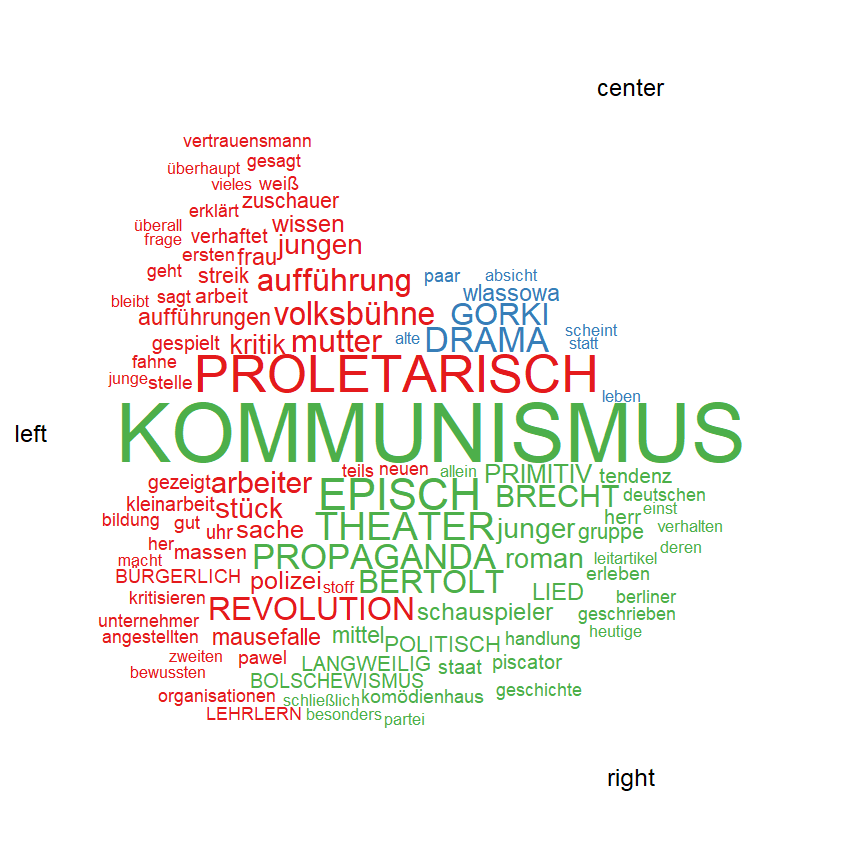
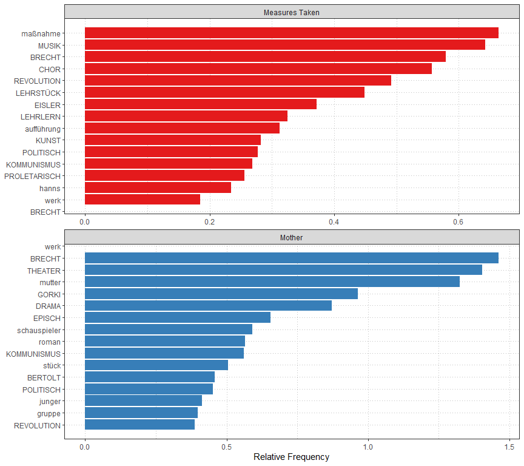
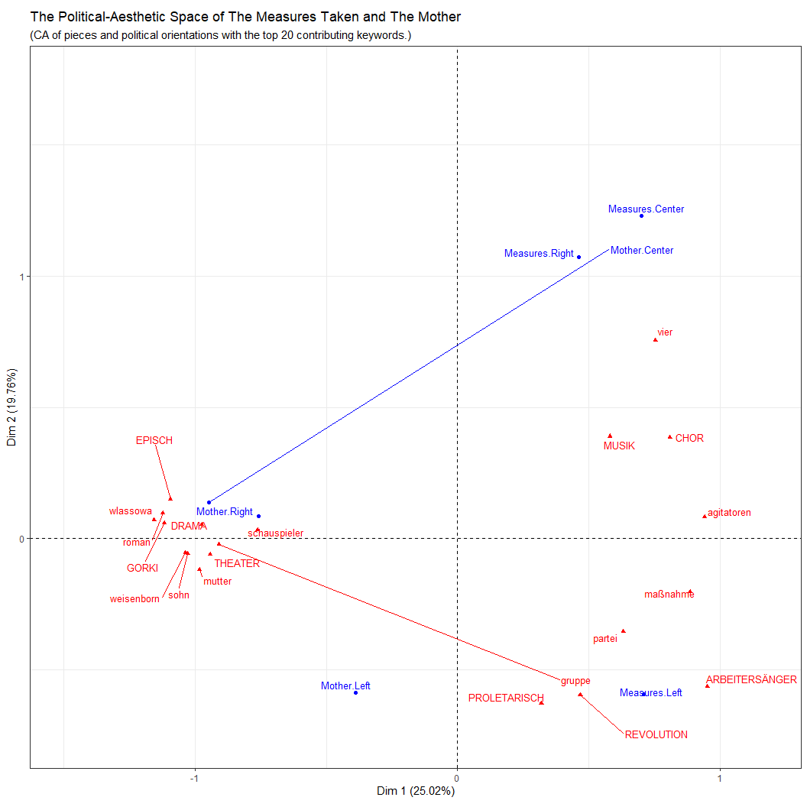
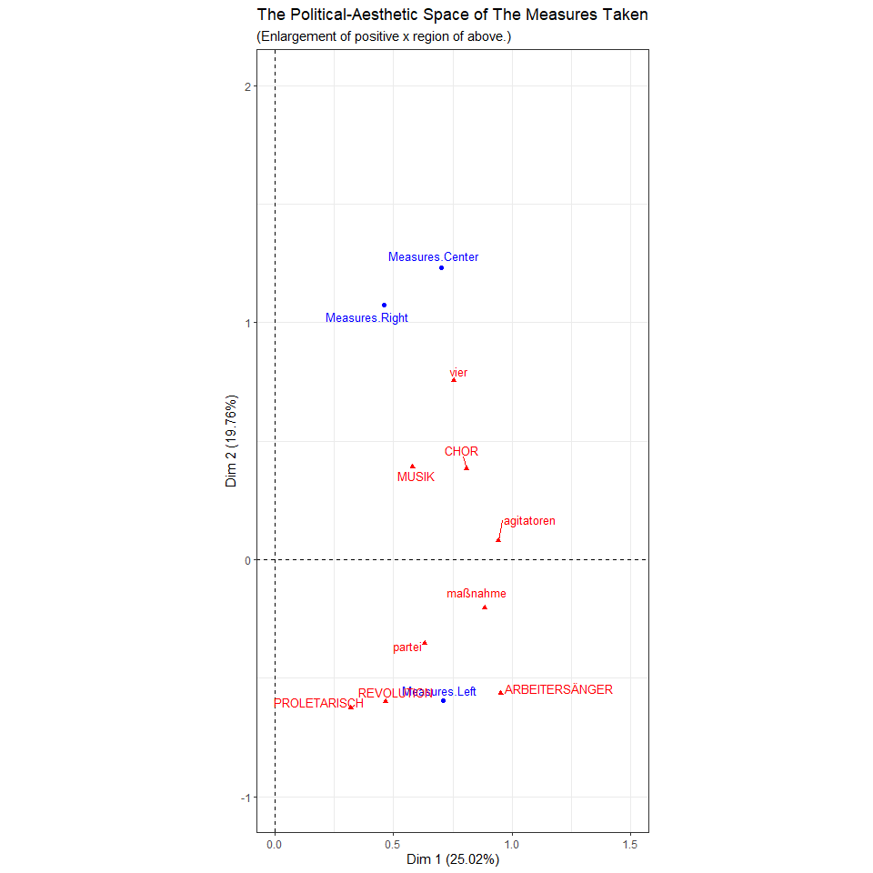
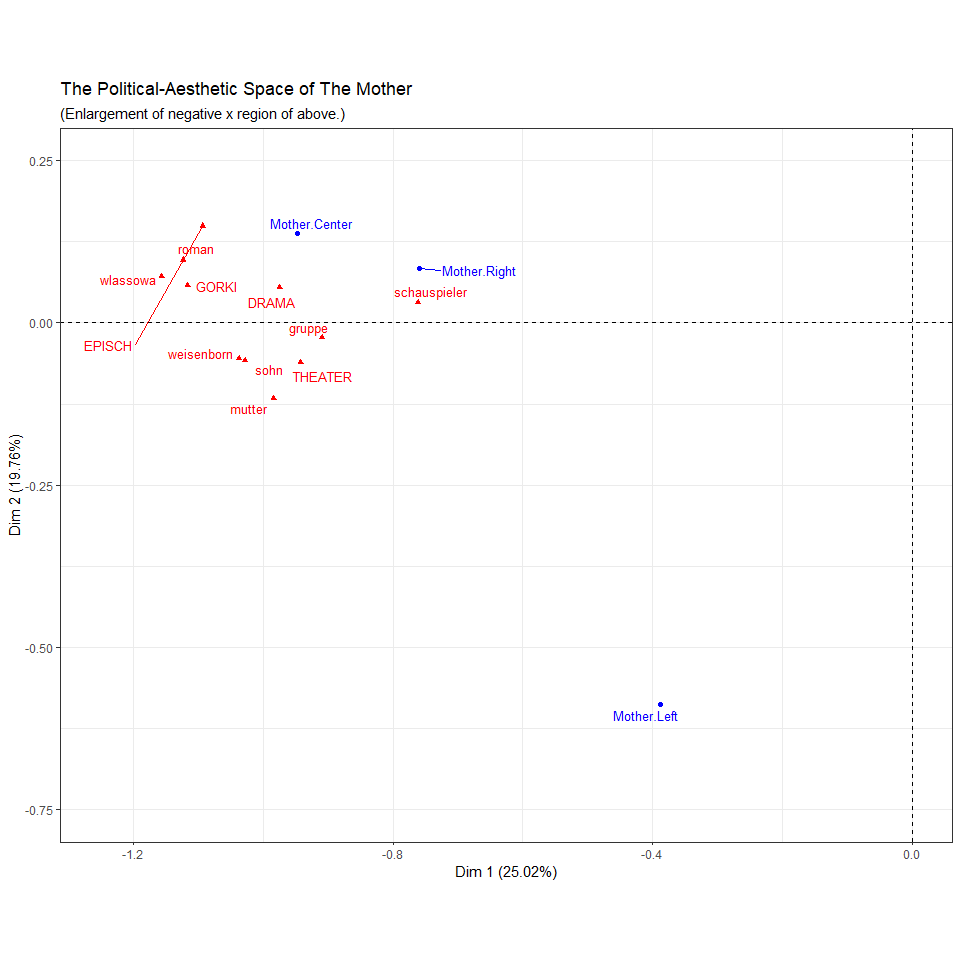

The Reception of *The Measures Taken* and *The Mother* in the
Political-Aesthetic Space of the Weimar Republic
================
Noah Zeldin
4/27/2021

  - [1. Introductory Remarks](#introductory-remarks)
  - [2. Load Packages](#load-packages)
  - [3. Importation](#importation)
  - [4. Quanteda Set-Up](#quanteda-set-up)
      - [Create Corpora from Data Sets](#create-corpora-from-data-sets)
          - [General Corpora](#general-corpora)
          - [Corpora Grouped by Piece](#corpora-grouped-by-piece)
          - [Corpora of Title Texts](#corpora-of-title-texts)
      - [Corpus Summary - Article Lengths,
        etc.](#corpus-summary---article-lengths-etc.)
      - [Dictionaries and Additional
        Stopwords](#dictionaries-and-additional-stopwords)
      - [Tokenize and Filter Corpora](#tokenize-and-filter-corpora)
      - [Document-Feature Matrices
        (dfm)](#document-feature-matrices-dfm)
          - [Group dfm’s by General Political Orientation
            (GPO)](#group-dfms-by-general-political-orientation-gpo)
          - [Create GPO grouped dfm’s for each
            piece](#create-gpo-grouped-dfms-for-each-piece)
          - [Less Specific Groupings](#less-specific-groupings)
          - [By GPO](#by-gpo)
          - [By Piece](#by-piece)
      - [Convert general (reduced) corpus and dfm to dataframes for
        later
        use](#convert-general-reduced-corpus-and-dfm-to-dataframes-for-later-use)
      - [Create corpus, dfm, ca, etc. of each piece without unknown GPO
        (for
        CA)](#create-corpus-dfm-ca-etc.-of-each-piece-without-unknown-gpo-for-ca)
  - [6. FactoMineR Set-Up (for CA)](#factominer-set-up-for-ca)
  - [7. Keywords In Context (KWIC) and Keyword
    Exploration](#keywords-in-context-kwic-and-keyword-exploration)
      - [Create function to link KWIC with
        data](#create-function-to-link-kwic-with-data)
      - [Explore various KWIC](#explore-various-kwic)
          - [Special Cases: LEHRLERN in rightwing articles on *The
            Mother*](#special-cases-lehrlern-in-rightwing-articles-on-the-mother)
      - [Additional Terms Post-Processing
        (DFMs)](#additional-terms-post-processing-dfms)
  - [8. Dates of Publication with
    Counts](#dates-of-publication-with-counts)
      - [Create Tables](#create-tables)
          - [General](#general)
          - [By Piece](#by-piece-1)
              - [*The Measures Taken*](#the-measures-taken)
              - [*The Mother*](#the-mother)
      - [Date Ranges, Time Lengths,
        etc.](#date-ranges-time-lengths-etc.)
          - [Time Length in Years](#time-length-in-years)
          - [Range / Interval](#range-interval)
              - [All](#all)
              - [*The Measures Taken*](#the-measures-taken-1)
              - [*The Mother*](#the-mother-1)
          - [Proportion of Articles Published near
            Premieres](#proportion-of-articles-published-near-premieres)
              - [*The Measures Taken*](#the-measures-taken-2)
              - [*The Mother*](#the-mother-2)
      - [Articles on *The Measures Taken* published in 1932 (with full
        dates)](#articles-on-the-measures-taken-published-in-1932-with-full-dates)
  - [9. Visualizations](#visualizations)
      - [Visual Summary of Reduced
        Corpus](#visual-summary-of-reduced-corpus)
          - [Very Long Articles](#very-long-articles)
      - [Wordclouds](#wordclouds)
      - [Word Frequency](#word-frequency)
      - [Correspondence Analysis](#correspondence-analysis)
  - [10. Evidence for Claims made in Ch.
    2](#evidence-for-claims-made-in-ch.-2)
  - [11. Additional Values for In-Line Code included in
    Write-Up](#additional-values-for-in-line-code-included-in-write-up)
  - [12. Final Step: Save Workspace](#final-step-save-workspace)

# 1\. Introductory Remarks

Below is the annotated set-up for my quantitative analysis of the
Weimar-era reception of Brecht and Eisler’s *The Measures Taken* and
*The Mother*, which is included in the second chapter of my
dissertation. The write-up is available
[here](https://github.com/noahzeldin/dissertation/blob/main/reception_analysis_write_up.md).

This analysis was conducted in [R](https://www.r-project.org/) and
relies heavily on the [quanteda](https://quanteda.io/) package (for
general manipulation, word counts, etc.) and
[FactoMineR](http://factominer.free.fr/index.html) package (for
correspondence analysis). Also, I have tried to use
[tidyverse](https://www.tidyverse.org/) syntax as consistently as
possible. The data set will be made available to researchers upon
request.

The **main goals** of this analysis are:

1.  to determine the most-discussed aspects of each work (e.g. musical
    vs.  theatrical components, politics)
    
      - In the dissertation, I compare these results to the works’
        postwar reception.

2.  to determine if there is a measurable correspondence between
    aesthetics and politics
    
      - Hence the notion of the “political-aesthetic space.”

The final version of the code will be included in the supplementary
materials of the dissertation.

# 2\. Load Packages

``` r
library(tidyverse)
library(readxl)
library(ggplot2)
library(quanteda)
library(FactoMineR)
library(lubridate)
```

# 3\. Importation

NB: Several articles had to be removed because of their distortionary
effects. This resulted in three versions of the data, as shown below.

Main data set containing all articles (`data_main`):

``` r
data_main <- read_excel("reception_analysis_data.xlsx", sheet = "all_docs")
```

Remove columns containing information that is unnecessary for analysis
(e.g.  references for republications):

``` r
data_main <- data_main %>% 
  select(-c(other_source:other_notes))
```

`data_main` w/o articles on the Erfurt performance *The Measures Taken*
(`data_no_erfurt`):

``` r
data_no_erfurt <- data_main %>% 
    filter(date != "24.01.1933") %>% 
    filter(date != "25.01.1933") %>% 
    filter(date != "26.01.1933") %>% 
    filter(date != "27.01.1933") %>% 
    filter(newspaper != "Internationaler_Revolutionärer_Theater-Bund_(Bulletin)")
```

  - 9 articles removed from original data set

(`data_main`).

`data_main` without *Measures Taken* articles on Erfurt performance or
Ferdinand Junghans, “Das Kartenhaus stürzt\!,” *Neue Preussische
Kreuz-Zeitung*, n.d. (`data_reduced`):

``` r
data_reduced <- data_no_erfurt %>% 
    filter(author != "Ferdinand Junghans")
```

  - 10 articles removed from original data set (`data_main`).

# 4\. Quanteda Set-Up

## Create Corpora from Data Sets

In addition to the main corpora, I create additional corpora, e.g. based
on piece, to provide greater flexibility for later analysis, for
instance, finding and/or counting instances of a keyword in articles on
*The Mother*.

### General Corpora

General Corpus from `data_main` (`corp`):

``` r
corp <- corpus(data_main, text_field = "text")
```

Corpus from `data_no_erfurt` (`corp_no_erfurt`):

``` r
corp_no_erfurt <- corpus(data_no_erfurt, text_field = "text")
```

Corpus from `data_reduced` (`corp_reduced` ):

``` r
corp_reduced <- corpus(data_reduced, text_field = "text")
```

### Corpora Grouped by Piece

*Measures Taken* Corpus (`mt_corp`):

``` r
mt_corp <- corpus_subset(corp, piece == "measures")
```

*Measures Taken* Corpus without articles on Erfurt performance
(`mt_corp_no_erfurt`):

``` r
mt_corp_no_erfurt <- corpus_subset(corp_no_erfurt, piece == "measures")
```

  - Again, the articles on the Erfurt performance were removed because
    of their distortionary effect.

*Mother* Corpus (`mother_corp`):

``` r
mother_corp <- corpus_subset(corp, piece == "mother")
```

### Corpora of Title Texts

This allows for later analysis of the texts of the article titles,
e.g. keyword frequencies.

Title Corpus (all articles) (`corp_title`):

``` r
corp_title <- corpus(data_main, text_field = "title")
```

*Mother* Title Corpus (`mother_corp_title`):

``` r
mother_corp_title <- corpus_subset(corp_title, piece == "mother")
```

## Corpus Summary - Article Lengths, etc.

For later reference; used sparingly in analysis.

``` r
corp_reduced_summary <- textstat_summary(corp_reduced) %>% 
  as_tibble

corp_reduced_summary$document <- corp_reduced_summary$document %>% 
        str_replace("text", "") 
    
corp_reduced_summary <- corp_reduced_summary %>% 
  mutate(document = as.numeric(document)) %>% 
  rename(article = document) %>% 
  left_join(data_main, by = "article") %>% 
  select(-text)
```

## Dictionaries and Additional Stopwords

General Dictionary

  - This dictionary contains what I perceived to be the most important
    keywords in the corpus and those on which I wished to focus in my
    analysis. As I explain in ch. 2, I read through all of the articles
    in the corpus prior to conducting this analysis. As a result, I had
    a clear idea of those terms on which I would focus.

<!-- end list -->

``` r
dict_gen <- dictionary(list(revolution = "revolution*",
                            bertolt = c("bert*", "bertolt*"),
                            theater = c("theater*", "theatralisch*"),
                            episch = "episch*",
                            musik = "musik*",
                            drama = "drama*",
                            politisch = "politi*",
                            kommunismus = "kommunis*",
                            chor = c("chor*", "chöre*"), 
                            proletarisch = "prolet*",
                            marxismus = "marx*",
                            primitiv = "primitiv*",
                            lehrstück = "lehrstück*",
                            brecht = "brecht*",
                            eisler = "eisler*",
                            gorki = "gorki*",
                            bürgerlich = "bürgerlich*",
                            propaganda = "propagand*",
                            kunst = c("kunst", "künstler*"),
                            lied = c("lied*", "song*"),
                            arbeitersänger = "arbeitersänger*", 
                            arbeiterchor = "arbeiterch*", 
                            bolschewismus = c("bolschewis*",
                                              "kulturbolschewis*"), 
                            langweilig = c("langweilig*", 
                                           "langeweile")))
```

Regular Expressions Dictionary

  - In the case of pedagogical terms, it was necessary to use regular
    expressions. As I explain in ch. 2, **LEHRLERN** is the only keyword
    defined in these dictionaries that can be considered an
    interpretative combination of different words, rather than a mere
    grouping of synonyms. **LEHRLERN** groups together words relating to
    the following terms (the regular expressions should cover all forms
    of the terms: nouns, verbs, adjectives and adverbs).
    
      - “teaching” \[*lehren*\]
    
      - “learning” \[*lernen* (and past particple, *gelernt*) and
        *erlernen*\]
    
      - “instructing” \[*belehren*\]
    
      - “pedagogical” \[*pädagogisch*\]
    
      - “didactic” \[*didaktisch*\]

<!-- end list -->

``` r
dict_regex <- dictionary(list(lehrlern = c("lehr(?!s)[a-z]+", 
                                           "belehr(?!s)[a-z]+", 
                                           "lern[a-z]+",
                                           "erlern[a-z]+", 
                                           "gelern[a-z]+", 
                                           "pädagog[a-z]+", 
                                           "didakt[a-z]+"))) 
```

Additional Stopwords

  - These stopwords are not part of the set of German stopwords provided
    in **quanteda**.

<!-- end list -->

``` r
sw_add <- c("dass", "wurde", "schon", "mehr", "ganz*", "immer", "gibt", "ja",
            "müssen", "kommt", "sei", "tun")
```

## Tokenize and Filter Corpora

Create function for tokenizing and removing stopwords, punctuation and
other symbols:

``` r
tokenize_and_remove_stopwords <- function(i) {
    tokens(i,
           remove_punct = TRUE,
           remove_numbers = TRUE,
           remove_symbols = TRUE) %>% 
        tokens_remove(c(stopwords("de"), sw_add)) %>% 
        tokens_remove(valuetype = "regex", "[0-9]+") %>% 
        tokens_keep(min_nchar = 3) 
}
```

Tokenize and filter corpora (results in tokens object, labeled `_toks`):

``` r
# general / ungrouped
gen_toks <- tokenize_and_remove_stopwords(corp)

# general / ungrouped NO ERFURT
gen_toks_no_erfurt <- tokenize_and_remove_stopwords(corp_no_erfurt)

# general / ungrouped REDUCED
gen_toks_reduced <- tokenize_and_remove_stopwords(corp_reduced)

# Measures Taken
mt_toks <- tokenize_and_remove_stopwords(mt_corp)

# Measures Taken NO ERFURT
mt_toks_no_erfurt <- tokenize_and_remove_stopwords(mt_corp_no_erfurt)

# Mother
mother_toks <- tokenize_and_remove_stopwords(mother_corp)

# Mother TITLE
mother_title_toks <- tokenize_and_remove_stopwords(mother_corp_title)
```

## Document-Feature Matrices (dfm)

Create function for converting tokenized items from previous section
(ending in `_toks`) to dfm and applying dictionaries:

``` r
convert_to_dfm_and_apply_dictionaries <- function(i) {
    dfm(i) %>% 
        dfm_lookup(dict_gen, exclusive = FALSE) %>% 
        dfm_lookup(dict_regex, valuetype = "regex", exclusive = FALSE)
}
```

Convert and apply dictionaries to tokens objects, using above-defined
function:

``` r
# general / ungrouped
gen_dfm <- convert_to_dfm_and_apply_dictionaries(gen_toks)
# general / ungrouped NO ERFURT
gen_dfm_no_erfurt <- convert_to_dfm_and_apply_dictionaries(gen_toks_no_erfurt)
# general / ungrouped REDUCD
gen_dfm_reduced <- convert_to_dfm_and_apply_dictionaries(gen_toks_reduced)
# Measures Taken 
mt_dfm <- convert_to_dfm_and_apply_dictionaries(mt_toks)
# Measures Taken NO ERFURT
mt_dfm_no_erfurt <- convert_to_dfm_and_apply_dictionaries(mt_toks_no_erfurt)
# Mother
mother_dfm <- convert_to_dfm_and_apply_dictionaries(mother_toks)
# ADDITION 12.17.20: Mother TITLE
mother_title_dfm <- convert_to_dfm_and_apply_dictionaries(mother_title_toks)
```

### Group dfm’s by General Political Orientation (GPO)

**GPO** or “general political orientation” is a variable included in the
original data set and is used extensively in the later analyses. It must
be added back int dfm’s, using the `groups` function in **quanteda**.

Here, we group the data by both piece and GPO, which results in 8 groups
total:

  - *The Measures Taken*
    
      - left, center, right, unknown

  - *The Mother*
    
      - left, center, right, unknown

<!-- end list -->

``` r
grouped_dfm <- dfm_group(gen_dfm,
                         groups = c("piece",
                                    "general_political_orientation"))

# same but NO ERFURT
grouped_dfm_no_erfurt <- dfm_group(gen_dfm_no_erfurt,
                                   groups = c("piece",
                                             "general_political_orientation"))
```

### Create GPO grouped dfm’s for each piece

NB: Only the third of these (`mother_dfm_gpo`) is used in the analysis
but all three have been kept for consistency.

``` r
# Measures Taken
mt_dfm_gpo <- dfm_group(mt_dfm,
                          groups = "general_political_orientation")

# Measures Taken NO ERFURT
mt_dfm_gpo_no_erfurt <- dfm_group(mt_dfm_no_erfurt,
                                    groups = "general_political_orientation")

# Mother
mother_dfm_gpo <- dfm_group(mother_dfm,
                            groups = "general_political_orientation")
```

### Less Specific Groupings

NB: The first two, which contain articles related to the Erfurt
performance of *The Measures Taken*, have been created for the sake of
consistency but are not used in the later analyses.

``` r
# by piece
piece_dfm <- dfm_group(gen_dfm,
                       groups = "piece")

# by GPO
gpo_dfm <- dfm_group(gen_dfm,
                     groups = "general_political_orientation")


# less specific groupings NO ERFURT

# by piece
piece_dfm_no_erfurt <- dfm_group(gen_dfm_no_erfurt,
                                 groups = "piece")

# by GPO
gpo_dfm_no_erfurt <- dfm_group(gen_dfm_no_erfurt,
                               groups = "general_political_orientation")
```

### By GPO

Not currently used in the analysis but leaving for the moment.

``` r
# left
left_sub <- dfm_subset(grouped_dfm, 
                       general_political_orientation == "left")

# right
right_sub <- dfm_subset(grouped_dfm, 
                        general_political_orientation == "right")

# center
center_sub <- dfm_subset(grouped_dfm, 
                         general_political_orientation == "center")

# unknown
unknown_sub <- dfm_subset(grouped_dfm,
                          general_political_orientation == "unknown")
```

### By Piece

Not currently used in the analysis but leaving for the moment.

``` r
# Measures Taken
mt_sub <- dfm_subset(grouped_dfm,
                            piece == "measures")

# Mother
mother_sub <- dfm_subset(grouped_dfm,
                         piece == "mother")
```

## Convert general (reduced) corpus and dfm to dataframes for later use

``` r
# convert gen_dfm_reduced to dataframe
gen_datafr_reduced <- convert(gen_dfm_reduced, to = "data.frame")

# convert corp_reduced to dataframe (contains GPOs + other metadata)
corp_reduced_datafr <- convert(corp_reduced, to = "data.frame")
```

## Create corpus, dfm, ca, etc. of each piece without unknown GPO (for CA)

This is necessary for the CA, where I exclude those articles for which
the GPO is unknown.

Create dfm without distortionary Erfurt articles or articles with
unknown GPO:

``` r
# broken up into 3 separate steps for legibility

corp_no_erfurt_or_unknown <- 
  corpus_subset(corp_no_erfurt, 
                ! general_political_orientation == "unknown" )

toks_no_erfurt_or_unknown <- 
  tokenize_and_remove_stopwords(corp_no_erfurt_or_unknown)

dfm_no_erfurt_or_unknown <- 
  convert_to_dfm_and_apply_dictionaries(toks_no_erfurt_or_unknown)
```

Just GPO, not piece (not currently using):

``` r
gpo_dfm_no_erfurt_or_unknown <- dfm_group(dfm_no_erfurt_or_unknown,
                                          groups = "general_political_orientation")
```

Grouped by piece and GPO:

``` r
grouped_dfm_no_erfurt_or_unknown <- 
  dfm_group(dfm_no_erfurt_or_unknown, 
            groups = c("piece", "general_political_orientation"))
```

Only articles on *The Measures Taken*:

``` r
mt_corp_no_erfurt_or_unknown <- 
  corpus_subset(corp_no_erfurt,
                piece == "measures" &! 
                  general_political_orientation == "unknown" )


mt_toks_no_erfurt_or_unknown <- 
  tokenize_and_remove_stopwords(mt_corp_no_erfurt_or_unknown)

mt_dfm_no_erfurt_or_unknown <- 
  convert_to_dfm_and_apply_dictionaries(mt_toks_no_erfurt_or_unknown)

mt_dfm_gpo_no_erfurt_or_unknown <- 
  dfm_group(mt_dfm_no_erfurt_or_unknown, 
            groups = "general_political_orientation")
```

Only articles on *The Mother*:

``` r
mother_corp_no_unknown <- 
  corpus_subset(corp, 
                piece == "mother" &! 
                  general_political_orientation == "unknown" )

mother_toks_no_unknown <- tokenize_and_remove_stopwords(mother_corp_no_unknown)

mother_dfm_no_unknown <- 
  convert_to_dfm_and_apply_dictionaries(mother_toks_no_unknown)

mother_dfm_gpo_no_unknown <- 
  dfm_group(mother_dfm_no_unknown, 
            groups = "general_political_orientation")
```

# 6\. FactoMineR Set-Up (for CA)

Create dfm with proper group names (will appear in CA graph) and apply
above-defined function:

``` r
# simply renaming groups with capitalized names (data is unchanged)
grouped_dfm_no_erfurt_or_unknown <- 
  dfm_group(grouped_dfm_no_erfurt_or_unknown,
            groups = c("Measures.Center", "Mother.Center", "Measures.Left",
                       "Mother.Left", "Measures.Right", "Mother.Right"))
```

Conduct CA:

``` r
grouped_ca_no_erfurt_or_unknown <- grouped_dfm_no_erfurt_or_unknown %>% 
  as.data.frame() %>% 
  column_to_rownames(var = "doc_id") %>% 
  CA(graph = FALSE)
```

View results (mainly to get p-value):

``` r
grouped_ca_no_erfurt_or_unknown
```

    ## **Results of the Correspondence Analysis (CA)**
    ## The row variable has  6  categories; the column variable has 7796 categories
    ## The chi square of independence between the two variables is equal to 48474.43 (p-value =  1.896141e-219 ).
    ## *The results are available in the following objects:
    ## 
    ##    name              description                   
    ## 1  "$eig"            "eigenvalues"                 
    ## 2  "$col"            "results for the columns"     
    ## 3  "$col$coord"      "coord. for the columns"      
    ## 4  "$col$cos2"       "cos2 for the columns"        
    ## 5  "$col$contrib"    "contributions of the columns"
    ## 6  "$row"            "results for the rows"        
    ## 7  "$row$coord"      "coord. for the rows"         
    ## 8  "$row$cos2"       "cos2 for the rows"           
    ## 9  "$row$contrib"    "contributions of the rows"   
    ## 10 "$call"           "summary called parameters"   
    ## 11 "$call$marge.col" "weights of the columns"      
    ## 12 "$call$marge.row" "weights of the rows"

  - Researchers can of course explore the results in further detail,
    following the instructions printed above.

# 7\. Keywords In Context (KWIC) and Keyword Exploration

## Create function to link KWIC with data

``` r
combine_kwic_with_data <- function(corpus, words, window) {
    
    i <- kwic(corpus, words, window = window) %>% 
        as_tibble() 
    
    i$docname <- i$docname %>% 
        str_replace("text", "") 
    
    i <- i %>% mutate(docname = as.numeric(docname)) %>% 
        rename(article = docname) %>% 
        left_join(
          data_reduced, 
          by = "article") 
    }
```

## Explore various KWIC

All of these keywords relate to claims made in ch. 2 of the
dissertation. (All words are written lowercase to reflect how they
appear post-processing.)

  - primitiv \[primitive\]

<!-- end list -->

``` r
primitiv_kwic <- 
  combine_kwic_with_data(corp, "primitiv*", 15)
```

  - langweilig \[boring\]

<!-- end list -->

``` r
langweilig_kwic <- 
  combine_kwic_with_data(corp, c("langeweile", "langweilig*"), 10)
```

  - langweilig + primitiv

<!-- end list -->

``` r
langweilig_primitiv_kwic <- 
  inner_join(langweilig_kwic, primitiv_kwic, by = "article")
```

  - proletarisch \[proletarian\]

<!-- end list -->

``` r
proletarisch_kwic <- 
  combine_kwic_with_data(corp, "proletarisch*", 10)
```

  - pudowkin
    \[[Pudovkin](https://en.wikipedia.org/wiki/Vsevolod_Pudovkin)\]

<!-- end list -->

``` r
pudowkin_kwic <- 
  combine_kwic_with_data(corp, "pudowkin*", 10)
```

  - kunst \[art\]

<!-- end list -->

``` r
kunst_kwic <- 
  combine_kwic_with_data(corp, c("kunst", "künstler*"), 10)
```

  - agitprop

<!-- end list -->

``` r
agitprop_kwic <- 
  combine_kwic_with_data(corp, "agitprop*", 10)
```

  - bildung

<!-- end list -->

``` r
bildung_kwic <- 
  combine_kwic_with_data(corp, "bildung", 10)
```

  - wissen \[knowledge\]

<!-- end list -->

``` r
wissen_kwic <- 
  combine_kwic_with_data(corp, "wissen*", 10)
```

  - lehrstück \[learning-piece\] - *The Mother*

<!-- end list -->

``` r
lehrstueck_mother_kwic <- 
  combine_kwic_with_data(corp, "lehrstück*", 10) %>% 
  filter(piece == "mother")
```

  - oratorium \[oratorio\] - *The Measures Taken*

<!-- end list -->

``` r
oratorium_mt_kwic <- 
  combine_kwic_with_data(corp, "oratori*", 30) %>% 
  filter(piece == "measures")
```

  - arbeitersänger \[worker-singer(s)\] - *The Measures Taken*

<!-- end list -->

``` r
arbeitersaenger_mt_kwic <- 
  combine_kwic_with_data(corp, "arbeitersänger*", 30) %>% 
  filter(piece == "measures")
```

  - stalin and stalinismus \[Stalinism\]

<!-- end list -->

``` r
combine_kwic_with_data(corp, "stalin*", 30) %>% 
  print()
```

    ## # A tibble: 3 x 17
    ##   article  from    to pre   keyword post  pattern title text  newspaper
    ##     <dbl> <int> <int> <chr> <chr>   <chr> <fct>   <chr> <chr> <chr>    
    ## 1      62    23    23 Gork~ Stalin  "- h~ stalin* "Die~ "Gor~ Germania 
    ## 2      66    55    55 Best~ Stalin  "und~ stalin* "Gor~ "Max~ Sächsisc~
    ## 3      83   662   662 und ~ Stalin~ "von~ stalin* "Ber~ "Ein~ Der_Aben~
    ## # ... with 7 more variables: publisher <chr>, political_affiliation <chr>,
    ## #   general_political_orientation <chr>, date <chr>, author <chr>,
    ## #   complete_or_incomplete <chr>, piece <chr>

Only 3 articles on Mother.

  - cantata

<!-- end list -->

``` r
combine_kwic_with_data(corp, "Kantate*", 25) %>% 
  print()
```

    ## # A tibble: 0 x 17
    ## # ... with 17 variables: article <dbl>, from <int>, to <int>, pre <chr>,
    ## #   keyword <chr>, post <chr>, pattern <fct>, title <chr>, text <chr>,
    ## #   newspaper <chr>, publisher <chr>, political_affiliation <chr>,
    ## #   general_political_orientation <chr>, date <chr>, author <chr>,
    ## #   complete_or_incomplete <chr>, piece <chr>

No results.

### Special Cases: LEHRLERN in rightwing articles on *The Mother*

As I explain in ch. 2, **LEHRLERN** is the only term in the keyword
diction (see above) that can be considered an interpretative combination
of different words, rather than a mere grouping of synonyms.
**LEHRLERN** groups together words relating to “teaching” \[*lehren*\],
“learning” \[*lernen*\] and “pedagogy.”

Create tibble:

``` r
lehrlern_kwic <- kwic(corp, dict_regex, window = 20, valuetype = "regex") %>% 
  as_tibble()

lehrlern_kwic$docname <- lehrlern_kwic$docname %>% 
    str_replace("text", "") 

lehrlern_kwic <- lehrlern_kwic %>% 
  mutate(docname = as.numeric(docname)) %>% 
  rename(article = docname) %>% 
  left_join(data_main, by = "article") %>% 
  select(-text)
```

Filter for *The Mother* and right GPO:

``` r
lehrlern_kwic_mother_right <- lehrlern_kwic %>% 
  filter(piece == "mother" & general_political_orientation == "right")
```

## Additional Terms Post-Processing (DFMs)

LEHRLERN in *The Mother*

``` r
lehrlern_mother_gpo_count <-  
  dfm_select(mother_dfm_gpo, pattern = "LEHRLERN") %>% 
  as_tibble()

lehrlern_mother_gpo_count
```

    ## # A tibble: 4 x 2
    ##   doc_id  LEHRLERN
    ##   <chr>      <dbl>
    ## 1 center        29
    ## 2 left          18
    ## 3 right         15
    ## 4 unknown       15

# 8\. Dates of Publication with Counts

## Create Tables

### General

All articles:

``` r
dates_tib <- corp_reduced_datafr %>% 
  as_tibble() %>% 
  select(article, date, piece) %>% 
  group_by(piece, date) %>% 
  count(date) %>% 
  arrange(desc(n))
```

Separate columns:

``` r
dates_tib_separate <- corp_reduced_datafr %>% 
  as_tibble() %>% 
    select(article, date, piece) %>% 
    filter(str_detect(date, "\\S{2}\\.\\S{2}\\.[:digit:]{4}")) %>% 
    separate(date, sep = "\\.", into = c("day", "month", "year"))
```

Make compatible with [Lubridate](https://lubridate.tidyverse.org/)
package:

``` r
dates_tib_lubridate <- dates_tib_separate %>% 
    mutate(day = as.numeric(day), 
           month = as.numeric(month),
           year = as.numeric(year)) %>%
    relocate(day, .after = month) %>% 
    relocate(year, .before = month) %>% 
    mutate(date = make_date(year, month, day)) %>% 
    select(article, date, piece) %>% 
  filter(!is.na(date)) %>% 
  arrange(date)
```

Percent of articles *without* full dates (i.e. excluded from Lubridate):

``` r
articles_perc_without_full_dates <- 
  (((nrow(dates_tib_separate) - 
     nrow(dates_tib_lubridate)) 
  / nrow(dates_tib_lubridate)) * 100) %>% 
  round() 
```

14% of articles do *not* have full dates.

Percent of articles *with* full dates (i.e. included for Lubridate):

``` r
articles_perc_with_full_dates <- 100 - articles_perc_without_full_dates
```

86% of articles have full dates.

### By Piece

#### *The Measures Taken*

<!-- may not need this first one (non-Lubridate) -->

All

``` r
dates_mt <- dates_tib %>% 
  filter(piece == "measures") %>% 
  ungroup %>% 
  select(-piece)
```

Edited, for Lubridate

  - Chronological, w/o counts (saved for computing range, length, etc.
    for write-up):

<!-- end list -->

``` r
dates_mt_lubridate <- 
  dates_tib_lubridate %>% 
  filter(piece == "measures") %>% 
  arrange(date)
```

  - Counted and sorted descending:

<!-- end list -->

``` r
dates_tib_lubridate %>% 
  filter(piece == "measures") %>%
  count(date) %>% 
  arrange(desc(n))
```

    ## # A tibble: 20 x 2
    ##    date           n
    ##    <date>     <int>
    ##  1 1930-12-15    10
    ##  2 1930-12-16     2
    ##  3 1931-01-20     2
    ##  4 1930-06-04     1
    ##  5 1930-12-13     1
    ##  6 1930-12-20     1
    ##  7 1930-12-22     1
    ##  8 1930-12-24     1
    ##  9 1931-01-01     1
    ## 10 1931-01-03     1
    ## 11 1931-01-11     1
    ## 12 1931-01-14     1
    ## 13 1931-01-24     1
    ## 14 1931-05-09     1
    ## 15 1931-12-09     1
    ## 16 1932-02-19     1
    ## 17 1932-06-01     1
    ## 18 1932-09-24     1
    ## 19 1932-11-22     1
    ## 20 1932-11-25     1

#### *The Mother*

All

``` r
dates_mother <- dates_tib %>% 
  filter(piece == "mother") %>% 
  ungroup %>% 
  select(-piece)
```

Edited, for Lubridate

  - Chronological, w/o counts (saved for computing range, length, etc.
    for write-up):

<!-- end list -->

``` r
dates_mother_lubridate <- 
  dates_tib_lubridate %>% 
  filter(piece == "mother") %>% 
  arrange(date)
```

  - Counted and sorted descending:

<!-- end list -->

``` r
dates_tib_lubridate %>% 
  filter(piece == "mother") %>%
  count(date) %>% 
  arrange(desc(n))
```

    ## # A tibble: 20 x 2
    ##    date           n
    ##    <date>     <int>
    ##  1 1932-01-18    20
    ##  2 1932-01-17     7
    ##  3 1932-01-19     7
    ##  4 1932-01-24     5
    ##  5 1932-01-23     4
    ##  6 1932-01-22     3
    ##  7 1932-01-25     3
    ##  8 1932-01-26     2
    ##  9 1932-01-27     2
    ## 10 1932-01-30     2
    ## 11 1931-12-23     1
    ## 12 1932-01-08     1
    ## 13 1932-01-13     1
    ## 14 1932-01-15     1
    ## 15 1932-01-20     1
    ## 16 1932-01-21     1
    ## 17 1932-01-29     1
    ## 18 1932-02-23     1
    ## 19 1932-03-05     1
    ## 20 1932-12-09     1

## Date Ranges, Time Lengths, etc.

### Time Length in Years

All Articles (edited for Lubridate):

``` r
difftime(tail(dates_tib_lubridate$date, 1),
         head(dates_tib_lubridate$date, 1)) %>% 
  time_length(unit = "year")
```

    ## [1] 2.516085

*The Measures Taken*

``` r
difftime(tail(dates_mt_lubridate$date, 1),
         head(dates_mt_lubridate$date, 1)) %>% 
  time_length(unit = "year")
```

    ## [1] 2.477755

*The Mother*

``` r
difftime(tail(dates_mother_lubridate$date, 1),
         head(dates_mother_lubridate$date, 1)) %>% 
  time_length(unit = "year")
```

    ## [1] 0.9637235

### Range / Interval

#### All

Save general start and end dates as variables for write-up:

``` r
articles_first_date <- head(dates_tib_lubridate$date, 1)

articles_last_date <- tail(dates_tib_lubridate$date, 1)
```

General dates interval:

``` r
interval(start = articles_first_date,
         end = articles_last_date)
```

    ## [1] 1930-06-04 UTC--1932-12-09 UTC

#### *The Measures Taken*

``` r
interval(start = head(dates_mt_lubridate$date, 1),
         end = tail(dates_mt_lubridate$date, 1))
```

    ## [1] 1930-06-04 UTC--1932-11-25 UTC

#### *The Mother*

``` r
interval(start = head(dates_mother_lubridate$date, 1),
         end = tail(dates_mother_lubridate$date, 1))
```

    ## [1] 1931-12-23 UTC--1932-12-09 UTC

### Proportion of Articles Published near Premieres

#### *The Measures Taken*

Save date of premiere as variable (cf.
[GBA](https://www.suhrkamp.de/werkausgabe/werke_grosse_kommentierte_berliner_und_frankfurter_ausgabe_30_baende_in_32_teilbaenden_und_ein_registerband_leinen_24.html)
3: 431):

``` r
mt_premiere_date <- ymd("1930-12-13")
```

Create interval for 1 week after premiere:

``` r
mt_premiere_week <- interval(start = mt_premiere_date,
         end = mt_premiere_date + dweeks(x = 1))
```

Percentage of articles published within 1 week of premiere:

``` r
articles_mt_premiere_week_perc <- 
  round(((dates_mt_lubridate %>% 
    filter(date %within% mt_premiere_week) %>% 
    nrow()) / nrow(dates_mt_lubridate)) * 100)
```

45% of articles on *The Measures Taken* were published within one week
of the premiere.

#### *The Mother*

Save date of premiere (cf.
[GBA](https://www.suhrkamp.de/werkausgabe/werke_grosse_kommentierte_berliner_und_frankfurter_ausgabe_30_baende_in_32_teilbaenden_und_ein_registerband_leinen_24.html)
3: 478):

``` r
mother_premiere_date <- ymd("1932-01-17")
```

Create interval for 1 week after premiere:

``` r
mother_premiere_week <- interval(start = mother_premiere_date,
         end = mother_premiere_date + dweeks(x = 1))
```

Percentage of articles published within 1 week of premiere:

``` r
articles_mother_premiere_week_perc <- 
  round(((dates_mother_lubridate %>% 
    filter(date %within% mother_premiere_week) %>% 
    nrow()) / nrow(dates_mother_lubridate)) * 100)
```

74% of articles on *The Mother* were published within one week of the
premiere.

## Articles on *The Measures Taken* published in 1932 (with full dates)

``` r
dates_tib_lubridate %>% 
    filter(piece == "measures" &
            year(date) == 1932) %>% 
    left_join(data_main, by = "article")
```

    ## # A tibble: 5 x 13
    ##   article date.x     piece.x title text  newspaper publisher political_affil~
    ##     <dbl> <date>     <chr>   <chr> <chr> <chr>     <chr>     <chr>           
    ## 1      35 1932-02-19 measur~ "Leh~ "Nic~ Literari~ Welt Ver~ unknown         
    ## 2      50 1932-06-01 measur~ "„Di~ "1.\~ Der_Kämp~ KPD       KPD             
    ## 3      34 1932-09-24 measur~ "Die~ "Die~ Arbeiter~ Sozialde~ SPÖ             
    ## 4      36 1932-11-22 measur~ "Ers~ "In ~ General-~ independ~ unknown         
    ## 5      37 1932-11-25 measur~ "Kom~ "Am ~ Bayrisch~ independ~ unknown         
    ## # ... with 5 more variables: general_political_orientation <chr>, date.y <chr>,
    ## #   author <chr>, complete_or_incomplete <chr>, piece.y <chr>

# 9\. Visualizations

Create color scheme:

``` r
colors_main <- c("#E41A1C", "#377EB8", "#4DAF4A", "#984EA3")
```

Create English labels for both works:

``` r
labels_english <- c(measures = "Measures Taken", mother = "Mother")
```

## Visual Summary of Reduced Corpus

Set-up for boxplot:

``` r
# 3 steps for set-up

# STEP 1
# create table with total number of tokens for each article
toks_grouped <- gen_datafr_reduced %>% 
    mutate(toks_sum = rowSums(.[ ,2:ncol(.)]), .after = 1) %>% 
    select(doc_id, toks_sum)

# NB: possible to use tidyverse syntax but much slower (including for reference)
# gen_datafr_reduced %>%
    # rowwise() %>% mutate(toks_sum = sum(c_across(2:ncol(.))), .after = 1)

# STEP 2
# add GPO column to gen_datafr_reduced (can't combine with above)
toks_grouped <- 
  left_join(toks_grouped, 
            corp_reduced_datafr[ , c("doc_id", 
                                     "general_political_orientation", 
                                     "piece")], 
            by = "doc_id", 
            copy = TRUE)

# STEP 3
# added for observation counts
toks_grouped <- toks_grouped %>% 
    add_count(piece, general_political_orientation)

# STEP 4
# must save GPO as factor and relevel, so that left appears first
toks_grouped <- toks_grouped %>% 
    mutate(general_political_orientation = 
               as.factor(general_political_orientation))

toks_grouped$general_political_orientation <- 
    toks_grouped$general_political_orientation %>% fct_relevel("left")
```

Code for boxplot:

``` r
toks_summary_boxplot <- toks_grouped %>% 
    ggplot(aes(x = piece, y = toks_sum, 
               fill = general_political_orientation)) +
    geom_boxplot(alpha = 0.7,
                 varwidth = FALSE) +
    stat_summary(fun = median, geom = "point", 
                 shape = 21, size = 4, color = "black", fill = "yellow2", 
                 alpha = 0.6) +
    stat_summary(fun = median, geom = "line", 
                 size = 1.2, color = "yellow2", alpha = 0.5, aes(group = 1)) +
    scale_fill_brewer(type = "seq", palette = "Set1") +
    geom_jitter(color = "darkgrey",
                size = 1.25, alpha = 0.95,
                show.legend = FALSE) + 
    coord_cartesian(xlim = NULL, ylim = c(0, 900)) +
    ylab("Tokens") + 
    scale_x_discrete(labels = c("Measures Taken", "Mother")) +
    xlab(NULL) +
    labs(fill = "Political Orientation",
         title = "Tokens per Article (Post-Processing)",
         subtitle = "Scaled for readability. Several outliers excluded.", 
         caption = "Yellow points denote the median tokens per article for each piece. NB: The positions of the scatter points do not correspond to political orientation.") +
    geom_text(aes(label = ..count.., 
                  y = ..prop..), 
              stat = "count",
              position = position_dodge(0.75)) +
    theme(axis.title.x = element_blank(),
          axis.ticks.x = element_blank(),
          panel.grid.major.x = element_blank(),
          panel.grid.major.y = element_line(color = "grey", linetype = 3),
          panel.grid.minor.y = element_line(color = "grey", linetype = 3),
          plot.caption.position = "plot",
          panel.background = element_rect(fill = "white", colour = 'black'))

toks_summary_boxplot
```

<!-- -->

A couple of quick points, which I review in the write-up in greater
detail:

  - There are far more articles on *The Mother* than on *The Measures
    Taken*.

  - Articles on *The Measures Taken* tend to be longer than those on
    *The Mother*.

  - Articles on *The Measures Taken* are overwhelmingly from leftwing
    publications.

### Very Long Articles

The goal is to identify the very long articles in ***The Measures Taken*
Unknown** category, because they stretch out the IQR. Here, a list of
articles in this category in order of descending total tokens
(post-processing).

``` r
toks_grouped %>% 
    filter(general_political_orientation == "unknown" &
               piece == "measures") %>% 
    arrange(desc(toks_sum)) %>%
    mutate(article = doc_id %>% str_replace_all("[a-z]","")) %>% 
    mutate(article = as.double(article)) %>% 
    left_join(corp_reduced_summary, by = "article") %>% 
    select(article, toks_sum, title, author, newspaper, date) %>% 
    knitr::kable()
```

| article | toks\_sum | title                                         | author                    | newspaper               | date       |
| ------: | --------: | :-------------------------------------------- | :------------------------ | :---------------------- | :--------- |
|      35 |       879 | Lehrstück in Gegenwart und Vergangenheit      | Julius Bab                | Literarische\_Welt      | 19.02.1932 |
|      18 |       852 | Politische Musik zu Brecht-Eislers »Maßnahme« | Hans Heinz Stuckenschmidt | Der\_Anbruch            | xx.xx.1931 |
|      25 |       215 | Anmerkung zu Brechts »Versuchen«              | Lutz Weltmann             | Die\_Literatur          | 03.01.1931 |
|      19 |       211 | Probenerfahrung bei der »Maßnahme«            | Friedrich Deutsch         | Der\_Anbruch            | xx.xx.1931 |
|       7 |       152 | Brecht-Eisler / Die Maßnahme/Philharmonie     | Klaus Pringsheim          | Münchner\_Merkur        | 15.12.1930 |
|      37 |       128 | Kommunistische »Musik«.                       | k.                        | Bayrische-Staatszeitung | 25.11.1932 |

## Wordclouds

Grouped by Piece:

``` r
# must rename groups in English for word cloud
piece_dfm_no_erfurt_english <- dfm_group(piece_dfm_no_erfurt, 
                                         groups = c("Measures Taken", "Mother"))

textplot_wordcloud(piece_dfm_no_erfurt_english,
                   max_words = 100,
                   color = colors_main,
                   rotation = FALSE,
                   comparison = TRUE,
                   labelcolor = "black")
```

<!-- -->

*Mother* - Grouped by GPO (no unknown):

``` r
wordcloud_mother_gpo <- 
  textplot_wordcloud(mother_dfm_gpo_no_unknown,
                   max_words = 100,
                   rotation = FALSE,
                   # must do manual order for colors, so that left is red
                   color = c("#377EB8", "#E41A1C", "#4DAF4A", "#984EA3"),
                   comparison = TRUE,
                   labelcolor = "black")
```

<!-- -->

## Word Frequency

By Piece:

``` r
# grouped by piece (weighted)
freq_piece <- dfm_weight(gen_dfm_reduced, scheme = "prop") %>% 
    textstat_frequency(n = 15, groups = "piece")

freq_piece_plot <- 
  ggplot(freq_piece, 
       aes(x = nrow(freq_piece):1, y = frequency, fill = group)) +
    geom_col() +
    facet_wrap(~ group, scales = "free", nrow = 2,
               labeller = labeller(group = labels_english)
               ) +
    coord_flip() +
    scale_x_continuous(breaks = nrow(freq_piece):1, 
                       labels = freq_piece$feature) +
    labs(x = NULL, y = "Relative Frequency") +
    scale_fill_manual(values = colors_main) + # prob could just use brewer, b/c only 2
    theme_bw() +
    theme(legend.position = "none",
          panel.grid.major.y = element_line(color = "grey", linetype = 3),
          panel.grid.minor.y = element_blank(),
          panel.grid.major.x = element_line(color = "grey", linetype = 3),
          panel.grid.minor.x = element_line(color = "grey", linetype = 3),
          plot.caption.position = "plot",
          panel.background = element_rect(fill = "white", colour = 'black'))

freq_piece_plot
```

<!-- -->

By Piece + GPO:

``` r
# create weighted frequency table
freq_grouped_wt <- dfm_weight(gen_dfm_reduced, scheme = "prop") %>% 
    textstat_frequency(n = 10, 
                       groups = c("piece", "general_political_orientation")) 

# rename groups
freq_grouped_wt <- freq_grouped_wt %>% 
    mutate(group = str_replace_all(group, 
                                   c("measures.left" = "Measures Taken | Left", 
                                     "measures.center" = 
                                       "Measures Taken | Center", 
                                     "measures.right" = 
                                       "Measures Taken | Right",
                                     "measures.unknown" = 
                                       "Measures Taken | Unknown",
                                     "mother.left" = "Mother | Left",
                                     "mother.center" = "Mother | Center",
                                     "mother.right" = "Mother | Right",
                                     "mother.unknown" = "Mother | Unknown")))

# save group column as factor and reorder
freq_grouped_wt$group <- freq_grouped_wt$group %>% as.factor() 

freq_grouped_wt$group <- freq_grouped_wt$group %>% 
    fct_relevel("Measures Taken | Left") %>% 
    fct_relevel("Mother | Left", after = 4)

# code for graph
freq_piece_gpo_plot <- ggplot(freq_grouped_wt, 
       aes(x = nrow(freq_grouped_wt):1, y = frequency, fill = group)) +
    geom_col() +
    facet_wrap(~ group, scales = "free", nrow = 2) +
    coord_flip() +
    scale_x_continuous(breaks = nrow(freq_grouped_wt):1, 
                       labels = freq_grouped_wt$feature) +
    labs(x = NULL, y = "Relative Frequency") +
    scale_fill_manual(values = c(colors_main, colors_main)) + # repeat b/c need 8
    theme_bw() +
    theme(legend.position = "none",
          panel.grid.major.y = element_line(color = "grey", linetype = 3),
          panel.grid.minor.y = element_blank(),
          panel.grid.major.x = element_line(color = "grey", linetype = 3),
          panel.grid.minor.x = element_line(color = "grey", linetype = 3),
          plot.caption.position = "plot",
          panel.background = element_rect(fill = "white", colour = 'black'))

freq_piece_gpo_plot
```

<!-- -->

## Correspondence Analysis

Main

``` r
ca_main <- plot(grouped_ca_no_erfurt_or_unknown,
                selectCol = "contrib 20",
                autoLab = "y", 
                ylim = c(-0.75, 1.75), 
                unselect = 1,
                cex = 0.85)

ca_main <- ca_main + 
    labs(title = "The Political-Aesthetic Space of The Measures Taken and The Mother",
         subtitle = "(CA of pieces and political orientations with the top 20 contributing keywords.)") +
    theme_bw()

ca_main
```

<!-- -->

*Measures Taken*

``` r
ca_measures <- plot(grouped_ca_no_erfurt_or_unknown,
     selectCol = "contrib 20",
     autoLab = "y",
     xlim = c(0, 1.5),
     ylim = c(-1, 2), 
     unselect = 1,
     cex = 0.85)

ca_measures <- ca_measures + 
  labs(title = "The Political-Aesthetic Space of The Measures Taken",
       subtitle = "(Enlargement of positive x region of above.)") +
  theme_bw()

ca_measures
```

<!-- -->

*Mother*

``` r
ca_mother <- plot(grouped_ca_no_erfurt_or_unknown,
     selectCol = "contrib 20",
     autoLab = "y",
     xlim = c(-1.25, 0),
     ylim = c(-0.75, 0.25), 
     unselect = 1,
     cex = 0.85)

ca_mother <- ca_mother + 
  labs(title = "The Political-Aesthetic Space of The Mother",
       subtitle = "(Enlargement of negative x region of above.)") +
  theme_bw() 

ca_mother
```

<!-- -->

# 10\. Evidence for Claims made in Ch. 2

The following code provides evidence for claims made in ch. 2 but for
which there are no corresponding in-line code values.

``` r
# All uses of the keyword agitprop appear in articles on 
# The Measures Taken (i.e. in no articles on The Mother)
agitprop_kwic %>% 
  group_by(piece) %>% 
  tally()
```

    ## # A tibble: 1 x 2
    ##   piece        n
    ##   <chr>    <int>
    ## 1 measures     8

# 11\. Additional Values for In-Line Code included in Write-Up

The following variables are used as in-line code in the
[write-up](https://github.com/noahzeldin/dissertation/blob/main/reception_analysis_write_up.md)
included in ch. 2.7 and have been provided here in the interest of
transparency and reproducibility.

Use of the keyword *proletarisch* across the political spectrum:

``` r
# create tibble with tallies of uses
proletarisch_kwic_gpo_tally <- proletarisch_kwic %>% 
  group_by(general_political_orientation) %>% 
  tally() %>% 
  as_tibble()

# create values for tallies
## total 
proletarisch_kwic_total_tally <- proletarisch_kwic_gpo_tally %>% 
  tally(n) %>% 
  as.numeric()
## leftwing publications
proletarisch_kwic_left_tally <- proletarisch_kwic_gpo_tally %>% 
  filter(general_political_orientation == "left") %>% 
  select(n) %>% 
  as.numeric()
```

``` r
# Create tibble with top 15 most frequent terms in titles.
mother_title_freq_top_15 <- textstat_frequency(mother_title_dfm, n = 15) %>% 
    as_tibble() 
```

``` r
# Docfreq of Lehrstück
mother_title_docfreq_lehrstueck <- mother_title_freq_top_15 %>% 
  filter(feature == "LEHRSTÜCK") %>% 
  select(docfreq) %>% 
  as.numeric()
```

``` r
# Percent of titles in which Lehrstück appears
mother_title_docfreq_lehrstueck_perc <- 
  round(mother_title_docfreq_lehrstueck/ndoc(mother_title_dfm) * 100)
```

``` r
# Rank of Lehrstück
mother_title_rank_lehrstueck <- mother_title_freq_top_15 %>% 
  filter(feature == "LEHRSTÜCK") %>% 
  select(rank) %>% 
  as.numeric()
```

``` r
# Create tibble with top 30 most frequent terms in texts
mother_freq_top_30 <- textstat_frequency(mother_dfm, n = 30) %>% 
    as_tibble() 
```

``` r
# Freq of Lehrstück in Mutter Texts
mother_freq_lehrstueck <- mother_freq_top_30 %>% 
  filter(feature == "LEHRSTÜCK") %>% 
  select(frequency) %>% 
  as.numeric()
```

``` r
# Docfreq of Lehrstück
mother_docfreq_lehrstueck <- mother_freq_top_30 %>% 
  filter(feature == "LEHRSTÜCK") %>% 
  select(docfreq) %>% 
  as.numeric()
```

``` r
# Percent of articles in which Lehrstück appears
mother_docfreq_lehrstueck_perc <- 
  round(mother_docfreq_lehrstueck/ndoc(mother_dfm) * 100)
```

``` r
# Docfreq of LEHRLERN
mother_docfreq_lehrlern <- mother_freq_top_30 %>% 
  filter(feature == "LEHRLERN") %>% 
  select(docfreq) %>% 
  as.numeric()
```

``` r
# Percent of articles in which LEHRLERN appears
mother_docfreq_lehrlern_perc <- 
  round(mother_docfreq_lehrlern/ndoc(mother_dfm) * 100)
```

``` r
# Rank of LEHRLERN
mother_rank_lehrlern <- mother_freq_top_30 %>% 
  filter(feature == "LEHRLERN") %>% 
  select(rank) %>% 
  as.numeric()
```

``` r
# center + primitiv
primitiv_center_no_articles <- 
  primitiv_kwic %>% 
  filter(general_political_orientation == "center") %>% 
  count(article) %>% 
  nrow() %>% 
  as.numeric()
```

``` r
# left + primitiv
primitiv_left_no_articles <- 
  primitiv_kwic %>% 
  filter(general_political_orientation == "left") %>% 
  count(article) %>% 
  nrow() %>% 
  as.numeric()
```

``` r
# langweilig + primitiv
langweilig_primitiv_no_articles <- 
  langweilig_primitiv_kwic %>% 
  count(article) %>% 
  nrow() %>% 
  as.numeric()
```

``` r
# Oratorium in Measures Taken
oratorium_mt_no_articles <- oratorium_mt_kwic %>% 
  count(article) %>% 
  nrow() %>% 
  as.numeric()
```

``` r
# Appearances in Centrist Press
lehrlern_mother_center_no_appearances <- 
  lehrlern_mother_gpo_count %>% 
  filter(doc_id == "center") %>% 
  select(LEHRLERN) %>% 
  as.numeric()
```

``` r
# Percent of appearances in Centrist Press
lehrlern_mother_center_perc <- 
  round((lehrlern_mother_center_no_appearances / 
           lehrlern_mother_gpo_count$LEHRLERN %>% sum())
        * 100)
```

``` r
# Appearances in Leftwing Press
lehrlern_mother_left_no_appearances <- 
  lehrlern_mother_gpo_count %>% 
  filter(doc_id == "left") %>% 
  select(LEHRLERN) %>% 
  as.numeric()
```

``` r
# Percent of appearances in Leftwing Press
lehrlern_mother_left_perc <- 
  round((lehrlern_mother_left_no_appearances / 
           lehrlern_mother_gpo_count$LEHRLERN %>% sum())
        * 100)
```

``` r
# Percent with Unknown GPO - Both Pieces
articles_unknown_gpo_perc <- round((data_reduced %>% 
  filter(general_political_orientation == "unknown") %>% 
  nrow()) /
    data_reduced %>% nrow() * 100)    
```

``` r
# Percent with Unknown GPO - Mutter
articles_unknown_gpo_mother_perc <- round((data_reduced %>% 
  filter(general_political_orientation == "unknown" &
            piece == "mother") %>% 
  nrow()) /
    data_reduced %>% filter(piece == "mother") %>% nrow() * 100)    
```

``` r
# DATES

# first article
## save individual components as strings
articles_first_month <- month(articles_first_date, 
                              label = TRUE, abbr = FALSE) %>%
  as.character()

articles_first_day <- day(articles_first_date) %>% as.character()

articles_first_year <- year(articles_first_date) %>% as.character()

## combine into single string
articles_first_date_written <- str_c(articles_first_month, 
                                     articles_first_day, 
                                sep = " ")

articles_first_date_written <- str_c(articles_first_date_written,
                                     articles_first_year, 
                                sep = ", ")

# last article
## save individual components as strings
articles_last_month <- month(articles_last_date, label = TRUE, abbr = FALSE) %>%
  as.character()

articles_last_day <- day(articles_last_date) %>% as.character()

articles_last_year <- year(articles_last_date) %>% as.character()

## combine into single string
articles_last_date_written <- str_c(articles_last_month, 
                                    articles_last_day, 
                                sep = " ")

articles_last_date_written <- str_c(articles_last_date_written,
                                    articles_last_year, 
                                sep = ", ")
```

# 12\. Final Step: Save Workspace

It is necessary to save the workspace as a `.Rdata` file so that the
code included in the write-up can access the data from the global
environment of the code in this script. It will look something like
this:

``` r
save.image(file = "SPECIFIED DIRECTORY/reception_analysis.Rdata")
```
