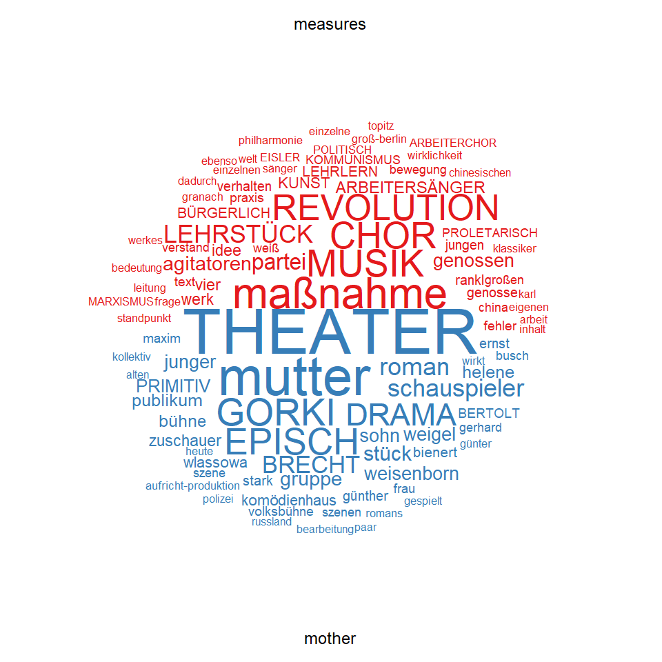

The Reception of *The Measures Taken* and *The Mother* in the
Political-Aesthetic Space of the Weimar Press: A Quantitative Approach
(ch. 2.7 of dissertation)
================
Noah Zeldin

Complementing the analyses of the music and theatrical elements of *The
Measures Taken* and *The Mother* and the discussions of their
performance histories, the final section of this chapter treats these
works’ reception in the Weimar Republic’s press, which will also serve
as an extension of the examination of the sociopolitical aspects of
these works outlined in chapter 1. The brazen and well-documented
partisanship of the Republic’s press, together with the significant
number of surviving articles on the two works, provides a natural
motivation to pursue questions regarding the existence of a meaningful
relationship between politics and aesthetics at the time and if this had
an impact on contemporary reception of *The Measures Taken* and *The
Mother*. That is, given the aesthetic split between Communists and
Social Democrats, discussed at length in chapter 1, were there any sort
of comparable divisions in the political spectrum at large? For
instance, what did liberal and rightwing outlets think about these two
learning-pieces? And, is there any relationship between the political
affiliation of a particular newspaper or magazine and the aspects of the
work discussed in the review, e.g. music, staging, political content,
pedagogical orientation?

Before beginning, I must mention two previous collections of articles
pertaining to the two works. For his important edition of *The Measures
Taken*, Steinweg collected 64 articles and reviews related to the work,
of which 48 are from the Weimar era (December 1930 through January
1933).\[1\] As for *The Mother*, Brecht collected excerpts from 13
reviews from 1932, which have been made available in volume 24 of the
GBA.\[2\] In addition to the reviews from the Weimar Republic, the
volume contains excerpts from 8 reviews of the 1935 production in New
York, which are not included in the corpus analyzed below.\] The corpus
I have assembled for the following analysis draws from both collections
(particularly Steinweg’s), as well the collections available at the AdK
and elsewhere.

In contrast to previous discussions of the reception of these works,
which have unsurprisingly operated at the local level (i.e. examining
specific passages from particular articles), the analysis offered here
proceeds at the macro level. This has become possible with the
remarkable advancement of natural language processing and introduction
of accessible software for conducting quantitative analyses of text in
recent years.\[3\] Drawing on techniques used by historians and
political scientists, I offer here a first attempt at a macro-level,
quantitative analysis of the reception of both *The Measures Taken* and
*The Mother*.\[4\] Through this quantitative approach, I arrive at a
number of conclusions that may have significant impact on future
understanding of the two works and hope that other researchers will use
the database of articles assembled here to improve and expand upon this
initial survey.

To be clear, before conducting the statistical analysis, I had read
closely all of the articles included the corpus and therefore had a very
clear idea, for instance, of which keywords and terms I wanted to
analyze. I thereby want to dispel any notion that this statistical
analysis is devoid of interpretative motives – far from it.

In keeping with the commitment to reproducibility, I have, as with the
musical analysis of *The Measures Taken*, included the complete code in
the supplementary materials. That said, it is still necessary to review
here a handful of basic procedural points and foundational items about
the data before examining the results of the analysis.

First, in keeping with the historical boundaries of this chapter, I have
only included articles published before the Nazi seizure of power
(January 30, 1933). Articles published after that date are discussed in
chapter 6. Also note that I do not claim that I am examining here *all*
possibly relevant articles on these two works published in this period
but rather merely the selection of articles that were accessible to me
in my limited research time.

Next, the categorization of the political orientation of each
publication, which requires a somewhat longer discussion.\[5\] While
certainly not unproblematic, I settled for the most basic tripart
division of the political spectrum into “left,” “right,” and “center.”
(NB: I have grouped the few official SPD newspapers included in the
corpus in the “center” group.)\[6\] I justify the categorization of each
publication through reference to scholarly works on the topic.\[7\]
While such categorization is in certain cases indisputably clear, for
instance, with the Münzenberg and Hugenberg publications or with
official party organs, in other cases it is quite difficult or even
impossible. Those publications, for which I was unable to find a
sufficient reference for political affiliation or tendency, have been
classified as “unknown.” It must be stressed that this analysis of
historical newspaper and magazine articles, including the political
classification of the corresponding publications, is meant only to serve
the analysis of *The Measures Taken* and *The Mother* and cannot be
considered a serious contribution to scholarship on either the political
history of the Weimar Republic or the history of the Republic’s media.

Let us begin with some basic figures for the data. The corpus includes
123 articles in total, 0 of which are about *The Measures Taken* and 0
of which are about *The Mother*. The dates of publication\[8\] range
from June 4, 1930 to December 9, 1932, representing a two-and-a-half
year period.\[9\] Importantly, a very substantial proportion of the
articles considered here were published within a week of the respective
work’s premiere: 45% for *The Measures Taken* and 74% for *The
Mother*.\[10\] Especially for the latter, it must be kept in mind that
much of the corpus analyzed here consists of articles written about the
premiere performances, both of which were held in Berlin.

These articles vary significantly in length. The figure below (**Tokens
per Article**) provides a visualization, comparing the lengths of
articles after processing (e.g. removing the most commonly used words
that provide no relevant information, like pronouns and basic verbs),
expressed in number of words or “tokens.” These are grouped first by
piece and then by political orientation.

<!-- -->

From this chart,\[11\] the following can be concluded: Although the
corpus contains significantly more articles about *The Mother*, the
articles about *The Measures Taken* tend to be longer. We also see that
an overwhelming majority of articles on *The Measures Taken* come from
leftwing publications, whereas things are a bit more balanced with *The
Mother*. The imbalance in articles relating to *The Measures Taken*
makes it more challenging to draw any definitive conclusions regarding
rightwing reception of the work, since the corpus includes only two
articles about the piece from publications that could be clearly
identified as rightwing.

We can now proceed with an examination of keywords with the goal of
answering questions like: Which aspects of each piece were most
significant for the press? And: Is there a clearly discernible
vocabulary that can associated with each political orientation? Below, I
present several visualizations, which will help answer these and related
questions.

Note that in the following visualizations, words in majuscules are in
fact groupings of different forms of the same term.\[13\] (All other
words, including nouns, have been lowercased as part of the data
processing. Below, I write the keywords exactly as they appear
post-processing, meaning that nouns, unless they belong to a grouping in
majuscules, will be written lowercase.) The only keyword grouping where
I went a step further and included what are clearly different terms in a
single grouping is *LEHRLERN*, which includes all terms related to the
verbs *Lernen* \[to learn\] and *Lehren* \[to teach\], as well as terms
related to “pedagogy” and “didacticism.” I felt this expanded grouping
was appropriate, because it highlights discussions related to pedagogy
terms that might otherwise have remained hidden.\[14\]

Let us begin with an examination of a straightforward count of the word
frequencies for each piece.

<!-- -->

One sees immediately how terms related to music dominate the reception
of *The Measures Taken*, while those related to theater dominate the
reception of *The Mother*.

We can further divide this further by political orientation.

<!-- -->

This subcategorization reveals a few striking tendencies. First, notice
that “Communism” (*KOMMUNISMUS*) is absent from the leftwing reception
of both pieces but present in all other groups, except centrist articles
on *The Mother*. The leftwing press seems to have favored instead the
positively connoted term “proletarian” (*PROLETARISCH*). We also see
several remarkable consistencies across the political spectrum. For
instance, terms related to music dominate all four groups reception of
*The Measures Taken*, while those related to theater weigh heavily in
the reception of *The Mother*.

Let us examine more closely the use of the keyword *LEHRSTÜCK*
\[learning-piece\]. Although it features prominently in the reception of
*The Measures Taken*, it is less present in that of *The Mother*.
However, this difference is relative and does not imply a complete
absence from the latter. In fact, it appears 45 times in 28 of the
article texts (35%). Additionally, the keyword appears in 8 titles of
articles on the *The Mother* (10%), making it the 10th most frequently
used word in these titles. We see therefore that although it is
certainly the case that the term “Lehrstück” is more closely associated
with *The Measures Taken*, it is also true that a sizable portion of the
Republic’s press also associated the term with *The Mother*.

Furthermore, the terms related to learning and teaching that I have
grouped together under the keyword *LEHRLERN* appear in 44% of the
articles on *The Mother* and is the 9th most frequently used term,
demonstrating that pedagogy was a major concern for contemporary
reception of the work.\[15\] However, uses of terms in this keyword
grouping are of course not necessarily positive, which is the case
especially for reviews published by the rightwing press. To give just
one example, the *Deutsche Zeitung*, aligned with the rightwing DNVP,
published an extraordinarily hostile review containing the following
criticism:

> Was aus dieser Schultheorie, die nicht erst von Bert Brecht ist,
> herauskommt, lehrt dieser Abend eines marxistischen Theaterseminars:
> Es ist angewandter Kommunismus für analphabetische Bedürfnisse, für
> den Massenwahn der Aufklärung, für die Predigt der ökonomischen
> Erlösung durch das Gesellschaftseigentum.\[16\]

In addition to lampooning the pedagogical orientation of the work, this
review also ridicules its target audience – unskilled workers with low
levels of education – and criticizes the leftwing political content. As
will become clear below, these traits are typical of the rightwing
reviews of The Mother.

For a different angle, let us now turn to word cloud visualizations,
which measure relative frequency or “keyness.” This means, for example,
that just because a word appears in one group does not mean it is wholly
absent from another, but rather that it is more strongly associated with
a particular group.

<!-- -->

Most immediately clear is the association of terms related to theater
(*THEATER*, *EPISCH*, *DRAMA*) with *The Mother* and those related to
music (*MUSIK*, *CHOR*) with *The Measures Taken*. In addition, Brecht
(*BRECHT* and *BERTOLT*) is more strongly associated with *The Mother*
than *The Measures Taken*, while Eisler is somewhat more strongly
associated with the latter.

I have claimed repeatedly that *The Measures Taken* should be viewed
first and foremost as a work of music rather than as a play.
Additionally, I have argued that the musical genre to which it bears
greatest affinity is the oratorio. We have seen how the reception of the
work was dominated by discussions of its music and the choir in
particular. However, we can also determine the extent to which
contemporary reception considered the work to be an oratorio.

The word “oratorio” appears in 9 articles on *The Measures Taken*. A
mixed review of the performance held in Vienna on September 20, 1932
published in the main organ of the Austrian Social Democrats states
plainly, “Its form is by no means that of a play \[*Theaterstück*\] but
rather that of an oratorio of today\[.\]”\[17\]Similarly, a positive
review in Münzenberg’s, i.e. Communist-aligned, *Berlin am Morgen* bears
the title, “The Oratorio of Tomorrow. The Measures Taken.”\[18\] The
glowing review by the well-known music critic and champion of modernism,
Hans Heinz Stuckenschmidt, published in the liberal *Berliner Zeitung*,
even includes the word in its title, calling the work a “political
oratorio.”\[19\] Uses of the term are a mixture of neutral description,
praise and criticism. For instance, the Communist *Welt am Abend* viewed
the work as having superseded the antiquated religious oratorio, thereby
implying a strong formal or generic affinity: “The form of the
learning-piece opens up great possibilities, especially for the working
class, which wants to create its own art and culture. The musical
oratorio, which draws its strength from religious sources, is dead. The
proletarian learning-piece has the chance to take its place.”\[20\]
Another article by Durus (Alfred Kemeny), published in the
Communist-controlled\[21\] ATBD’s periodical, *Arbeiterbühne und Film*,
takes a similar stance:

> From the perspective of the worker-singers’ movement, *The Measures
> Taken* is an epochal work. No pseudo-Christian and sentimental
> “proletarian” oratorio, like the previous evening-length choral
> works for worker-singers, but instead a literary and musically high
> quality composition \[*Gestaltung*\], which not only and also not
> primarily delivers aesthetic pleasures but also challenges the
> listener to assume a political position.”\[22\]

We see that references to the oratorio are largely general and apply to
the work as a whole. In fact, the only piece singled out for association
with the oratorio is “Lob der illegalen Arbeit,” which arguably contains
some of the most involved choral material in the whole work.\[23\]

All of this presents further evidence for my claim that *The Measures
Taken* should be considered first and foremost an oratorio or at the
very least as a work of music, for, in addition to the formal and
historical analyses of the work presented above and in chapter 1, it was
perceived as such at the time of its initial performances.

A final, informative word cloud is that for keywords in the reception of
*The Mother*, grouped by political orientation. (As mentioned above,
given that there are only two clearly identifiable rightwing articles on
*The Measures Taken*, it makes little sense to present a comparable word
cloud for that piece.) Articles with unknown political orientation have
been omitted.\[24\]

<!-- -->

One immediately notices the words “proletarian” (*PROLETARISCH*), a
positively connoted keyword for the leftwing press, and “Communism”
(*KOMMUNISMUS*), a negatively connoted keyword for the rightwing press.
While this dichotomy is perhaps expected, it is rather intriguing that
the leftwing press, including official organs of the KPD, seemed to
refrain from using terms related to “Communism” in their reviews of the
work. With the notable exception of the song “Lob des Kommunismus” \[“In
Praise of Communism”\] and the dialogue immediately preceding it, there
is surprisingly a glaring absence of references to “Communism” in *The
Mother*. This contrasts greatly with *The Measures Taken*, which is
filled with references to the Communist Party and the Soviet Union.
Additionally, it is plausible that the Communist press played down the
“Communistic” angle of the piece, in the hope that it would attract
Social Democratic and unaffiliated workers.\[25\] Conversely, rightwing
outlets would have been motivated to defame the piece as little more
than “Communist propaganda.” Indeed, among the keywords for the
rightwing press are “propaganda” and “Bolshevism” (*BOLSCHEWISMUS*),
while the keyword “revolution” accompanies “proletarian” in the leftwing
press.

While I will not tediously examine each and every term in the word
cloud, I wish to point out a couple of additional, revealing features.
First, the association of several aesthetic and literary terms with the
centrist and rightwing press, namely, *BRECHT*, *DRAMA* and *GORKI* in
the centrist press and *EPISCH*, *THEATER* and *schauspieler* \[actor or
actors\] in the rightwing press. One could interpret this divergence as
corresponding to the Communists’ insistence on the extra-aesthetic,
political utility of aesthetic activity, as laid out above and in
chapter 1, which would make Communist critics less inclined to discuss
the aesthetic features of *The Mother* and to focus instead on the
political aspects of the piece. And indeed, we see political keywords
like “strike,” “worker,” “job,” “businessman,” “employees,” “masses,”
“arrested,” and “flag” are all associated with leftwing outlets.
Interestingly, there is no strong association with either
“learning-piece” (*LEHRSTÜCK*) or *LEHRLERN*\[26\] with any of the
political groupings.\[27\] However, the word cloud, to repeat, measures
keyness or relative frequency and not absolute figures. I demonstrated
above that the the word “learning-piece” is a significant feature of the
reception of *The Mother*.

A final remark about this word cloud: The keyword “primitive”
(*PRIMITIV*) is associated with rightwing outlets. This corresponds to
Brecht’s remark that “in a certain part of the bourgeois press\[,\]”
*The Mother* was labeled “primitive.”\[28\] In fact, both centrist and
rightwing publications used the word in their reviews.\[29\] Similarly,
words relating to “boredom” (the grouping *LANGWEILIG* includes both
“boredom” \[*Langeweile*\] and “boring” \[*langweilig*\]) were also
used by the centrist and rightwing press.\[30\]

The macro-level statistical analysis confirms my observation from
reading the individual reviews for the piece: The non-leftwing press was
on the whole extremely critical of the work, both for its political
content and aesthetic features, while the leftwing press universally
praised it. Let us examine a couple of notable examples.

One of the most critical articles on *The Mother* was unsurprisingly
published in the Nazi *Völkischer Beobachter*.\[31\] The subtle title,
“Brecht’s Bolshevist ‘Mother’-Propaganda,” indicates the direction the
article will take. It is worth reproducing text in its entirety, in
order to give an impression of the extreme politicization of Weimar
society and its relation to the arts.

> Die Gruppe junger Schauspieler (wie viele haben sich schon so genannt)
> zeigte sich mit Bert Brechts neuestem, bolschewistischem
> Propagandastück „Mutter“. Es ist die nach Gorkis Roman gedrechselte
> Geschichte einer Mutter, die sich aus Liebe zu ihrem Sohn
> bolschewistischen Ideen verschreibt. Und das Ganze wird episches
> Theater genannt. Die Aufführung und besonders die Songs („Wenn du
> keine Suppe hast, musst du den Staat umkehren“) sind primitiv, die
> Musik, für die der Komponist Eisler zeichnet, quäkt und schrillt mit
> Posaune und Schlagzeug. Diese Aufforderung zur bolschewistischen
> Revolution – in Berlin darf man sich so etwas ruhig erlauben, während
> jede nationalsozialistische Tendenz im Theater auch bei viel zarterer
> Meinungsäußerung untersagt werden würde – wird trotz ihrer
> Primitivität sogar noch als „neue Form“ und „vorbildlicher Versuch“
> gelobt, obschon man vergeblich das „Neue“ sucht. Denn diese
> Piscator-Erinnerung ist schlecht, und so graue Leinwandkulissen wie
> hier sah man schon öfter. Die immer gerissener werdende mütterliche
> Agitatorin, die jedes Bedenken ablehnt und sich für skrupellosen
> Fanatismus entscheidet, war weder künstlerisch gesehen noch
> propagandistisch wirksam. Wenn man aber kommunistisches Verhalten in
> allen Lebenslagen bieten wollte, dann brauchte man nicht ins
> Komödienhaus zu rufen, dann genüge es, jedem Besucher einen Zettel
> für einen Groschen mit den nötigen Richtlinien in die Hand zu
> drücken. Das sparte Zeit und wäre billiger.

This of course stands in stark contrast to the laudatory articles in the
leftwing press. Münzenberg’s, i.e. Communist-aligned, *Berlin am Morgen*
published an article with the title, “The Mother. Proletarian
Organizations Recommend the New Work,” which not only praised the work
but, as the title indicates, stated that “\[a\] whole array of
proletarian organizations” (all aligned with the KPD, of course) “highly
recommend that their members attend performances \[of the work\].”\[32\]
Another short article, published a week later in the same newspaper
under the title, “***Are you familiar with*** the Learning-piece ‘The
Mother’?”, contains a similar urging to its readership: “Go with your
wife to *The Mother*. Every woman, every mother must see the new
Marxist, ***lebendige***, innovative drama *The Mother*.”\[33\] Given,
however, that, for example, these and other the main KPD organ, the Rote
FahneCommunist aligned newspapers, including KPD organs, advertised the
piece and offered discounted tickets to their subscribers, this kind of
encouragement is unsurprising.\[34\]

One of the most detailed and laudatory leftwing articles on *The Mother*
was published shortly after the premiere in the *Rote Fahne* under the
title “Brecht’s Learning-piece a Great Success.” The article praises
Brecht and discusses the pedagogy behind the piece. For instance,
discussing the scene in which Vlassova distributes leaflets calling for
the factory workers to strike, the author of the article writes, “The
foundational concepts of Marxism are made clear to her through the
simplest examples of proletarian life.” We see here that for Communists,
the intentionally simplified and pedagogically oriented content of the
work was a positive quality, in contrast to rightwing and centrist
critics.

However, perhaps one of the most intriguing reviews of *The Mother*
contained in the corpus was published in the main SPD organ *Vorwärts*
(to be precise, in the evening edition, *Der Abend*), the day after the
work’s premiere.\[35\] The author, Max Hochdorf, tries to reclaim
Gorky’s novel for the Social Democrats\[36\] and criticizes Brecht,
who “racks his brains on his epic theater\[,\]” which Hochdorf later
calls a “pseudo-theater” \[*Halbtheater*\]. Hochdorf’s aesthetic
conservatism, arguably a manifestation of some of the trends discussed
in chapter 1 regarding the official SPD line on culture, reveals itself
through formulations like “theater has its laws, \[…\] very definite and
unwavering laws of life” \[*ganz eindeutige und unerschütterliche
Lebensgesetze*\] and the praiseworthy “old theater.” The expected
anti-Communism comes through in the following passage:

> Brecht krempelt aber auch den wunderbaren Gorkismus von dazumal in den
> Stalinismus von 1932 um. Er lässt den Bolschewistenkatechismus auf der
> Bühne zerkauen, und niemand hat Recht außer ihm, und er tut so, als
> wenn alle übrigen Leute im Theater Idioten mit unendlich langer
> Leitung wären. Kurz, der großartige Roman, umgeformt zum Drama, wird
> wieder ein Roman, aber hat den psychologischen Schmelz verloren. Die
> Menschen werden zu Lautsprechermaschinen der Partei.

Although Hochdorf makes no reference to agitprop (as mentioned above,
astoundingly, no article on *The Mother* included in the corpus uses the
term), his critique in this passage, especially the final points, imply
a disdain for anti-psychological, propagandistic theater. This disdain
for a different set of aesthetic values separates Hochdorf and
like-minded critics from Communists, who advocated for them, and made
any sort of aesthetic-based reconciliation impossible.

Additionally, this passage contains one of only three appearances of
“Stalin” or “Stalinism” in the entire corpus. (Given postwar
scholarship’s obsession with comparing *The Measures Taken* with the
Great Purge of 1936-38 and Stalinism in general, it is significant not
one of the 0 articles on *The Measures Taken* contained in this corpus
mentions Stalin.) Another can be found in the SPD newspaper in Zwickau,
in which Gorky’s recent pledge of support for Stalin is criticized as
betrayal of his origins. One of the others can be found in the SPD
newspaper in Zwickau, in which Gorky’s recent pledge of support for
Stalin is criticized as betrayal of his origins. The third appearance of
“Stalin” is in a long, extraordinarily critical review of *The Mother*,
published two days after the work’s premiere in *Germania*, the paper of
the Catholic Zentrum \[Center\] party, which, in the final years of the
Weimar Republic, drifted continually to the right.\[37\] “The Communist
‘Mother,’” as the article’s title refers to the piece, opens with a
criticism of Gorky’s return to Russia and “his father Stalin, who has
long resented him.” Like the Social Democrat Hochdorf, the author, H.
Bachmann, criticizes Brecht’s “Epic Theater” as “primitive.”
Additionally, Bachmann lambastes the lack of individuality and
Vlassova’s tactic of deceit in the work’s penultimate scene,\[38\] in
other words, the work’s agitprop-like qualities and strong endorsement
of political realism. The article ends with a sweeping criticism and
call for the work to be banned:

> Das Ganze ist eine eindeutige, klipp und klare Heroisierung eines
> revolutionären Frauentyps, herausgeführt aus der bürgerlichen in die
> klassenkämpferische, proletarische Welt. Ein Lehrstück, - \[*sic*\]
> das (wie wohl auch schon vorgesehen) nur ins Russische und in allen
> anderen Sprachen übersetzt zu werden braucht, um die primitiven
> Argumentationen der Bolschewiken und ihrer Weltrevolution vor den
> einfältigsten Hirnen (allerdings nur vor ihnen) beweiskräftig zu
> machen. Das Stück opponiert hundertprozentig gegen das bei uns
> herrschende Staatssystem und plädiert für Moskau. Also – \[*sic*\]
> muss es verboten werden\!

This corresponds to the similarly dramatic ending of the above-discussed
review in the rightwing *Deutsche Zeitung*:\[39\]

> Der politische Marxismus hat – das lehrt diese primitive, aber
> gefährliche Aufführung – seinen dramaturgischen Stil und seine
> Bühnentheorie gefunden. Wir müssen im Kampf um das Schicksal unseres
> Theaters den marxistischen Theaterschulen für Analphabeten die
> dichterische Persönlichkeit gegenüberstellen, die nicht – wie Bert
> Brecht es will – durch eine „Montage“ ersetzt werden kann, sondern aus
> dem Volkstum organisch wächst.

The examples provided above are simply meant to fill out the admittedly
abstract macro level analysis and to demonstrate how strongly related
politics and aesthetics were in the Weimar Republic in 1932 and how this
affected the reception of *The Mother*.

I will conclude the examination of the reception of *The Measures Taken*
and *The Mother* with a concretization of what I have referred to as the
political-aesthetic space of the Weimar Press via correspondence
analysis (CA), a spatial representation of the associations between
variables.\[40\] The goal of conducting the CA is to measure (and
visualize) the tendencies described above, that is, the association of
certain words and thus the reception of *The Measures Taken* and *The
Mother* and political affiliation. In other words, the CA will determine
if there is in fact a measurable correspondence between politics and
aesthetics. As with the word cloud and keyness analyses offered above,
the CA here treats text as data and measures distance as a function of
deviation in vocabulary. Note that I use the same processed data set for
the CA that I used for the above visualizations and analysis.

The figure below presents the CA with six groups, corresponding to the
known political affiliations for each work,\[41\] with the top twenty
contributing keywords, several of which are recognizable from the
visualizations presented above. The horizontal axis represents the
aesthetic space. Terms associated with *The Mother* are pulled to the
left, while those associated with *The Measures Taken* are pulled to the
right. The vertical axis represents the political space.

<!-- -->

The following two figures provide cropped reproductions of the left and
right halves of the previous figure for additional readability.

<!-- -->

 

<!-- -->

There is incredible consistency on the vertical plane, i.e. in the
political space. For both works, the centrist and rightwing press are
very close together, while the leftwing press is isolated. A comparison
of their positions indicates the following: There is more carryover in
the leftwing press’s vocabulary on articles for the two works than in
the centrist or rightwing press. A comparison of the positions of the
leftwing press for the two works, implies that the leftwing reception of
*The Mother*, in comparison to that of *The Measures Taken*, is more
strongly distinguished by words related to politics and less strongly by
those related to the content of the work or aesthetics.

Finally, we see that, corresponding to previous visualizations, the
negatively connoted keyword “primitive” (*PRIMITV*) is strongly
associated with non-leftwing reviews of *The Mother*, while the
positively connoted words “proletarian” \[*PROLETARISCH*\] and
“revolution” are strongly associated with leftwing reviews of both
works. Perhaps surprisingly, words relating to “music” and “choir” are
more strongly associated with non-leftwing reviews of *The Measures
Taken*. At the same time, however, the keyword grouping *ARBEITERSÄNGER*
\[worker-singers\] is strongly associated with the leftwing press. (NB:
The analyzed corpus includes only one article on *The Measures Taken*
published in an official SPD organ.)\[42\] This indicate that leftwing
(and therefore Communist) outlets were, in comparison to the
non-leftwing press, relatively more concerned with the political content
of the work and with the worker-singers’ movement than with the
specifics of the music, which is consonant with what I laid out in part
II of chapter 1.

The analysis presented above demonstrates the existence of strong
relationships between aesthetics and politics in Weimar-era reviews of
*The Measures Taken* and *The Mother*, thereby reaffirming several
aspects of these relationships discussed in chapter 1. Although I did
not conduct a sentiment analysis with the assembled corpus, it is worth
considering how the above analysis and the visualizations correspond to
anecdotal impressions of the criticisms voiced in the articles. However,
it must be stressed that the coalescence of the centrist and rightwing
reception of both *The Measures Taken* and *The Mother*, patently
visible in the CA presented above, is one of vocabulary and must not be
mistaken for a coalescence of sentiment. However, as I have
demonstrated, one can glean certain trends from specific keywords. (The
most obvious examples were the negatively connoted uses of “Communism”
and “primitive” in centrist and rightwing reviews of *The Mother*.)
Beyond sentiment, the results of the above analysis, particularly the
CA, seem to indicate that Communists and their sympathizers indeed had a
clear stance on aesthetics (or at least had topics they prioritized when
discussing these two works) that differed strongly from the aesthetic
orientation of those with other political affiliations.

In terms of sentiment, reviews of *The Measures Taken* were fairly
mixed. As previous scholars have noted, certain Communists were highly
critical of the text, while finding reason to praise the music, and
multiple outlets either belonging to the centrist press or lacking a
clearly identifiable political orientation lavished praise on the work,
especially on Eisler’s music. On the other hand, political and aesthetic
divisions are much more clearly defined for reviews of *The Mother*.
Praise for the work was essentially unanimous from the leftwing press,
while criticism was equally unanimous from the rightwing press. In
particular, the essentially universal disdain for all aspects of *The
Mother* – literary, musical, theatrical, political – from the rightwing
press and much of the centrist press is inseparable from the brazen
partisanship of the era and shows very clearly the extent of the
politicization of the extra-political sphere in the final years of the
Weimar Republic.

This demonstrable, strong correspondence between aesthetics and politics
supports one of the central claims of this chapter and chapter 1,
namely, that *The Measures Taken* and *The Mother* can only be
understood within the historical context of the final years of the
Weimar Republic. Embedding the two works in this context makes the
intense, perhaps even bewildering political content of their texts
comprehensible and, in turn, shows that these works were written for a
particular audience and group of performers that belonged to a very
unique place and time.

1.  MKA,“G1. Berichte und Kritiken,” 319-468. NB: Due to the
    distortionary effects of the nearly identical press releases on the
    police break-up of the Erfurt performance, I was forced to exclude
    all of the articles related to that performance contained in ibid.,
    411-15.

2.  See GBA 24:177-189.

3.  Furthermore, as Lemercier and Zalc, *Quantitative Methods*, 1-2
    note, “advances in microcomputing” “every student now has at her
    disposal calculating capabilities of which researchers could only
    dream in the 1970s.” See also ibid., 52. Ibid., ch. 7: “Counting
    Words, Exploring Texts,” 142-54 provides a helpful overview of
    processes related to quantitative textual analysis and potential
    issues that may arise.

4.  I rely primarily on the quanteda package for the R programming
    language: Benoit et al., “quanteda.” For the correspondence analysis
    (CA) conducted at the end of this section, I rely on the FactoMineR
    package: Lê et al., “FactoMineR.” A detailed, yet accessible
    introduction to conducting textual analysis in R, with an extensive
    bibliography and list of available packages, is provided in Arnold
    et al., “Beyond Lexical Frequencies.”

5.  I of course agree with the general remarks in Lemercier and Zalc,
    *Quantitative Methods*, 64-66 that “categorization is often a
    political choice.” Needless to say, in the case of the present
    study, the categorization of historical periodicals based on their
    perceived political orientation is potentially quite political. For
    this reason, I tried to proceed very cautiously with these
    categorizations, as I explain below.

6.  Despite its official status as a workers’ party and continuing to be
    regarded by some members and many of their opponents as “Marxist,”
    the SPD was aligned with the centrist liberal parties at the
    national level and vehemently opposed the KPD. (I discuss all of
    this in great detail in part II of ch. 1.) The included articles’
    hostility towards Brecht and *The Mother* affirm this general
    political position.

7.  These references are included in the data set for consultation.

8.  The following remarks about dates pertain only to those articles for
    which precise publication dates were available, i.e. those with day,
    month and year. These constitute 88% of the articles in the corpus.

9.  The first article, published months before the premiere of *The
    Measures Taken* by Durus \[A. Kemeny\] in *Die Rote Fahne*
    criticizes the oft discussed censoring of the piece by the board of
    Neue Musik Berlin. d. \[Durus\], “Kulturreaktion: Revolutionäre
    Kunst verboten…,” *Rote Fahne*, June 4, 1930. Cf. GBA 3:431 and 440
    and 24:97-98. I decided to include this article in the corpus on
    account of its substantive political content, despite that fact that
    it is of course not a review. Also, note that given that *The
    Mother* premiered thirteen months after *The Measures Taken*, the
    publication period of articles pertaining to it is obviously much
    shorter (slightly under a year). Note too that the aforementioned
    exclusion of press releases pertaining to the performance of *The
    Measures Taken* held on Jan. 28, 1933 truncated the time period
    given above by a over a month and a half.

10. Again, *The Measures Taken* premiered in the late hours of the
    evening between Dec. 13 and 14, 1930, and *The Mother* premiered on
    Jan. 17, 1932. BFA 3: 431 and 478.

11. Note: Two exceptionally long articles on The Measures Taken with
    unknown political orientation are responsible for stretching the IQR
    for that subcategory. Unsurprisingly, these long articles appeared
    in a literary and in a musical periodical, rather than in a daily
    newspaper. Julius Bab, “Lehrstück in Gegenwart und Vergangenheit,”
    Literarische Welt, Feb. 19, 1932; and Hans Heinz Stuckenschmidt,
    “Politische Musik zu Brecht-Eislers ‘Maßnahme,’” *Der Anbruch*
    XIII, vol. 1, 1931.

12. See appendix ***???*** for a complete list of these groupings.

13. For instance, “music”, “musical” and “musically” have been grouped
    under the keyword *MUSIK*, so that they are counted as a single
    token, which of course increases their significance in the
    statistical analysis.\[12\] This practice is particularly relevant
    for German texts, because the same adjective with a different
    declination (e.g. *musikalische* versus *musikalischen*) would
    otherwise count as a separate token.

14. On the other hand, I take my decision to group the various forms of
    *Lied*, the German word for song, and the Anglicism *Song* under a
    single token \[*LIED*\] to be rather harmless.

15. Perhaps somewhat surprisingly, this keyword grouping appears most
    frequently in centrist articles (NA% of appearances) on *The Mother*
    and much less frequently in leftwing articles (NA%).

16. Richard Biedrynski, “Gruppe junger Schauspieler im Komödienhaus.
    Marxistische Theaterschule. Bert Brecht - Maxim Gorki: ‘Die
    Mutter,’” *Deutsche Zeitung*, Jan. 18, 1932.

17. D. J. Bach, “Die revolutionäre Aufgabe und der einzelne. ‘Die
    Maßnahme’, Lehrstück von Brecht und Eisler,” *Arbeiter-Zeitung*,
    Sept. 24, 1932. The author is highly critical of the work’s plot and
    text and lukewarm on Eisler’s music but praises the performance and
    actually calls for additional performances to be organized.

18. F.C.W. and P.H., “Das Oratorium von morgen,” *Berlin am Morgen*,
    Dec. 16, 1930.

19. Hans Heinz Stuckenschmidt, “Ein politisches Oratorium. Brecht-Eisler
    ‘Die Maßnahme,’” *Berliner Zeitung*, Dec. 15, 1930. See the
    discussion of Stuckenschmidt and his reception of The Measures Taken
    in Brecht et al., *Die Maßnahme*, ed. Krüger, 93.

20. Paul Friedländer, “Die Maßnahme. Zur Wiederaufführung im Großen
    Schauspielhaus,” *Welt am Abend*, Jan. 24, 1931.

21. Discussed in ch. 1.8.

22. Durus \[A. Kemeny\], “Die ‘Maßnahme’, ein Lehrstück,” *Arbeiterbühne
    und Film* (Feb. 1931).

23. See L. Sp., “Musik im Propagandakampf. ‘Die Maßnahme’ in der
    Philharmonie,” *Vossische Zeitung*, Dec. 15, 1930.

24. These constitute NaN% of articles on *The Mother*.

25. Dümling, *Lasst euch*, 335-39 notes Brecht and Eisler’s desire to
    engage with a diverse working-class audience, including
    non-Communists, in the early 1930s.

26. As explained above, this is a collection of the various forms of the
    terms “learning” and “teaching.”

27. Other terms related to pedagogy, “knowledge” \[*Wissen*\] and
    *Bildung* occur infrequently but are strongly associated with the
    leftwing press. All four instances of Bildung occur in just two
    Communist articles, both on *The Mother*. “Knowledge” \[*Wissen*\]
    appears just three times total in the corpus, two in Brand’s
    important article in the *Rote Fahne*, discussed above, where he
    praisingly writes, “Die Form wird glänzend durchgehalten, Wissen
    wird vermittelt. Wem? Dem Spieler? Nein, dem Zuhörer. Er merkt es
    nicht einmal, wie er zum Lernen angeregt wird. Und man sieht, dass
    Wissen nichts Langweiliges, dass Theorie das Lebendigste des Alltags
    ist, wenn sie sich mit der Praxis verwebt.”

28. See GBA 24:114-15.

29. In the word cloud above, the word appears to be associated with the
    rightwing press on *The Mother*, because the majority of appearances
    of the term were in rightwing publications. However, 0 centrist
    articles also use the word, while only 0 articles from leftwing
    outlets include the word “primitive,” one on *The Measures Taken*
    and one on *The Mother*. The former, which appeared in the Communist
    *Welt am Abend* on Dec. 15, 1930, i.e. immediately after the
    premiere, focuses almost exclusively on the work’s music. The word
    “primitive” appears in the following sentence: ***“Die Musik gemäß
    der Idee des Stückes monumental angelegt, zieht Schlüsse aus der
    jüngsten Musikentwicklung und ballt sich zu bewusst primitiver
    Mehrstimmigkeit.”*** Here, we see an idiosyncratic, positive
    connotation of the word “primitive.” V., “‘Die Maßnahme’:
    Veranstaltung der Internationalen Tribünde in der Philharmonie,”
    *Welt am Abend*, Dec. 15, 1930. The second article on *The Mother*,
    which also appeared in the *Welt am Abend* immediately after that
    work’s premiere (Jan. 18, 1932), gives a similarly glowing review
    and rebukes the criticism of “primitiveness”: ***“In diesem Stück
    wird viel debattiert, auch moralisiert, aber es wird in einer ganz
    klaren, anschaulichen und immer fesselnden Form gezeigt, wie du dich
    zu verhalten hast. Primitiv ist diese Art wahrhaftig nicht, es gab
    sehr viele Szenen, die gewiss Anlass zu Aussprachen in ganzen Kursen
    gegeben hätte.”*** K. Kn., “Auf der Bühne sah man: Die Mutter
    Aufführung der ‘Gruppe Junger Schauspieler,’” *Welt am Abend*,
    18.01.1932.

30. Only a single leftwing article - Paul Brand, “Brechts Lehrstück in
    großer Erfolg. Gorkis ‘Mutter’ von Bert Brecht, Eisler und
    Weisenborn”, *Rote Fahne*, Jan. 19, 1932 - uses any variant of
    “boring” or “boredom” and uses it simply to state that, relating
    to the form and didacticism of *The Mother*, “knowledge”
    \[*Wissen*\] is “nothing boring\[.\]” 6 articles include both
    keyword groupings (“boring” and “primitive”), none of which are
    leftwing.

31. "Brechts bolschewistische ‘Mutter“-Propaganda,’ *Völkischer
    Beobachter*

32. “Die Mutter. Proletarische Organisationen empfehlen das neue Stück,”
    *Berlin am Morgen*, Jan. 17, 1932.

33. “Kennen sie schon das Lehrstück ‘die Mutter’?”

34. Virtually identical advertisements for The Mother, including
    exclusive (and presumably, discounted) tickets for subscribers,
    occupies the bottom third of p. 13 of the *Rote Fahne*, Jan. 22,
    1932 and on p. 12 of the issue from Jan. 24, 1932. The latter page
    also contains an article on the political feuds within the DASB:
    “Rote Front der Arbeitersänger.”

35. Max Hochdorf, “Bert Brechts Episches Theater,” *Der Abend*, Jan. 18,
    1932. As a reminder of the political situation of the time, the
    previous page of the issue contains both an article on two recent
    attacks by Nazis on youth members of the Social Democratic defense
    organization (Jungbanner) and on Communists and an article on recent
    attempts by conservative parties in Austria to disarm that country’s
    powerful Social Democratic paramilitary organization, the
    Republikanischer Schutzbund. “Nazis überfallen Jungbanner. 100 gegen
    30 - das ist wahres Naziheldentum,” *Der Abend*, Jan. 18, 1932; and
    “Selbstschuss der Demokratie. Unparteiische Entwaffnung in
    Deutschösterreich,” ibid.

36. Hochdorf notes correctly that the German translation of the novel
    was first published in Vorwärts in 1907 (also noted in GBA 3:479 and
    BHB 1:295).

37. H. Bachmann, “Die kommunistische ‘Mutter.’ Gastspiel im
    Komödienhaus,” *Germania*, Jan. 19, 1932. Brecht was evidently
    quite familiar with this article. See GBA 24:184, 185 and 187.

38. Scene 14. “Vor einer Vaterländischen Kupfersammelstelle.” GBA
    3:319-323.

39. Biedrynski, “Marxistische Theaterschule.”

40. To put it somewhat more technically, “The objective is to construct
    a low-dimensional map that well summarizes the data, which in the
    case of CA are the associations between two categorical variables.”
    Michailidis, “Correspondence Analysis,” n.p. As the reader may be
    aware, CA was made famous by Bourdieu in *Distinction*, but
    interestingly, one of its initial applications was text analysis,
    more specifically, an analysis of Racine’s Phaedre by Brigitte
    Escofier. See Bécue-Bertaut, *Textual Data Science with R*, 1.
    Sapiro, “The Structure of the French Literary Field” provided
    further motivation to conduct a CA on these data. See also Duval,
    “Correspondence Analysis” and, more generally, the engagements
    with Bourdieu’s methods and theory in Robson and Sanders, ed.,
    *Quantifying Theory*. For an accessible overview of CA for
    humanists, see Lemercier and Zalc, Quantitative Methods, 87-100.
    Deschamps, “Correspondence Analysis” provides a tutorial that uses
    the same R package, FactoMineR.

41. Articles with “unknown” political orientation have been excluded,
    constituting 0% of the corpus.

42. K. P., “‘Die Maßnahme.’ Nachtvorstellung in der Philharmonie,”
    *Vorwärts*, Dec. 15, 1930. Note that although this article does not
    mention “worker-singers,” it does discuss the DASB and the three
    choirs which participated in the premiere performance. While I am
    hesitant to attribute too much meaning to the specifics of this word
    choice, it would seem to imply that this article, published in the
    main SPD organ, was glad to promote an SPD-controlled cultural
    institution (the DASB) without mentioning the worker-singers’
    movement at large. Additionally, one article included in Steinweg’s
    collection is from a regional SPD newspaper. However, this has been
    excluded, because it belongs to the aforementioned group of nearly
    identical press releases on the performance scheduled for Jan. 1933
    in Erfurt that was broken up by police. Perhaps somewhat
    surprisingly, the short article is highly supportive of Brecht and
    the work. “Unwürdige Schikanierung der Kunst,” *Volkszeitung für das
    Vogtland*, Jan. 24 1933. The claim made in the editors’ commentary
    on *The Measures Taken* that “intensive engagement
    \[*Auseinadersetzung*\] with the work and performance, as Brecht and
    Eisler intended, took place within the revolutionary workers’
    movement\[,\]” in contrast to “\[t\]he Social Democratic press and
    public in Germany\[,\]” which “reacted \[…\] indifferently” should
    be relativized (GBA 3:441).
